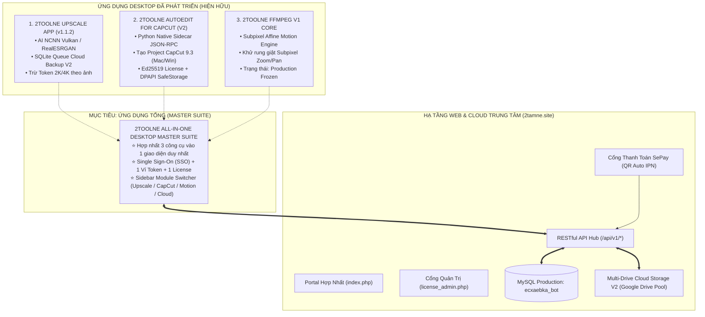

# 👑 CẨM NANG BÀN GIAO TOÀN DIỆN HỆ SINH THÁI 2TOOLNE
## TÀI LIỆU KỸ THUẬT DÀNH RIÊNG CHO AGENT PHÁT TRIỂN "APP TỔNG" (MASTER UNIFIED SUITE)

**Đơn vị phát hành**: Đội ngũ Kiến trúc sư Kỹ thuật 2TOOLNE Studio  
**Mục tiêu**: Bàn giao 100% tri thức, mã nguồn, kiến trúc hệ thống, cơ sở dữ liệu, API và các bài học kỹ thuật xương máu cho Agent phụ trách xây dựng **Ứng dụng Tổng hợp (2TOOLNE All-in-One Master Suite)**.  
**Ngày cập nhật**: 07/09/2026  
**Trạng thái hệ thống**: Hoạt động ổn định trên Production (`https://www.2tamne.site`)

---

## 🗺️ PHẦN 1: BẢN ĐỒ TOÀN CẢNH HỆ SINH THÁI 2TOOLNE (ECOSYSTEM MAP)

Hệ sinh thái **2TOOLNE** được xây dựng xung quanh giá trị cốt lõi: **Sức mạnh xử lý Local-First trên máy người dùng, kết hợp Cloud Storage và Quản lý Bản quyền tập trung qua Web**.

Hiện tại, hệ thống bao gồm 3 trụ cột sản phẩm và 1 hạ tầng Backend trung tâm:



---

## 📂 PHẦN 2: CẤU TRÚC KHO MÃ NGUỒN TRÊN MÁY PHÁT TRIỂN

Máy chủ phát triển hiện tại (macOS Apple Silicon) chứa 2 kho mã nguồn độc lập tương ứng với các phân hệ:

### 1. Thư mục Repo 1: `/Users/2tamne/Documents/toolupscale`
- **Tên sản phẩm**: `2toolne Upscale` (Phiên bản v1.1.2)
- **Công nghệ**: Electron 33, Vite, React 18, TypeScript, Tailwind CSS, Python / Vulkan NCNN binary engine.
- **Nhiệm vụ**: Upscale ảnh/video siêu phân giải bằng GPU nội bộ, tự động upload bản sao lưu lên Google Drive qua Cloud Storage V2, trừ Token ví người dùng.
- **Thư mục quan trọng**:
  - `apps/desktop/`: Mã nguồn giao diện chính Electron (Vite, React, IPC Handlers).
  - `engine/runtime/`: Bộ thực thi `realesrgan-ncnn-vulkan.exe` / native binaries.
  - `services/`: `CloudBackupQueue.ts`, `CloudStorageService.ts`, `UpscaleSyncService.ts`.
  - `database/`: Quản lý SQLite cục bộ (`cloud_backup_jobs`, `cloud_spaces_cache`).
  - `docs/`: Toàn bộ tài liệu kỹ thuật, sơ đồ schema SQL V2, cẩm nang tích hợp.
  - `web_index.php`, `license_admin.php`, `db.php`: Bản sao lưu cấu hình server sản xuất.

### 2. Thư mục Repo 2: `/Users/2tamne/tool ffmpeg`
- **Tên sản phẩm**: `2TOOLNE AutoEdit for CapCut` (V2) & `FFmpeg V1 Core`
- **Công nghệ**: Electron 33, Python 3.12, PyInstaller, Node.js 20, GitHub Actions CI.
- **Nhiệm vụ**:
  - Tự động dựng timeline, cắt ghép, tạo hiệu ứng chuyển động máy quay và xuất bản trực tiếp thành tệp dự án CapCut Desktop (`draft_content.json`).
  - Lõi FFmpeg V1 (`subpixel_affine_engine.py`): Khử jitter subpixel chuyển động.
- **Thư mục quan trọng**:
  - `apps/capcut-v2/desktop/`: Ứng dụng Electron giao diện người dùng.
  - `apps/capcut-v2/core/`: Python Sidecar engine (`sidecar_main.py`), RuleEngine, EditPlan, License Validator.
  - `apps/capcut-v2/adapters/capcut/`: Bộ chuyển đổi dự án CapCut (`version_9_3.py`, `detector.py`).
  - `.github/workflows/capcut-v2-windows-rc.yml`: Pipeline tự động build Windows CI (x64 NSIS).
  - `reports/windows_rc/external_lab/`: Bộ kit kiểm thử vật lý Windows cho phòng Lab ngoài (Checklist 27 bước, Media test, Template kết quả).
  - `website/`: Mã nguồn Web Portal sản xuất đang chạy trực tiếp trên `2tamne.site`.

---

## ⚙️ PHẦN 3: ĐẶC TẢ CHI TIẾT 5 PHÂN HỆ KỸ THUẬT CỐT LÕI

Agent làm "App Tổng" cần nắm vững 5 phân hệ này để ghép nối:

### 🔹 PHÂN HỆ 1: AI UPSCALE ENGINE & HÀNG ĐỢI LOG 2K / 4K
1. **Thuật toán xử lý**:
   - Sử dụng mô hình RealESRGAN (NCNN Vulkan tăng tốc phần cứng trên Windows/macOS).
   - Chế độ xử lý: **100% xử lý Offline trên GPU máy người dùng**, không gửi ảnh gốc về máy chủ.
2. **Quy tắc tính phí Token & Ghi nhận Log (`/api/v1/upscale/log`)**:
   - **Độ phân giải 2K** (chiều dài hoặc rộng $\le 2560\text{px}$): **Trừ 1 Token**.
   - **Độ phân giải 4K** (chiều dài hoặc rộng $> 2560\text{px}$): **Trừ 2 Token**.
   - Payload gửi về server:
     ```json
     {
       "file_name": "IMG_2026_09_07_portrait.png",
       "resolution_type": "4K",
       "tokens_consumed": 2,
       "processing_time_seconds": 4.8,
       "device_id": "SHA256_HWID_FINGERPRINT"
     }
     ```
   - Nếu ví không đủ Token: App chặn tác vụ upscale, hướng dẫn người dùng nạp token tại web portal.

---

### 🔹 PHÂN HỆ 2: AUTOEDIT CAPCUT V2 (PYTHON SIDECAR + ELECTRON)
1. **Kiến trúc Sidecar IPC**:
   - Electron Main Process quản lý tiến trình ngầm `autoedit-core.exe` (biên dịch bằng PyInstaller `--onedir`).
   - Giao thức: **JSON-RPC 2.0 thuần qua `stdin` / `stdout`**, mã hoá UTF-8.
   - Không chạy máy chủ HTTP localhost (tránh xung đột cổng mạng và rủi ro tường lửa).
   - Tắt tiến trình an toàn bằng lệnh OS không bật cửa sổ đen:
     ```javascript
     // Windows: Dọn dẹp cả process tree
     spawnSync('taskkill', ['/pid', String(proc.pid), '/f', '/t'], { windowsHide: true });
     ```
2. **Quy chuẩn tạo bản nháp CapCut Desktop 9.3**:
   - Tệp tạo ra: `draft_content.json` và `root_meta_info.json`.
   - Vị trí lưu trên Windows: `%LOCALAPPDATA%\CapCut\User Data\Projects\com.lveditor.draft\`
   - Vị trí lưu trên macOS: `~/Movies/CapCut/User Data/Projects/com.lveditor.draft/`
   - Thuộc tính hệ điều hành trong JSON:
     - Windows: `platform.os = "windows"`, `platform.app_version = "9.3.0"`
     - macOS: `platform.os = "mac"`, `platform.app_version = "9.3.0"`
   - Đơn vị thời gian Timeline: **Microseconds ($\mu\text{s}$)**, $1\text{s} = 1,000,000\ \mu\text{s}$.
   - Keyframe chuẩn hoá: Tỉ lệ tọa độ `0.0 - 1.0`, các thuộc tính scale `KFTypeScaleX`, vị trí `KFTypePositionX`.
   - Kiểm định tự động: Phải luôn vượt qua `CapCutDraftValidator.validate_draft(draft_dir)`.

---

### 🔹 PHÂN HỆ 3: FFmpeg V1 MOTION CORE (SUBPIXEL AFFINE ENGINE)
1. **Trạng thái**: **PRODUCTION FROZEN** (Đã đóng băng sản xuất).
2. **Tập tin**: `subpixel_affine_engine.py` (tại repo `tool ffmpeg`).
3. **Nhiệm vụ**:
   - Xử lý phóng to, thu nhỏ, xoay, quét góc máy bằng biến đổi Affine ở mức độ Subpixel (dưới 1 điểm ảnh).
   - Ngăn chặn hoàn toàn hiện tượng rung lắc/giật hình (Zoom Jitter Regression) của các bộ lọc FFmpeg thông thường.
4. **Nguyên tắc cho App Tổng**:
   - Giữ nguyên vẹn thuật toán toán học của tệp này.
   - App Tổng có thể đóng gói engine này thành 1 mô-đun chức năng (Direct Video Render) hoặc làm thư viện phụ trợ.

---

### 🔹 PHÂN HỆ 4: CLOUD STORAGE V2 (GOOGLE DRIVE MULTI-ACCOUNT POOL)
1. **3 Nguyên tắc vàng bắt buộc**:
   - **Zero GPU Blocking**: Tác vụ backup Cloud chạy hoàn toàn ở Background Queue. Khi AI upscale xong, giao diện phải báo "Xong" ngay lập tức cho người dùng.
   - **0 Bytes qua Hosting**: Desktop App tải trực tiếp lên Google Drive API qua Resumable Upload URL (`https://www.googleapis.com/upload/drive/v3/files?uploadType=resumable&upload_id=...`). Máy chủ `2tamne.site` chỉ đóng vai trò phân phối Session và lưu Metadata.
   - **Local-First**: Tệp sau khi upscale luôn được lưu an toàn trên ổ cứng người dùng trước tiên.
2. **Quy trình 3 bước của `CloudBackupQueue`**:
   - **Bước 1 — Tạo Session (`POST /api/v1/cloud/upload/create-session`)**:
     Gửi tên tệp, dung lượng `file_size_bytes`, mã băm SHA-256. Server chọn ổ Google Drive tối ưu trong Pool và trả về `resumable_upload_url`.
   - **Bước 2 — Upload phân đoạn (Chunks 4MB)**:
     App tải từng chunk 4MB (`4,194,304 bytes`) với header `Content-Range: bytes START-END/TOTAL`. Nếu mất mạng, gửi truy vấn `Content-Range: bytes */TOTAL` để lấy offset đã nhận và tiếp tục tải từ byte bị đứt.
   - **Bước 3 — Xác nhận hoàn tất (`POST /api/v1/cloud/upload/finalize`)**:
     Server kiểm tra tệp trên Google Drive, cập nhật dung lượng đã dùng vào database `storage_accounts`, trả về trạng thái lưu trữ thành công.
3. **Quản lý Hạn Mức Dung Lượng (Storage Quotas)**:
   - Miễn phí: 1GB | Basic: 20GB | Pro: 50GB | Studio: 200GB | Team Starter: 1TB (Pool đa ổ).
   - Khi vượt hạn mức: App chuyển job sang trạng thái `PAUSED_OVER_QUOTA`, hiển thị thông báo nhẹ nhàng cho người dùng, **tuyệt đối không làm crash app hay dừng GPU**.

---

### 🔹 PHÂN HỆ 5: HỆ THỐNG XÁC THỰC, VÍ TOKEN & BẢN QUYỀN (UNIFIED AUTH)
1. **Cổng Web Hợp Nhất (Single Unified Portal)**:
   - Mọi tương tác người dùng diễn ra tại `https://www.2tamne.site/index.php`.
   - Quản trị viên duyệt đơn nạp tiền, quản lý key tại `https://www.2tamne.site/license_admin.php`.
2. **Cơ chế Xác thực Thiết bị (Hardware Fingerprint / HWID Binding)**:
   - HWID tính bằng `HMAC-SHA256(CPU_ID + MOTHERBOARD_UUID + MAC_ADDRESS)`.
   - Giới hạn số thiết bị theo gói: Basic (1 máy), Pro (3 máy), Studio (5 máy).
3. **Mã hoá Bản quyền Cục bộ (Ed25519 & SafeStorage)**:
   - Bản quyền CapCut V2 sử dụng chữ ký số Ed25519 (công khai: `capcut_v2_ed25519_pub.pem`).
   - Khóa bản quyền lưu trong Electron qua API `safeStorage`:
     - Trên Windows: Được mã hóa bằng **Windows DPAPI** gắn liền với Windows User Profile.
     - Trên macOS: Được mã hóa bằng **macOS Keychain Services**.
   - Hỗ trợ **72 giờ Offline Grace**: Trong vòng 72 giờ không có mạng Internet, app vẫn cho phép mở và xuất dự án bình thường.

---

## 🏛️ PHẦN 4: THIẾT KẾ KIẾN TRÚC ĐỀ XUẤT CHO "APP TỔNG" (MASTER SUITE)

Dành cho Agent phát triển: Dưới đây là mô hình kiến trúc tối ưu để hợp nhất toàn bộ hệ sinh thái thành một ứng dụng duy nhất mang tên **2TOOLNE CREATIVE SUITE**:

```
+-------------------------------------------------------------------------+
|                2TOOLNE ALL-IN-ONE DESKTOP APPLICATION                   |
+-------------------------------------------------------------------------+
| [Top Bar]: User Avatar | Email | Wallet: 1,250 Tokens | Cloud: 42.5/50GB|
+-------------------+-----------------------------------------------------+
| [SIDEBAR MENU]    | [MAIN CONTENT WORKSPACE]                            |
|                   |                                                     |
| 🌟 AI Upscale     | [MODULE 1: AI SUPER RESOLUTION]                     |
|    Image & Video  | • Kéo thả batch ảnh / video                         |
|                   | • Chọn model RealESRGAN, phóng to x2, x4            |
|                   | • Checkbox: "Tự động sao lưu lên 2TOOLNE Cloud"     |
|                   |                                                     |
| 🎬 AutoEdit       | [MODULE 2: CAPCUT TIMELINE GENERATOR]               |
|    for CapCut     | • Nạp danh sách clip, nhạc nền, phụ đề SRT          |
|                   | • Chọn preset chuyển động (Zoom, Pan, Subpixel)     |
|                   | • Bấm 1 click: Tạo trực tiếp vào CapCut Projects    |
|                   |                                                     |
| 🎞️ Motion Core    | [MODULE 3: PRO MOTION RENDER]                       |
|    Direct Render  | • Render trực tiếp video với nhân Subpixel Affine   |
|                   |                                                     |
| ☁️ Cloud Files    | [MODULE 4: CLOUD STORAGE & BACKUP HUB]              |
|    & Google Drive | • Xem danh sách tệp đã lưu trên đám mây 2TOOLNE     |
|                   | • Tải về, chia sẻ liên kết, theo dõi dung lượng     |
|                   |                                                     |
| ⚙️ Cài đặt & Ví   | [MODULE 5: TÀI KHOẢN & VÍ TOKEN]                    |
|    Thiết bị & Key | • Nạp token trực tiếp qua mã QR SePay               |
|                   | • Quản lý số máy kích hoạt (HWID), đổi mật khẩu     |
+-------------------+-----------------------------------------------------+
```

### Kiến trúc phân tầng kỹ thuật (Technical Layering):
1. **Lớp Giao diện (Presentation Layer - Electron / React)**:
   - Sử dụng một khung ứng dụng Electron duy nhất, quản lý Router nội bộ bằng React Router.
   - Header cố định hiển thị: Trạng thái kết nối, Số dư Token, Dung lượng Cloud đã dùng.
2. **Lớp Điều phối Cục bộ (Node.js Main Process & IPC Broker)**:
   - Điều phối hàng đợi SQLite cục bộ: Cả Upscale Log, Cloud Backup Jobs, và CapCut History đều được lưu trong SQLite nội bộ tại `%APPDATA%\2toolne-suite\app.db`.
   - Quản lý các Python / Binary Worker thông qua Process Manager tập trung, đảm bảo khi tắt app thì dọn sạch toàn bộ tiến trình con (Zero Zombie Processes).
3. **Lớp Động cơ Native (Native Worker Pool)**:
   - Worker 1: `realesrgan-ncnn-vulkan` (C++ Vulkan binary).
   - Worker 2: `autoedit-core` (Python PyInstaller native sidecar - stdin/stdout JSON-RPC).
   - Worker 3: `ffmpeg-engine` (FFmpeg binary + Subpixel script).
4. **Lớp Giao tiếp Mạng & Đám mây (Cloud Gateway)**:
   - Dùng chung 1 phiên đăng nhập JWT duy nhất (`Authorization: Bearer <TOKEN>`).
   - Tự động đồng bộ Ví Token và trạng thái License mỗi khi mở app hoặc sau khi hoàn thành tác vụ.

---

## ⚠️ PHẦN 5: CÁC NGUYÊN TẮC BẤT DI BẤT DỊCH & BÀI HỌC KỸ THUẬT XƯƠNG MÁU

Agent phát triển App Tổng **BẮT BUỘC PHẢI THUỘC LÒNG** 6 bài học sau để không gây lỗi hệ thống:

> [!CAUTION]
> ### 1. BÀI HỌC VỀ PHÁT HÀNH WEB: TUYỆT ĐỐI KHÔNG GHI ĐÈ FILE WEB
> - Trong repo có file `web_index.php` (khoảng 338 KB) và `license_admin.php` (khoảng 182 KB).
> - Khi đóng gói app hoặc build phiên bản mới (ví dụ cập nhật link tải installer), **chỉ cập nhật thông tin phiên bản trong database hoặc đúng đoạn link tải**, **tuyệt đối không đè file làm mất toàn bộ giao diện web chính thức**.
> - Không tạo các trang web con mồ côi (như `dashboard.html`). Mọi tính năng web phải nằm trong `index.php` hoặc `license_admin.php`.

> [!IMPORTANT]
> ### 2. BÀI HỌC VỀ HIỆU NĂNG: KHÔNG ĐƯỢC CHẶN GPU (ZERO GPU BLOCKING)
> - Tiến trình AI Upscale hình ảnh và dựng video là tiến trình nặng nhất ngốn GPU.
> - Bất kỳ tác vụ mạng nào (Upload Cloud, Đồng bộ Log 2K/4K, Ping server) phải chạy hoàn toàn bất đồng bộ trong background thread. Khi GPU xử lý xong 1 bức ảnh/video, phải báo "Hoàn thành" cho người dùng ngay lập tức, sau đó mới đẩy vào queue upload ngầm.

> [!TIP]
> ### 3. BÀI HỌC VỀ HOSTING: 0 BYTES QUA HOSTING WEB
> - Server hosting `2tamne.site` có băng thông và tài nguyên giới hạn.
> - **Tuyệt đối không upload file ảnh/video thành phẩm qua máy chủ hosting web**.
> - Quy trình chuẩn: App xin server một `resumable_upload_url` của Google Drive, sau đó App tự bắn stream dữ liệu trực tiếp sang Google Drive API (`googleapis.com`).

> [!WARNING]
> ### 4. BÀI HỌC VỀ PHIÊN ĐĂNG NHẬP: KHÔNG ĐỂ VĂNG AUTH KHI ĐỒNG BỘ
> - Từng xảy ra lỗi: Khi người dùng bấm nút "Đồng bộ", app vô tình xóa cache token trong `safeStorage` dẫn đến việc bị văng đăng nhập ra ngoài.
> - Cơ chế đúng: Đọc token từ `safeStorage` -> Gửi request kiểm tra session lên server -> Nếu token còn hạn thì cập nhật lại số dư ví; nếu server trả về 401 thì mới xóa token và yêu cầu đăng nhập lại.

> [!NOTE]
> ### 5. BÀI HỌC VỀ WINDOWS PYINSTALLER: GIỮ NGUYÊN CONSOLE ĐỂ KHÔNG CHẾT IPC
> - Khi đóng gói Python Sidecar bằng PyInstaller trên Windows, **phải dùng cờ console mặc định** (không dùng `--noconsole` hay `--windowed`), vì nếu tắt console thì pipe `stdin`/`stdout` sẽ bị Windows đóng lại gây treo IPC.
> - Để không hiện cửa sổ đen trước mắt người dùng: Phía Electron khi gọi spawn tiến trình, bắt buộc truyền tham số `{ windowsHide: true }`.

> [!WARNING]
> ### 6. BÀI HỌC VỀ TRUNG THỰC KỸ THUẬT: KHÔNG NHẬN VƠ KIỂM CHỨNG WINDOWS
> - Do chủ sở hữu phát triển trên máy Mac Apple Silicon, mọi bản build Windows phải đi qua GitHub Actions Windows Runner (`windows-latest`) và được chuyển cho Tester phòng Lab ngoài kiểm tra vật lý.
> - Trước khi Tester ngoài gửi lại kết quả kiểm thử trên máy thật, trạng thái hệ thống bắt buộc ghi rõ: `WINDOWS_PHYSICAL_VALIDATION = UNTESTED`.

---

## 🗄️ PHẦN 6: BẢNG TRA CỨU HỆ THỐNG DATABASE & API TRUNG TÂM

### 1. Thông Tin Kết Nối Cơ Sở Dữ Liệu MySQL Production:
- **Tên Database**: `ecxaebka_bot` (MySQL / MariaDB trên hosting `2tamne.site`)
- **Tệp cấu hình máy chủ**: `db.php` (sử dụng PDO Connection Pool, charset `utf8mb4`)
- **Các bảng dữ liệu cốt lõi**:
  - `users`: Tài khoản khách hàng (`id`, `email`, `password_hash`, `role`, `created_at`).
  - `wallets`: Ví token người dùng (`user_id`, `balance_tokens`, `updated_at`).
  - `token_transactions`: Lịch sử biến động token (`amount`, `type`, `description`, `created_at`).
  - `user_devices`: Thiết bị liên kết phần cứng (`user_id`, `device_id`, `platform`, `device_alias`).
  - `storage_accounts`: Danh sách ổ đĩa Google Drive trong Pool lưu trữ V2 (`id`, `display_alias`, `total_capacity_bytes`, `used_capacity_bytes`, `status`).
  - `cloud_spaces`: Không gian lưu trữ của người dùng/đội nhóm (`id`, `owner_user_id`, `allocated_bytes`, `used_bytes`).
  - `cloud_files`: Danh mục tệp sao lưu trên Google Drive (`id`, `space_id`, `file_name`, `drive_file_id`, `file_size_bytes`).
  - `cloud_upload_sessions`: Phiên upload trực tiếp dạng phân đoạn (`resumable_uri`, `status`, `expires_at`).
  - `upscale_logs`: Nhật ký xử lý ảnh/video (`resolution_type`, `tokens_consumed`, `processing_time_seconds`).
  - `license_keys`: Khóa bản quyền phần mềm (`license_key`, `product_tier`, `max_activations`, `expires_at`).

### 2. Danh Mục RESTful API Hub (`https://www.2tamne.site/api/v1/`):

| Endpoint | Method | Chức năng | Tham số chính |
|:---|:---:|:---|:---|
| `/auth/register` | `POST` | Đăng ký tài khoản mới (Tặng 50 tokens) | `email`, `password`, `device_id`, `platform` |
| `/auth/login` | `POST` | Đăng nhập tài khoản, lấy JWT Token | `email`, `password` |
| `/devices/activate` | `POST` | Đăng ký & Kích hoạt thiết bị phần cứng | `user_id`, `device_id`, `device_alias`, `platform` |
| `/devices/deactivate` | `POST` | Hủy kích hoạt thiết bị | `device_id` |
| `/wallet/balance` | `GET` | Lấy số dư ví Token hiện tại | Header `Authorization: Bearer <JWT>` |
| `/upscale/log` | `POST` | Đồng bộ lịch sử xử lý và trừ Token 2K/4K | `file_name`, `resolution_type`, `tokens_consumed` |
| `/cloud/upload/create-session` | `POST` | Khởi tạo phiên upload Google Drive V2 | `file_name`, `file_size_bytes`, `file_hash` |
| `/cloud/upload/finalize` | `POST` | Nghiệm thu tệp sau khi upload thành công | `session_id`, `drive_file_id` |
| `/cloud/spaces/usage` | `GET` | Xem dung lượng Cloud đã dùng / còn lại | Header `Authorization: Bearer <JWT>` |
| `/license/verify` | `POST` | Kích hoạt & Xác thực License Key CapCut V2 | `license_key`, `hwid_fingerprint` |

---

## 🏁 PHẦN 7: BẢN CHECKLIST NGHIỆM THU CHO AGENT PHÁT TRIỂN APP TỔNG

Khi Agent tiếp quản và hoàn thiện App Tổng, hãy đối chiếu theo bảng tiêu chí nghiệm thu sau:

- [ ] **Giao diện Hợp nhất**: Người dùng chỉ cần cài 1 ứng dụng duy nhất, có đầy đủ các tab chức năng (AI Upscale, AutoEdit CapCut, Motion Render, Cloud Sync, Ví Token).
- [ ] **Single Sign-On (SSO)**: Đăng nhập 1 lần trên App Tổng, token được bảo vệ an toàn bằng `safeStorage` (DPAPI/Keychain), toàn bộ module dùng chung phiên.
- [ ] **Ví Token Dùng Chung**: Số dư token hiển thị đồng nhất ở góc trên ứng dụng, dùng chung cho cả Upscale lẫn các tác vụ nâng cao.
- [ ] **Zero GPU Blocking**: Tác vụ đồng bộ Cloud và Log chạy nền 100%, không làm đứng hình hay chậm tiến trình AI GPU.
- [ ] **Độc lập Nền tảng**: Hỗ trợ đầy đủ cả Windows 10/11 x64 và macOS Apple Silicon.
- [ ] **Bảo vệ V1 Motion Core**: Mã nguồn `subpixel_affine_engine.py` giữ nguyên vẹn thuật toán toán học.
- [ ] **Tương thích CapCut 9.3**: Tạo bản nháp chuẩn, mở lên được ngay trong CapCut Desktop, keyframe native mượt mà.
- [ ] **Tự Phục Hồi Cloud (Resume)**: Khi mạng bị ngắt giữa chừng, queue tự động ghi nhận vị trí byte và tiếp tục upload khi có mạng trở lại.

---
*Tài liệu này được biên soạn đầy đủ, chính xác và đóng băng để bàn giao trực tiếp cho Agent phát triển tiếp theo.*
