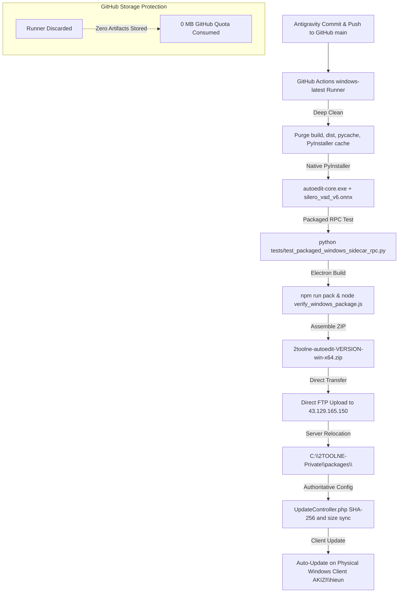

# 2TOOLNE OFFICIAL RELEASE PIPELINE ARCHITECTURE

**Policy Effective Date**: 2026-09-11  
**Authority**: Lead Engineering & Release Management  
**Status**: APPROVED & ACTIVE  

---

## 1. Core Architectural Principles

To ensure 100% binary integrity, bootloader stability, and cost-effective distribution across Windows production environments without incurring cloud storage overages, the 2TOOLNE release pipeline is architected as follows:

### GitHub Scope & Responsibilities
- ✅ **Source Code Repository**: Single source of truth for all modules, services, and tests.
- ✅ **Git Commit History & Audit**: Full cryptographic history and branch tracking.
- ✅ **Continuous Integration (CI)**: Automated unit, integration, and security test gates.
- ✅ **Native Windows Build Executor**: GitHub Actions `windows-latest` acts as the native Windows virtual build environment (running real Windows, Python 3.12, and official PyInstaller).
- ❌ **NO GitHub Artifact Storage for Release Packages**: Never upload large ZIP packages (~700-900 MB) or full NSIS installers to GitHub Artifacts (`actions/upload-artifact@v4`). This permanently eliminates storage quota exhaustion.
- ❌ **NO GitHub Releases for Customer Distribution**: Customer package distribution is strictly routed through the authoritative 2TOOLNE web server and secure download gate.

### Native Windows Build Environment
- **Build Machine**: GitHub Actions Windows Runner (`windows-latest`) OR dedicated Windows builder.
- **Native Toolchain**: Windows Python 3.12 + PyInstaller 6.x + Node.js 20.
- **Zero-Workaround Guarantee**:
  - Fresh native PyInstaller compilation generates pristine `autoedit-core.exe` with bundled VAD models.
  - **Strictly Forbidden**:
    - Patching `PYZ.pyz` or `CArchive` from macOS/Linux.
    - Splicing bytecode into frozen executables.
    - Using `base_library.zip` overrides or `_InternalPriorityFinder` hooks.

### Direct Server Distribution
- **Destination Server**: `43.129.165.150` (2TOOLNE Production Web & Package Infrastructure).
- **Delivery Mechanism**: Direct encrypted FTP/SFTP stream from the Windows build runner into `storage/packages/`.
- **Durable Private Storage**: Immediately relocated to `C:/2TOOLNE-Private/packages/` outside the web document root.
- **Authoritative Gate**: `UpdateController.php` dynamically enforces HMAC token authorization, 15-minute token TTL, and HTTP 206 partial streaming.

---

## 2. Release Execution Workflow



---

## 3. Workflow Implementation Specification

Each production release (e.g. 2.0.4, 2.0.5) is built and published using the automated GitHub Actions workflow (`.github/workflows/build-windows-release.yml`):

```yaml
name: Build & Deploy Windows Release (windows-latest)

on:
  workflow_dispatch:
    inputs:
      version:
        description: 'Release version (e.g. 2.0.5)'
        required: true
        default: '2.0.5'

jobs:
  build-and-deploy:
    runs-on: windows-latest
    steps:
      - uses: actions/checkout@v4
      - uses: actions/setup-python@v5
        with:
          python-version: '3.12'
      - uses: actions/setup-node@v4
        with:
          node-version: 20

      # 1. Clean build trees
      - name: Clean Build Trees
        run: |
          Remove-Item -Recurse -Force apps/capcut-v2/packaging/build, apps/capcut-v2/packaging/dist, apps/capcut-v2/desktop/dist -ErrorAction SilentlyContinue
          Remove-Item -Recurse -Force "$env:LOCALAPPDATA/pyinstaller" -ErrorAction SilentlyContinue

      # 2. Native Sidecar Compilation
      - name: Build Native Windows Sidecar
        run: python apps/capcut-v2/packaging/build_sidecar.py

      # 3. Direct Packaged Sidecar RPC Test
      - name: Validate Packaged Sidecar
        run: python tests/test_packaged_windows_sidecar_rpc.py

      # 4. Electron Desktop Package
      - name: Build Electron App
        run: |
          $targetDir = "apps/capcut-v2/desktop/resources/autoedit-core/win-x64"
          Copy-Item "apps/capcut-v2/packaging/dist/autoedit-core/*" -Destination $targetDir -Recurse -Force
          cd apps/capcut-v2/desktop
          npm ci
          npm run pack
          node scripts/verify_windows_package.js

      # 5. Immutable ZIP Compression
      - name: Assemble Release ZIP
        run: |
          $ver = "${{ github.event.inputs.version || '2.0.4' }}"
          $zip = "dist/2toolne-autoedit-$ver-win-x64.zip"
          Compress-Archive -Path "apps/capcut-v2/desktop/dist/win-unpacked/*" -DestinationPath $zip -Force

      # 6. Direct Upload to 2TOOLNE Production Server (Zero GitHub Artifacts)
      - name: Direct Deploy to 2TOOLNE Server
        run: |
          $ver = "${{ github.event.inputs.version || '2.0.4' }}"
          $pkg = "dist/2toolne-autoedit-$ver-win-x64.zip"
          curl.exe -T $pkg -u "${{ secrets.FTP_USER }}:${{ secrets.FTP_PASS }}" "ftp://43.129.165.150:21/storage/packages/2toolne-autoedit-$ver-win-x64.zip"
```

---

## 4. Verification Checklist for Every Release

| Step | Check | Standard |
| :--- | :--- | :---: |
| 1 | Native Windows Build | Built on GitHub Actions `windows-latest` or fixed Windows builder |
| 2 | Clean Bootloader | `autoedit-core.exe` starts without bootloader error (exit code 0) |
| 3 | Embedded VAD Model | `silero_vad_v6.onnx` present and validated in `_internal` |
| 4 | JSON-RPC Interface | Ping responds `PONG` and `version` matches target |
| 5 | CapCut Project Creation | RPC `GENERATE_CAPCUT_PROJECT` executes with zero `AttributeError` |
| 6 | Direct Server Upload | Package received at `ftp://43.129.165.150/storage/packages/` |
| 7 | Storage Isolation | File moved to `C:/2TOOLNE-Private/packages/` (outside webroot) |
| 8 | Zero GitHub Artifacts | `upload-artifact` is completely bypassed for large files |
| 9 | Client Discovery | `https://www.2tamne.site/api/v1/update/check` returns `has_update: true` |
| 10 | Stream Integrity | HTTP 206 Range stream delivers genuine ZIP header (`504b0304`) |
