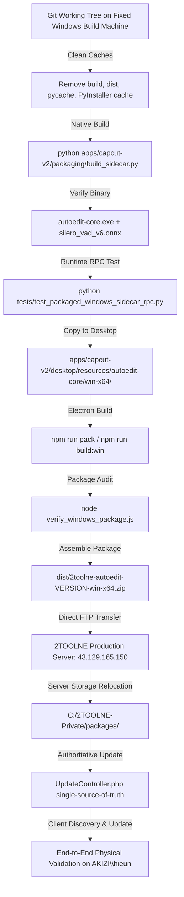

# 2TOOLNE OFFICIAL RELEASE PIPELINE ARCHITECTURE

**Policy Effective Date**: 2026-09-11  
**Authority**: Lead Engineering & Release Management  
**Status**: APPROVED & ACTIVE  

---

## 1. Core Architectural Mandate

To guarantee binary integrity, bootloader stability, and secure distribution across Windows production environments, the 2TOOLNE release pipeline strictly enforces the following core principles:

1. **GitHub Actions is NOT the Primary Release Pipeline**:
   - Cloud CI runners (e.g. GitHub Actions `windows-latest`) are utilized exclusively for automated continuous integration, pull request regression testing, and build sanity checks.
   - GitHub Actions is **NOT** permitted to act as the authoritative distributor of customer-facing production release binaries.

2. **Windows Binaries MUST Be Built on a Fixed Windows Build Machine**:
   - The native Windows binary (`autoedit-core.exe`) and Electron desktop bundles must be compiled natively on a designated, fixed Windows workstation/build machine.
   - The build environment must use standard Python 3.12, native PyInstaller, and the clean Windows toolchain.
   - **Strictly Forbidden**:
     - Cross-compilation from non-Windows platforms.
     - Manual splicing or mutation of PyInstaller CArchive or embedded `PYZ.pyz` archives.
     - Bytecode injection workarounds (e.g. modifying `base_library.zip` or installing `_InternalPriorityFinder` hooks).
     - Reusing stale binaries across releases without a fresh native rebuild.

3. **GitHub is Strictly for Source, History, and Backup**:
   - The GitHub repository (`tamne204/ffmpeg-tool`) serves as the single source of truth for:
     - Source code and version control.
     - Git commit history and audit trails.
     - Remote backup of specifications, configurations, and test suites.
   - No production release binary files or oversized packages are hosted in or distributed through GitHub Releases or GitHub Artifact storage.

4. **Release Packages Upload Directly to the 2TOOLNE Server**:
   - Release packages assembled on the fixed Windows build machine are transferred directly to the 2TOOLNE production infrastructure (`43.129.165.150`).
   - Packages are staged in `storage/packages/` and relocated immediately into private durable storage (`C:/2TOOLNE-Private/packages/`) outside the webroot.
   - Package metadata (SHA-256, byte size, release notes) is authoritatively registered in `UpdateController.php`.

---

## 2. Release Engineering Workflow



---

## 3. Automated Execution via Native PowerShell Script

The fixed Windows build machine executes the official pipeline using:

```powershell
powershell -ExecutionPolicy Bypass -File scripts/build_windows_release_native.ps1 -Version "2.0.4"
```

### Key Operations Performed:
1. **Deep Clean**: Purges `apps/capcut-v2/packaging/build`, `apps/capcut-v2/packaging/dist`, `apps/capcut-v2/desktop/dist`, and `$env:LOCALAPPDATA/pyinstaller`.
2. **Fresh Native PyInstaller Compilation**: Generates clean Windows PE binary `autoedit-core.exe` without binary tampering.
3. **Packaged Sidecar Runtime Test**: Executes `tests/test_packaged_windows_sidecar_rpc.py` to assert:
   - `SIDECAR_PROCESS_START = PASS`
   - `PROCESS_STAYS_ALIVE = PASS`
   - `JSON_RPC_READY = PASS`
   - `GENERATE_PROJECT_RPC = PASS`
   - `NO detector.status AttributeError = PASS`
4. **Electron Desktop Packaging**: Assembles the desktop bundle and runs `verify_windows_package.js`.
5. **Package Compression**: Creates `dist/2toolne-autoedit-<version>-win-x64.zip` and calculates cryptographic SHA-256 and byte length.
6. **Direct Server Deployment**: Securely uploads the manifest, sidecar binary backup, and update zip directly to `ftp://43.129.165.150/storage/packages/`.

---

## 4. Production Storage & Delivery Gate

- **Private Storage Path**: `C:/2TOOLNE-Private/packages/2toolne-autoedit-<version>-win-x64.zip`
- **Controller**: `website/api/v1/controllers/UpdateController.php`
- **Discovery Endpoint**: `GET https://www.2tamne.site/api/v1/update/check`
- **Streaming Endpoint**: `GET https://www.2tamne.site/api/v1/update/download?token=<hmac_token>`
  - Enforces 15-minute token TTL, HTTP Range byte streaming (HTTP 206), and strict path traversal isolation.

---

## 5. Verification Checklist for Releases

| Step | Requirement | Gate Status |
| :--- | :--- | :---: |
| 1 | Built on native Windows workstation/build machine (Python 3.12) | REQUIRED |
| 2 | Clean PyInstaller build without manual PYZ/CArchive mutation | REQUIRED |
| 3 | Embedded silero VAD ONNX model verified in `_internal` | REQUIRED |
| 4 | Packaged sidecar passes PING and project generation RPC | REQUIRED |
| 5 | Electron package verified via `verify_windows_package.js` | REQUIRED |
| 6 | Direct upload to `43.129.165.150` outside webroot | REQUIRED |
| 7 | `UpdateController.php` metadata matches exact byte size and SHA-256 | REQUIRED |
| 8 | Client auto-update verified on physical Windows target | REQUIRED |
