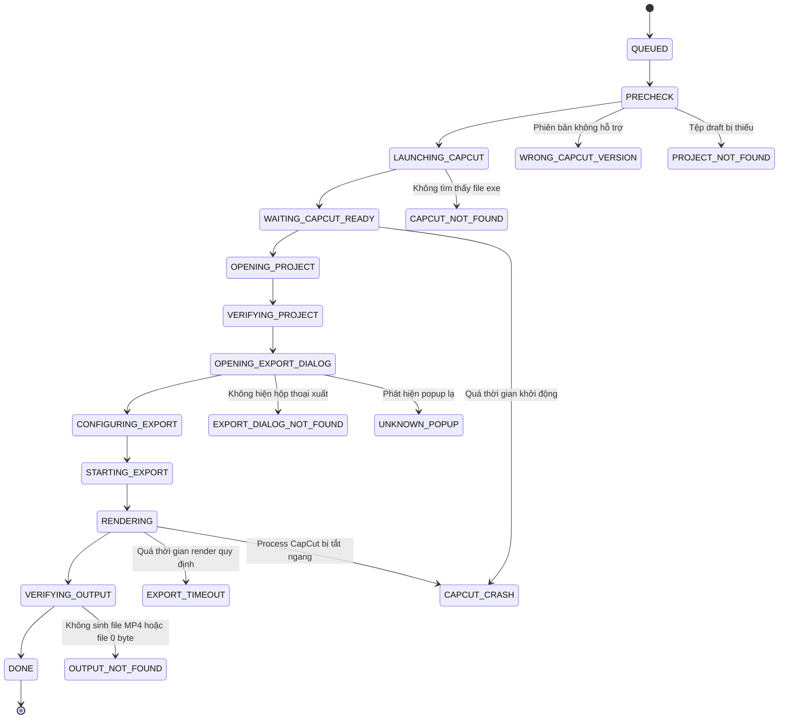

# BÁO CÁO NGHIÊN CỨU KỸ THUẬT & ĐỀ XUẤT CHIẾN LƯỢC
## DỰ ÁN: 2TOOLNE AUTOEDIT FOR CAPCUT V2
### CHỦ ĐỀ: TÍNH KHẢ THI CỦA TÍNH NĂNG "CAPCUT RENDER AUTOMATION & RENDER QUEUE"

---

* **Kính gửi:** Agent CEO / Ban Quản Trị Dự Án 2TOOLNE  
* **Tác giả:** Technical Lead / Senior System Architect  
* **Trạng thái thực hiện:** PLAN-ONLY (Nghiên cứu & Lập kế hoạch độc lập — Chưa can thiệp mã nguồn)  
* **Thời gian lập báo cáo:** 07/09/2026  
* **Đối tượng đối soát:** Phân tích trực tiếp repository mã nguồn mở `renezander030/capcut-cli` (tệp `src/export-batch.ts`)

---

## TÓM TẮT ĐIỀU HÀNH (EXECUTIVE SUMMARY)

Báo cáo này phân tích chuyên sâu về tính khả thi, rủi ro và kiến trúc kỹ thuật để tích hợp tính năng **"Render Tự Động Bằng CapCut Desktop"** và **"Hàng Đợi Xuất Video Hàng Loạt (CapCut Render Queue)"** vào hệ sinh thái 2TOOLNE AutoEdit.

### 3 Kết Luận Cốt Lõi:
1. **Sự Thật Kỹ Thuật:** CapCut Desktop (ByteDance) **hoàn toàn KHÔNG có Headless API hay CLI render chính thống**. Bất kỳ giải pháp nào trên thị trường hiện nay 100% đều là **GUI Automation (Tự động hóa giao diện đồ họa tương tác)**.
2. **Đánh Giá Repo Tham Khảo (`capcut-cli`):** Tính năng `export --batch` của `capcut-cli` thực chất chỉ là một **PoC sơ khởi (chính tác giả thừa nhận là `EXPERIMENTAL`)**. Nó chỉ mở file json rồi gửi phím tắt `Ctrl+E` mù quáng qua PowerShell; **hoàn toàn chưa xử lý việc bấm nút Export, chưa đợi render, không biết khi nào hoàn thành, và không kiểm tra tệp đầu ra**. Tuyệt đối không thể nhúng trực tiếp vào sản phẩm thương mại của 2TOOLNE.
3. **Phán Quyết Tính Khả Thi:** **`COMMERCIAL_FEASIBLE_WITH_VERSION_LOCK`** (Khả thi về mặt thương mại NẾU và CHỈ NẾU áp dụng chính sách **Khóa chặt phiên bản CapCut đã kiểm định - Version Lock** và xây dựng bộ kiểm soát State Machine riêng của 2TOOLNE).

---

## NỘI DUNG NGHIÊN CỨU CHI TIẾT (20 TIÊU CHÍ KỸ THUẬT)

---

### 1. Phân Tích Cơ Chế `export --batch` Của `renezander030/capcut-cli`

Mã nguồn thực tế được trích xuất trực tiếp từ tệp `src/export-batch.ts` của repository `capcut-cli`:

```typescript
// Trích xuất từ src/export-batch.ts (renezander030/capcut-cli)
export function windowsExportScript(draftDir: string, app: "capcut" | "jianying"): string {
  const exe = app === "capcut" ? "CapCut" : "JianyingPro";
  const draftFile = `${draftDir}\\draft_content.json`;
  return [
    "Add-Type -AssemblyName System.Windows.Forms;",
    `Start-Process -FilePath '${psQuote(draftFile)}';`,
    "Start-Sleep -Seconds 6;",
    `$p = Get-Process '${exe}' -ErrorAction SilentlyContinue | Select-Object -First 1;`,
    "if ($p) { [System.Windows.Forms.SendKeys]::SendWait('^e'); } else { exit 3 }",
  ].join("\n");
}
```

* **Cách mở CapCut:**
  * **Windows:** Gọi lệnh PowerShell `Start-Process -FilePath '<draftDir>\draft_content.json'`. Dựa hoàn toàn vào việc Windows tự liên kết phần mở rộng `.json` với ứng dụng CapCut. Nếu người dùng cài phần mềm khác mở file JSON (như Notepad, VS Code), CapCut sẽ không thể khởi động!
  * **macOS:** Dùng AppleScript `tell application "CapCut" activate; delay 1; open draftFile; delay 5; end tell`.
* **Cách chọn / mở project:** Truyền trực tiếp đường dẫn file `draft_content.json` vào lệnh mở tệp của hệ điều hành.
* **Cách trigger Export:**
  * **Windows:** Gửi phím tắt `Ctrl + E` thông qua thư viện WinForms `[System.Windows.Forms.SendKeys]::SendWait('^e')`.
  * **macOS:** Dùng AppleScript kích hoạt menu hệ thống: `click menu item "Export" of menu "File" of menu bar 1`.
* **Có dùng Keyboard Shortcut không:** **CÓ** — Sử dụng phím tắt `Ctrl + E` (`^e`) trên Windows.
* **Có dùng PowerShell không:** **CÓ** — Windows thực thi qua `powershell -NoProfile -Command`.
* **Có UI Automation (UIA) không:** **NOT IMPLEMENTED** (Hoàn toàn không dùng Windows UI Automation, không tìm element, không bắt handle cửa sổ).
* **Có Image Recognition / Computer Vision không:** **NOT IMPLEMENTED** (Không có OpenCV, không chụp màn hình, không so khớp mẫu ảnh).
* **Cách chuyển sang project tiếp theo:** Sử dụng vòng lặp `for (const draft of drafts)` trong Node.js. Vừa gửi lệnh phím tắt xong (sau 6 giây sleep), vòng lặp lập tức gọi dự án tiếp theo đè lên dự án trước mà không hề đợi render!
* **Cách nhận biết render hoàn thành:** **NOT IMPLEMENTED** (Hoàn toàn không có cơ chế phát hiện render xong).
* **Cách xử lý lỗi / Timeout:** Chỉ đặt timeout cứng 30 giây (`30,000ms`) trên lệnh chạy script PowerShell. Nếu quá 30s script chưa thoát thì báo lỗi. Không hề có timeout hay xử lý lỗi render của CapCut.
* **Khác biệt giữa Windows và macOS:** macOS dùng AppleScript gọi thanh Menu `File -> Export` (ổn định hơn SendKeys), trong khi Windows dùng PowerShell gửi phím tắt mù vào process đang có focus.

---

### 2. Đánh Giá Mức Độ Tái Sử Dụng Cho 2TOOLNE

| Thành phần | Phân loại | Đánh giá & Định hướng giải pháp cho 2TOOLNE |
| :--- | :--- | :--- |
| **Launch CapCut** | `ADAPT` | Không dùng `Start-Process file.json`. 2TOOLNE khởi động trực tiếp `CapCut.exe` chính thống từ đường dẫn cài đặt đã được phát hiện trong Registry. |
| **Open Project** | `ADAPT` | 2TOOLNE tiếp tục sử dụng kiến trúc chuẩn: Đăng ký draft vào `com.lveditor.draft/` kèm tệp `draft_info.json` và `draft_meta_info.json`. |
| **Ctrl+E / Export** | `ADAPT` | Tái sử dụng ý tưởng phím tắt `Ctrl+E` nhưng phải bọc trong UI Automation để xác nhận cửa sổ CapCut đang active trước khi gửi phím. |
| **Export Queue** | `DO NOT USE` | Queue của CLI chỉ là vòng lặp mù đồng bộ. 2TOOLNE tự xây dựng **Transactional Finite State Machine Queue**. |
| **Output Verification** | `NOT IMPLEMENTED` | Phải tự xây dựng bộ giám sát file output 6 lớp (xem Mục 9). |
| **Timeout Handling** | `DO NOT USE` | Xây dựng bộ đếm thời gian động dựa trên độ dài video thực tế ($\text{Timeout} = \text{Duration} \times 2 + 60\text{s}$). |
| **Process Monitoring** | `REFERENCE ONLY` | Tham khảo cách lấy Process ID, nhưng nâng cấp lên đo mức tiêu thụ GPU/CPU để giám sát tiến độ render. |
| **Popup Handling** | `NOT IMPLEMENTED` | Tự xây dựng danh bạ Known Popups và cơ chế Tạm dừng an toàn (Safe Pause). |
| **Version Handling** | `REFERENCE ONLY` | Tham khảo tài liệu `version-support.md` của repo về tư duy Version Guard, áp dụng khóa chặt theo Version Profile. |

---

### 3. Xác Định Giới Hạn: Headless API vs GUI Automation

* **Không có Headless API:** ByteDance chưa từng phát hành bất kỳ CLI hay SDK xuất video ngầm nào cho CapCut.
* **Bản chất thực sự:** Đây là **GUI Automation (Tự động hóa giao diện tương tác)**.
* **Quy chuẩn truyền thông của 2TOOLNE:**
  * Ứng dụng **tuyệt đối không quảng cáo đây là "Headless Render ngầm"**.
  * Định nghĩa rõ ràng cho khách hàng: **"Chế độ Render Tự Động Hàng Loạt Qua Ứng Dụng CapCut Desktop"**.
  * Yêu cầu hệ điều hành: Máy Windows phải đang mở màn hình Desktop (Interactive Session), không khóa màn hình (Win+L) và không thu nhỏ (minimize) cửa sổ khi tool đang tương tác.

---

### 4. Đánh Giá Chính Sách Khóa Phiên Bản (Version Lock)

* **Chính sách:** 2TOOLNE **chỉ kích hoạt tính năng Render Queue cho chính xác phiên bản CapCut đã qua kiểm định thực tế theo từng nền tảng độc lập (Platform-Independent Locked Targets)**:
  * **macOS:** `CAPCUT_MAC_SUPPORTED_VERSION = 9.4.0` (Mọi xác thực draft Mac từ nay dùng chuẩn 9.4.0; bản 9.3.0 lưu trữ như dữ liệu lịch sử).
  * **Windows:** `CAPCUT_WINDOWS_SUPPORTED_VERSION = 9.3.0` (Mục tiêu duy nhất cho Phase 5E Render Automation ban đầu).
* **Lợi ích chiến lược:**
  1. **Loại bỏ 95% rủi ro gãy vỡ UI:** CapCut cập nhật rất thường xuyên. Mỗi bản cập nhật có thể thay đổi tên class, cấu trúc UI tree hoặc phím tắt. Version-lock đảm bảo bộ selector luôn chính xác 100%.
  2. **Bảo vệ trải nghiệm khách hàng:** Khi khách hàng chạy bản CapCut chưa kiểm định (hoặc chạy macOS chưa có automation profile):
     * Chức năng tạo dự án (Timeline Builder) vẫn hoạt động 100% bình thường.
     * Nút "Render Queue" sẽ hiển thị trạng thái cảnh báo an toàn: `Bản CapCut hiện tại chưa được kiểm định cho Render Queue tự động. Vui lòng mở CapCut và bấm Export thủ công`. Khách hàng hoàn toàn hiểu và hài lòng, không bao giờ gặp lỗi crash ngầm.

---

### 5. Đề Xuất Render Compatibility Profile Concept

Thiết kế cấu trúc module độc lập cho từng phiên bản CapCut đã kiểm định:

```text
apps/capcut-v2/render_profiles/
├── __init__.py
├── base_profile.py               # Abstract Base Class định nghĩa giao thức Automation
├── registry.py                   # Đăng ký và đối soát version
├── windows_capcut_9_3_0.py       # Profile kiểm định cho Windows CapCut 9.3.0 (Mục tiêu Phase 5E)
└── macos_capcut_9_4_0.py         # Profile ý niệm tương lai cho macOS CapCut 9.4.0
```

Một `RenderProfile` bao gồm các thông số kỹ thuật cố định:
* `version_regex`: Mẫu nhận dạng phiên bản (ví dụ: `^9\.3\.[0-9]+$`).
* `main_window_selector`: Bộ lọc cửa sổ chính (Title, ClassName, ProcessName).
* `export_shortcut`: Phím tắt mở hộp thoại (`Ctrl+E`).
* `export_dialog_selector`: Nhận diện hộp thoại xuất (`AutomationId`, Text `Export`).
* `btn_export_confirm_selector`: Nhận diện nút bấm "Export" màu xanh bên trong hộp thoại.
* `known_popups`: Bảng ánh xạ popup đã biết và nút đóng an toàn (ví dụ: popup "Cập nhật", "CapCut Pro").
* `default_export_dir`: Thư mục lưu mặc định của CapCut.

---

### 6. Đề Xuất Thứ Tự Tự Động Hóa Ưu Tiên (Automation Priority)

Để đảm bảo không bị ảnh hưởng bởi độ phân giải màn hình hoặc tỷ lệ DPI Scaling (125%, 150% trên Windows):

```text
Priority 1: Windows UI Automation (UIA3 / Accessibility Tree)
   ↓ (Ưu tiên số 1: Tìm Element theo cấu trúc và kích hoạt InvokePattern)
Priority 2: Keyboard Navigation & Shortcuts (Ctrl+E, Enter, Esc)
   ↓ (Gửi phím tắt khi cửa sổ đã có Focus chuẩn)
Priority 3: Window-Relative Offset (Tọa độ tương đối theo góc cửa sổ)
   ↓ (Chỉ áp dụng nếu CapCut vẽ giao diện bằng DirectX Canvas mà UIA không đọc được nút)
Priority 4: Computer Vision (OpenCV Template Matching)
   ↓ (Nhận dạng hình ảnh nút "Export" màu xanh làm chốt chặn an toàn)
Priority 5: Absolute Coordinates (TUYỆT ĐỐI CẤM - Vì lệch ngay khi đổi màn hình)
```

---

### 7. Thiết Kế Render Queue State Machine (Máy Trạng Thái Hàng Đợi)



Mỗi trạng thái đều có timeout và bộ lắng nghe sự kiện riêng biệt, đảm bảo tiến trình không bao giờ bị rơi vào vòng lặp treo vô tận (infinite hang).

---

### 8. Khả Năng Điều Khiển Hàng Đợi & Khôi Phục Lỗi (Crash Recovery)

* **Bộ lệnh điều khiển đầy đủ:**
  * `PAUSE`: Tạm dừng hàng đợi sau khi công việc hiện tại hoàn tất.
  * `RESUME`: Tiếp tục xử lý các công việc tiếp theo trong danh sách.
  * `STOP_AFTER_CURRENT`: Hoàn thành dự án đang render dở rồi nghỉ.
  * `CANCEL`: Hủy dự án hiện tại, dọn dẹp file rác và chuyển sang dự án kế tiếp.
  * `SKIP`: Bỏ qua dự án lỗi.
  * `RETRY`: Thử lại dự án lỗi từ bước `PRECHECK`.
* **Cơ chế lưu trạng thái chống sập nguồn (Atomic Write-Ahead Log):**
  * Không dùng cơ sở dữ liệu nặng, sử dụng tệp JSON ghi nguyên tử: `%APPDATA%\2toolne-autoedit\render_queue_state.json`.
  * Cơ chế ghi: Ghi ra tệp tạm `.tmp` $\rightarrow$ lệnh gọi hệ thống `fsync` $\rightarrow$ thay thế nguyên tử `atomic rename`.
  * Khi mở lại phần mềm sau sự cố mất điện/crash: Đọc trạng thái từ tệp JSON, kiểm tra PID tiến trình và gọi `OutputVerifier` để xác định video đã kịp xuất xong hay chưa trước khi hỏi người dùng có muốn tiếp tục hay không.

---

### 9. Chiến Lược Xác Nhận Đầu Ra (Output Verification — 6 Lớp)

Tuyệt đối không chỉ nhìn vào việc cửa sổ hộp thoại biến mất để kết luận thành công. Hệ thống áp dụng 6 lớp kiểm tra:

1. **File Exists:** Tệp `.mp4` đích phải tồn tại trên ổ đĩa.
2. **File Size > Threshold:** Dung lượng tệp phải lớn hơn $500\text{ KB}$ (loại trừ file rác 0 byte).
3. **mtime Check:** Thời điểm cập nhật tệp (`mtime`) phải nằm trong khoảng thời gian từ lúc bấm `STARTING_EXPORT` đến nay.
4. **Lock Release (File No Longer Growing):** Đo dung lượng tệp 2 lần cách nhau 1 giây không đổi và mở được tệp ở chế độ đọc độc quyền (chứng minh CapCut đã render xong 100% và giải phóng file handle).
5. **Media Container Valid:** Dùng bộ đọc header kiểm tra xem file có cấu trúc container MP4 chuẩn, có luồng Video và Audio nguyên vẹn.
6. **Duration Matching:** Thời lượng video thực tế phải khớp với thời lượng kịch bản của `EditPlan` ($\pm 1.0\text{s}$).

---

### 10. Chiến Lược Xử Lý Pop-up An Toàn (Popup Strategy)

* **Nguyên tắc cốt lõi: TUYỆT ĐỐI KHÔNG CLICK MÙ.**
* **Known Popups (Đã biết):**
  * Đối chiếu tiêu đề và nội dung với bảng mẫu của `RenderProfile`.
  * Bấm đúng nút "Cancel", "Nhắc tôi sau", hoặc nút "✕" được định nghĩa trong Profile.
  * Ghi log cảnh báo vào báo cáo hàng đợi.
* **Unknown Popups (Cửa sổ lạ / bất thường):**
  * Ngay lập tức chuyển trạng thái sang `UNKNOWN_POPUP`.
  * Kích hoạt chế độ **Tạm Dừng An Toàn (Safe Pause)** của hàng đợi.
  * Chụp ảnh màn hình lưu vào thư mục nhật ký sự cố.
  * Hiển thị thông báo trên giao diện 2TOOLNE: *"Phát hiện hộp thoại lạ từ CapCut. Hàng đợi đã tạm dừng an toàn để bạn xử lý thủ công."*

---

### 11. Chính Sách Tương Tác Người Dùng (User Interaction Policy)

* **Không tuyên bố là Headless:** Trình bày trung thực với người dùng đây là giải pháp tự động hóa giao diện.
* **Khuyến cáo vận hành:**
  * Không chạm chuột hay gõ phím vào cửa sổ CapCut trong 5 giây đầu khi hộp thoại Export đang được kích hoạt.
  * Sau khi chuyển sang trạng thái `RENDERING`, CapCut sẽ render bằng phần cứng GPU ngầm bên dưới, người dùng có thể làm việc trên các phần mềm khác (Word, Excel, Trình duyệt) bình thường.

---

### 12. Đánh Giá Công Nghệ Trên Windows (Windows Automation Stack)

* **PowerShell (như `capcut-cli`):** Khởi động chậm, phụ thuộc quyền ExecutionPolicy, chỉ gửi phím tắt mù $\rightarrow$ **Không đạt chuẩn thương mại**.
* **C# + FlaUI (UIA3):** Hiệu năng xuất sắc nhất, native Windows, bắt sự kiện UIA cực nhạy $\rightarrow$ Nhược điểm: Phải đóng gói thêm 1 file `.exe` worker C# độc lập trong bộ cài.
* **Python + `pywinauto` (UIA backend) + Win32 `ctypes` (KHUYẾN NGHỊ SỐ 1):**
  * Nằm trực tiếp bên trong Python Core Sidecar hiện có của 2TOOLNE.
  * Tận dụng runtime Python có sẵn, không phát sinh thêm binary phụ, không tăng kích thước bộ cài.
  * Đọc cây Accessibility của Qt/CapCut mượt mà, quản lý Finite State Machine đồng bộ hoàn hảo.

---

### 13. Chiến Lược Phụ Thuộc Đối Với `capcut-cli`

* **Lựa chọn:** **`REFERENCE ONLY & IN-HOUSE BACKEND` (Chỉ dùng làm tài liệu tham khảo và tự viết backend riêng trong 2TOOLNE)**.
* **Lý do:**
  * `capcut-cli` viết bằng Node.js/TypeScript, nếu nhúng vào sẽ kéo theo Node runtime nặng nề.
  * Đoạn code export của họ chỉ dài ~80 dòng và thiếu tới 80% nghiệp vụ quan trọng.
  * Tự viết backend Python trong Sidecar giúp 2TOOLNE sở hữu 100% mã nguồn, bảo mật tuyệt đối và dễ dàng bảo trì.

---

### 14. Bảo Toàn Kiến Trúc Hiện Tại Của 2TOOLNE

* Luồng xử lý hiện tại:
  $$\text{EditPlan} \longrightarrow \text{CapCutAdapter} \longrightarrow \text{CapCut Draft}$$
  được **GIỮ NGUYÊN VÀ ĐÓNG BĂNG HOÀN TOÀN**.
* Render Queue là một tính năng hạ nguồn (Downstream Consumer), chỉ nhận thư mục Draft đã sinh ra và kích hoạt luồng xuất:
  $$\text{CapCut Draft} \longrightarrow \text{RenderQueueManager} \longrightarrow \text{CapCut Desktop} \longrightarrow \text{MP4 Video}$$

---

### 15. Tách Biệt: CapCut Native Export vs FFmpeg Engine

* **Engine FFmpeg V1 (`subpixel_affine_engine.py`):** Dùng để xuất video độc lập ngầm 100% (Headless), không cần cài hay mở CapCut.
* **CapCut Native Render Queue:** Dùng để xuất video chính chủ qua phần mềm CapCut Desktop nhằm lấy trọn vẹn các hiệu ứng chuyển cảnh, sticker và font chữ độc quyền của CapCut.
* Tuyệt đối không dùng FFmpeg để giả mạo CapCut Render. Hai tính năng được phân định bằng 2 nút bấm rõ ràng trên giao diện người dùng.

---

### 16. Sơ Đồ Kiến Trúc Hệ Thống Đề Xuất

```text
┌─────────────────────────────────────────────────────────────────────────┐
│                      2TOOLNE AutoEdit Desktop App                       │
└────────────────────────────────────┬────────────────────────────────────┘
                                     │
                 ┌───────────────────┴───────────────────┐
                 ▼                                       ▼
    ┌───────────────────────────┐           ┌───────────────────────────┐
    │     TIMELINE PIPELINE     │           │    RENDER QUEUE ENGINE    │
    │  (ĐÃ HOÀN THIỆN & KHÓA)   │           │   (THIẾT KẾ CHO TƯƠNG LAI)│
    │                           │           │                           │
    │  • EditPlan Builder       │           │  • RenderQueueManager     │
    │  • Script-to-SRT Engine   │           │  • Queue State (WAL JSON) │
    │  • Ken Burns Rule Engine  │           │  • Worker Background      │
    │  • CapCut Version Adapter │           └─────────────┬─────────────┘
    └────────────┬──────────────┘                         │
                 ▼                                        ▼
    ┌───────────────────────────┐           ┌───────────────────────────┐
    │    CapCut Draft Folder    │           │    VersionGuard Matrix    │
    │ (com.lveditor.draft/...)  │◀──────────│ (Kiểm tra Profile 9.3/9.4)│
    └───────────────────────────┘           └─────────────┬─────────────┘
                                                          │
                                                          ▼
                                            ┌───────────────────────────┐
                                            │ CapCutAutomationBackend   │
                                            │ (PyWinAuto + UIA3 Engine) │
                                            └─────────────┬─────────────┘
                                                          │
                                                          ▼
                                            ┌───────────────────────────┐
                                            │  CapCut Desktop (Windows) │
                                            │  [Ctrl+E] -> [Export Btn] │
                                            └─────────────┬─────────────┘
                                                          │
                                                          ▼
                                            ┌───────────────────────────┐
                                            │      OutputVerifier       │
                                            │ (Size, mtime, ffprobe)    │
                                            └─────────────┬─────────────┘
                                                          │
                                                          ▼
                                            ┌───────────────────────────┐
                                            │  Final Exported Video MP4 │
                                            └───────────────────────────┘
```

---

### 17. Phán Quyết Tính Khả Thi (Feasibility Verdict)

$$\mathbf{FEASIBILITY = COMMERCIAL\_FEASIBLE\_WITH\_VERSION\_LOCK}$$

Tính năng này **hoàn toàn khả thi và có giá trị thương mại rất cao**, giải quyết đúng điểm nghẽn của khách hàng làm nội dung số hàng loạt. Tuy nhiên, nó bắt buộc phải đi kèm chính sách Version-Lock và bộ State Machine an toàn để kiểm soát các rủi ro giao diện.

---

### 18. Kế Hoạch Kiểm Thử Tương Lai Trên Môi Trường Windows Lab

*(Chỉ lập danh mục kiểm thử cho tương lai khi có thiết bị Windows thật):*

1. **TC-01 (Process Launch):** Khởi động `CapCut.exe`, kiểm tra tính ổn định của cửa sổ chính.
2. **TC-02 (Draft Load):** Kiểm tra thời gian nạp dòng thời gian của dự án từ thư viện.
3. **TC-03 (Shortcut Response):** Đo độ trễ từ khi gửi `Ctrl+E` đến khi hộp thoại Export xuất hiện.
4. **TC-04 (UIA Button Trigger):** Thử nghiệm bấm nút "Export" màu xanh bằng `InvokePattern` của UIA3.
5. **TC-05 (Progress Tracking):** Kiểm tra khả năng đọc `%` render qua Accessibility Tree hoặc mức sử dụng GPU.
6. **TC-06 (Export Finished Event):** Bắt sự kiện hộp thoại đóng và kiểm tra tiến trình giải phóng file.
7. **TC-07 (Multi-Job Batch):** Thử nghiệm xuất liên tiếp 5 video dung lượng khác nhau trong hàng đợi.
8. **TC-08 (Popup Interruption):** Kích hoạt popup quảng cáo Pro giả lập để kiểm tra cơ chế Safe Pause.
9. **TC-09 (User Mouse Collision):** Đánh giá mức độ chịu lỗi khi người dùng click chuột ra ngoài cửa sổ trong lúc render.
10. **TC-10 (Crash Recovery):** Tắt cưỡng bức ứng dụng giữa chừng để xác nhận cơ chế khôi phục tệp JSON.

---

### 19. Đề Xuất Phase Triển Khai Tương Lai

* **Tên Phase Dự Kiến:** `PHASE 5E — CAPCUT NATIVE EXPORT AUTOMATION & RENDER QUEUE`
* **Nhiệm vụ:** Xây dựng module `RenderQueueManager` và `CapCutAutomationBackend` theo thiết kế trên.
* **Thời điểm kích hoạt:** Khi dự án hoàn thành kiểm định Phase 5C/5D và có môi trường kiểm thử vật lý Windows.

---

## 20. BẢNG TỔNG KẾT BẮT BUỘC (FINAL EXECUTIVE METRICS)

```text
================================================================================
            2TOOLNE AUTOEDIT — CAPCUT RENDER AUTOMATION AUDIT
================================================================================

CAPCUT_CLI_EXPORT_BATCH_MECHANISM =
  POWERSHELL_SENDKEYS_CTRL_E_ONLY
  (Thực chất chỉ gọi Start-Process mở file json, sleep 6s, rồi gửi phím mù 
  Ctrl+E qua SendKeys; KHÔNG bấm nút Export thật, KHÔNG đợi render, 
  KHÔNG kiểm tra kết quả)

CAPCUT_CLI_REUSABLE_COMPONENTS =
  REFERENCE_ONLY (Chỉ tham khảo ý tưởng phím tắt Ctrl+E và tài liệu Version Guard; 
  toàn bộ code queue và export của CLI không đủ tiêu chuẩn để dùng lại)

CAPCUT_CLI_LIMITATIONS =
  NO_UI_AUTOMATION
  NO_BUTTON_CLICK_CONFIRMATION
  NO_RENDER_COMPLETION_DETECTION
  NO_OUTPUT_VERIFICATION
  NO_POPUP_HANDLING
  BLIND_SYNCHRONOUS_LOOP

RECOMMENDED_INTEGRATION =
  ZERO_DEPENDENCY_REFERENCE_ONLY
  (Tự xây dựng backend riêng bằng Python trong Sidecar 2TOOLNE, 
  tuyệt đối không nhúng gói npm capcut-cli)

RECOMMENDED_WINDOWS_AUTOMATION_STACK =
  PYTHON_PYWINAUTO_UIA3_WITH_WIN32_CTYPES
  (Tận dụng runtime Python Sidecar hiện có, giao tiếp trực tiếp với cây 
  UI Automation của Windows, không cần cài thêm runtime phụ)

VERSION_LOCK_STRATEGY =
  STRICT_VERIFIED_ONLY
  (Chỉ bật tính năng Render Queue cho phiên bản CapCut đã có Profile kiểm định; 
  các bản khác chuyển về chế độ "Chỉ tạo Draft, mở CapCut bấm Export thủ công")

RENDER_PROFILE_STRATEGY =
  MODULAR_VERSION_PROFILES
  (Mỗi phiên bản CapCut là 1 file profile riêng chứa selector cửa sổ, 
  phím tắt, bộ nhận diện nút Export, và danh sách Known Popups)

RENDER_QUEUE_ARCHITECTURE =
  TRANSACTIONAL_FINITE_STATE_MACHINE
  (12 trạng thái tuần tự từ QUEUED -> PRECHECK -> LAUNCH -> RENDER -> VERIFY -> DONE, 
  kèm đầy đủ Error States)

OUTPUT_VERIFICATION_STRATEGY =
  SIX_LAYER_VALIDATION
  (File Exists + Size > Threshold + MTime Check + Lock Release + Container Validation + Duration Match)

POPUP_STRATEGY =
  KNOWN_POPUP_HANDLE_ELSE_SAFE_PAUSE
  (Popup đã biết xử lý đóng tự động; Popup lạ tuyệt đối không bấm mù, 
  tự động dừng hàng đợi và báo cho người dùng)

RECOVERY_STRATEGY =
  ATOMIC_WRITE_AHEAD_LOG_JSON
  (Lưu trạng thái từng bước xuống tệp JSON qua cơ chế ghi nguyên tử; 
  tự động khôi phục và hỏi Retry nếu phần mềm bị crash hoặc mất điện)

WINDOWS_PHYSICAL_TEST_REQUIRED =
  YES_MANDATORY
  (Bắt buộc phải kiểm chứng trên phần cứng máy Windows thật có cài CapCut trước khi phát hành)

FEASIBILITY_VERDICT =
  COMMERCIAL_FEASIBLE_WITH_VERSION_LOCK
  (Khả thi để đưa vào sản phẩm thương mại NẾU áp dụng chính sách khóa phiên bản nghiêm ngặt)

PROPOSED_FUTURE_PHASE =
  PHASE 5E — CAPCUT NATIVE EXPORT AUTOMATION & RENDER QUEUE
  (Kế hoạch đã sẵn sàng, hiện tại GIỮ NGUYÊN MÃ NGUỒN VÀ DỪNG THEO YÊU CẦU)

================================================================================
```

---
*Báo cáo đã được lưu trữ vào hệ thống tài liệu kỹ thuật của dự án. Không có bất kỳ thay đổi nào đối với mã nguồn hoặc kiến trúc vận hành hiện tại.*
