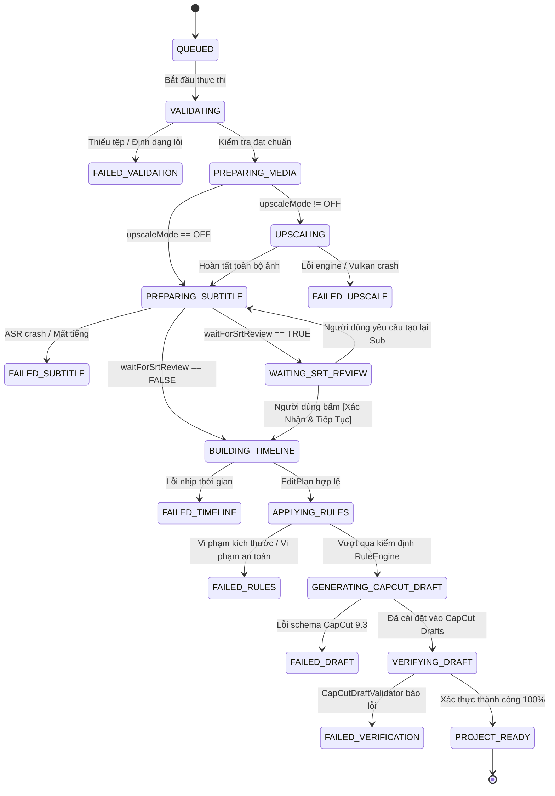
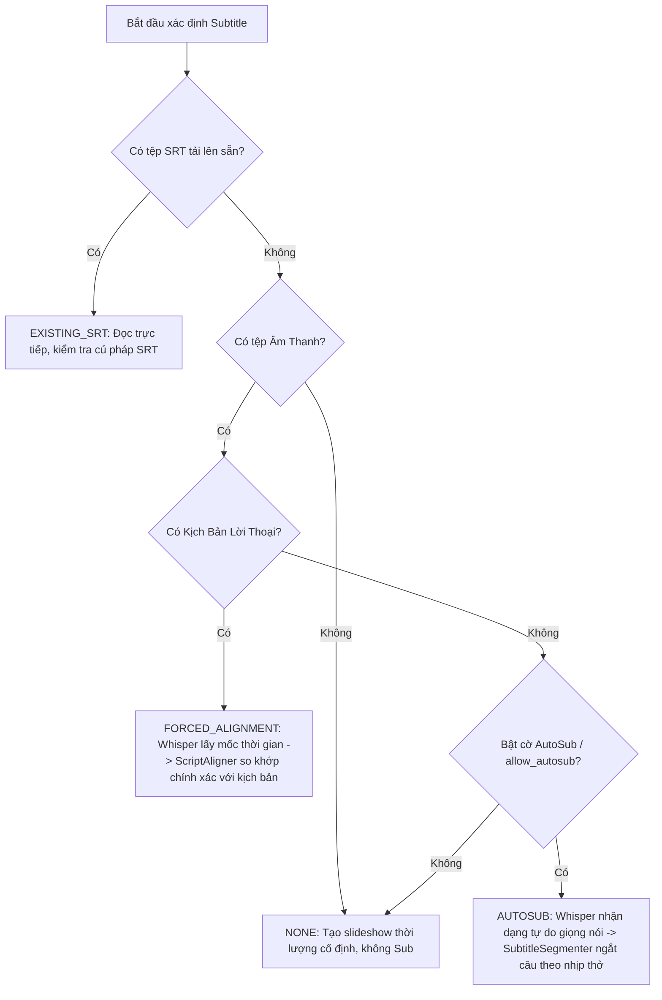

# BÁO CÁO NGHIÊN CỨU KIẾN TRÚC CHUYÊN SÂU: AUTOEDIT PROJECT BUILD QUEUE
**HỆ THỐNG HÀNG ĐỢI TẠO DỰ ÁN CAPCUT TỰ ĐỘNG - 2TOOLNE AUTOEDIT V2**

> **Tài liệu**: Nghiên cứu & Thiết kế Kiến trúc (Deep Architecture Research & Design Specification)  
> **Chế độ**: READ-ONLY ARCHITECTURE RESEARCH / PLAN ONLY  
> **Cam kết**: KHÔNG thay đổi mã nguồn sản phẩm (Product source remains untouched)  
> **Phiên bản mã nguồn kiểm toán**: Git HEAD `df40b144a30070d8bd9e180ced5b451570cabade` (Core) / `d047fb9` (Master)  
> **Ngày lập báo cáo**: 07/09/2026  
> **Tác giả**: Antigravity Engineering Architecture Team  

---

## MỤC LỤC

1. [Tổng Quan Hiện Trạng & Kiểm Toán Mã Nguồn (Current Queue Reality)](#1-tổng-quan-hiện-trạng--kiểm-toán-mã-nguồn)
2. [Phân Định Hai Hệ Thống Hàng Đợi Độc Lập (Two Distinct Queues Architecture)](#2-phân-định-hai-hệ-thống-hàng-đợi-độc-lập)
3. [Mô Hình Dữ Liệu Studio & Hành Vi Đóng Băng Snapshot (Project Queue Add Behavior)](#3-mô-hình-dữ-liệu-studio--hành-vi-đóng-băng-snapshot)
4. [Định Nghĩa Lược Đồ Dữ Liệu ProjectJob (ProjectJob Schema)](#4-định-nghĩa-lược-đồ-dữ-liệu-projectjob)
5. [Máy Trạng Thái Hữu Hạn Tạo Dự Án (Project Build FSM)](#5-máy-trạng-thái-hữu-hạn-tạo-dự-án)
6. [Đồ Thị Phụ Thuộc Giai Đoạn (Step Dependency Graph)](#6-đồ-thị-phụ-thuộc-giai-đoạn)
7. [Kiến Trúc & Hiện Thực Upscale/Resize (Upscale Engine Truth & Caching)](#7-kiến-trúc--hiện-thực-upscaleresize)
8. [Cơ Chế Phân Nhánh & Xử Lý Phụ Đề (Subtitle Decision Engine: FA vs AutoSub)](#8-cơ-chế-phân-nhánh--xử-lý-phụ-đề)
9. [Cổng Kiểm Duyệt Phụ Đề Không Chặn (SRT Review Gate & Asynchronous Resumption)](#9-cổng-kiểm-duyệt-phụ-đề-không-chặn)
10. [Ma Trận Vô Hiệu Hóa Phụ Thuộc (Dependency Invalidation Matrix)](#10-ma-trận-vô-hiệu-hóa-phụ-thuộc)
11. [Đồ Thị Sản Phẩm Trung Gian & Tính Bất Biến (Pipeline Artifact Graph)](#11-đồ-thị-sản-phẩm-trung-gian--tính-bất-biến)
12. [Cơ Chế Idempotency & Phục Hồi Tác Vụ Bị Gián Đoạn (Interrupted Job Recovery)](#12-cơ-chế-idempotency--phục-hồi-tác-vụ-bị-gián-đoạn)
13. [Chính Sách Lỗi Toàn Cục & Xử Lý Hàng Loạt (Global Queue Failure Policy & Batch Creation)](#13-chính-sách-lỗi-toàn-cục--xử-lý-hàng-loạt)
14. [Quản Lý & Điều Phối Tài Nguyên Hệ Thống (CPU/GPU Contention & Resource Locks)](#14-quản-lý--điều-phối-tài-nguyên-hệ-thống)
15. [Bảo Vệ Token & Giao Dịch Tín Dụng (Credit / Token Safety)](#15-bảo-vệ-token--giao-dịch-tín-dụng)
16. [Hợp Đồng Đạt Chuẩn Dự Án (PROJECT_READY Contract)](#16-hợp-đồng-đạt-chuẩn-dự-án)
17. [Cơ Chế Bàn Giao Sang Render Queue (Handoff to Render Queue)](#17-cơ-chế-bàn-giao-sang-render-queue)
18. [Giới Hạn Tương Tác CapCut CLI & Trải Nghiệm Thực Tế (Open in CapCut Truthful UX)](#18-giới-hạn-tương-tác-capcut-cli--trải-nghiệm-thực-tế)
19. [Thiết Kế Giao Diện & Kiến Trúc Thông Tin UI (UI/UX Specification)](#19-thiết-kế-giao-diện--kiến-trúc-thông-tin-ui)
20. [Kế Hoạch Di Trú & Lộ Trình Triển Khai (Migration Strategy & Phased Roadmap)](#20-kế-hoạch-di-trú--lộ-trình-triển-khai)

---

## 1. TỔNG QUAN HIỆN TRẠNG & KIỂM TOÁN MÃ NGUỒN

### 1.1. Hiện Trạng Thực Tế Của `autoedit_queue` (The "Phantom Queue")
Qua việc truy vết toàn bộ mã nguồn frontend và backend tại commit `df40b14`, phát hiện một lỗ hổng kiến trúc nghiêm trọng:
* **Nơi khởi tạo**: `apps/capcut-v2/desktop/src/renderer/app.js:947-972` gắn sự kiện `DOM.btnAddToQueue.addEventListener('click', ...)`:
  ```javascript
  const payload = assembleCurrentProjectPayload();
  const queueItem = {
    id: `job_${Date.now()}_${Math.random().toString(36).substring(2, 6)}`,
    name: payload.project_name,
    payload,
    status: 'WAITING',
    progress: 0,
    error: null,
    draftDir: null,
    addedAt: Date.now(),
  };
  state.queue.push(queueItem);
  await saveQueue(); // Ghi vào localStorage.autoedit_queue
  ```
* **Thực trạng**:
  1. Biến `state.queue` chỉ được tham chiếu đúng 3 lần trong toàn bộ codebase (`app.js:965`, `app.js:1936`, `app.js:1955`).
  2. **Không có bất kỳ hàm render nào** đưa dữ liệu của `state.queue` lên bảng giao diện người dùng.
  3. **Không có vòng lặp xử lý (Execution Loop)** hoặc worker nào theo dõi và lấy việc từ `state.queue` để thực thi.
  4. **Không có IPC handler hay Python bridge endpoint** nào tiếp nhận mảng này.
  5. Đây hoàn toàn là một **"Hàng đợi ảo" (Phantom Queue)** — dữ liệu người dùng bấm "Thêm vào hàng đợi" bị rơi vào hố đen (dead-end) trong `localStorage`.

### 1.2. Hiện Trạng Thực Tế Của `RenderQueueManager`
* **Nơi hiện thực**: `apps/capcut-v2/adapters/capcut/render_queue_manager.py` và `render_job.py`.
* **Bản chất**: Đây là một bộ điều phối FSM chạy đơn luồng tuần tự (`Single CapCut Worker`), kết nối trực tiếp với automation Win32 (`Win32AutomationDriver` / `CapCutNativeExporter`) để thực hiện xuất video `.mp4` từ các dự án CapCut **đã tồn tại sẵn trên ổ cứng**.
* **Trạng thái FSM**: `QUEUED` -> `PRECHECK` -> `STARTING_CAPCUT` -> `WAITING_CAPCUT_READY` -> `OPENING_PROJECT` -> `VERIFYING_PROJECT` -> `OPENING_EXPORT_DIALOG` -> `CONFIGURING_EXPORT` -> `STARTING_EXPORT` -> `RENDERING` -> `VERIFYING_OUTPUT` -> `DONE`.
* **Giao diện hiển thị**: Tab 2 (`#view-queue` trong `index.html:326-362`) đang được nối 1:1 với `state.renderQueue` (thông qua `app.js:993` `renderQueueTableFromState(queueData)`). Tab này chỉ hiển thị việc xuất video MP4, không hiển thị việc tạo dự án!

### 1.3. Lối Tắt Sinh Dự Án Hiện Tại (Direct Generation Pathway)
* Người dùng hiện chỉ có một cách duy nhất để tạo dự án: bấm nút `DOM.btnGenerateProject` ("Tạo Dự Án") trên Tab 1 (Studio).
* Lộ trình gọi: `app.js:884` -> `preload.js:46` (`window.autoedit.generateProject`) -> `main/index.js:475` (`sidecar:generate-project`) -> `bridge.py:396` (`_handle_generate_capcut_project`).
* Các bước trong `bridge.py`:
  1. `VALIDATING_INPUT`: Thẩm định file ảnh, âm thanh, kịch bản.
  2. `ALIGNING_SUBTITLES`: Nếu có kịch bản + âm thanh nhưng chưa có SRT -> gọi `ScriptToSrtPipeline().align_script_to_audio()`.
  3. `BUILDING_TIMELINE`: Gọi `TimelineBuilder(preset).build(...)` -> sinh `EditPlan`.
  4. `VALIDATING_EDIT_PLAN`: Gọi `EditPlan.validate(check_files_exist=True)`.
  5. `GENERATING_CAPCUT_DRAFT`: Gọi `CapCutProjectManager.create_project(...)` -> sinh nháp trong `staging`, xác thực bằng `CapCutDraftValidator`, khóa file `root_meta_info.json`, sao chép vào thư mục CapCut Drafts, rollback nếu thất bại.
* **Các thiếu sót chí mạng trong luồng này**:
  * Tùy chọn `auto_upscale` trong Studio bị **bỏ quên hoàn toàn**: `bridge.py` không hề đọc trường `auto_upscale` từ payload!
  * Nếu người dùng có âm thanh nhưng không có kịch bản và muốn dùng AutoSub, luồng tạo dự án không tự động chạy AutoSub mà buộc người dùng phải tự qua Tab 2 của Subtitle để bấm thủ công trước.
  * Không thể xếp hàng nhiều dự án Studio để máy tự làm qua đêm. Người dùng phải bấm từng dự án, chờ xong mới cấu hình tiếp dự án sau.

---

## 2. PHÂN ĐỊNH HAI HỆ THỐNG HÀNG ĐỢI ĐỘC LẬP

Kiến trúc chuẩn hóa bắt buộc phải tách biệt rạch ròi hai phân hệ hàng đợi (Two Distinct Queues):

```
┌────────────────────────────────────────────────────────────────────────────────────────┐
│                                STUDIO CONFIGURATION                                    │
│   (Images, Aspect Ratio, Audio, Script/AutoSub, Motion Presets, Upscale Toggle/Engine) │
└───────────────────────────────────────────┬────────────────────────────────────────────┘
                                            │ [Thêm vào hàng đợi] (Snapshot)
                                            ▼
┌────────────────────────────────────────────────────────────────────────────────────────┐
│                        QUEUE A: PROJECT BUILD QUEUE (HÀNG ĐỢI TẠO DỰ ÁN)               │
│                                                                                        │
│  [Job 1: QUEUED]  ──► [VALIDATING] ──► [UPSCALING] ──► [SUBTITLES (FA/AutoSub)]        │
│                                                              │                         │
│                                                [WAITING_SRT_REVIEW] (Optional Gate)    │
│                                                              │                         │
│  [PROJECT_READY] ◄── [VERIFYING] ◄── [DRAFT_GEN] ◄── [TIMELINE & RULES] ◄─────────────┘
└───────────────────────────────────────────┬────────────────────────────────────────────┘
                                            │
               ┌────────────────────────────┴────────────────────────────┐
               │ [Render Ngay]                                           │ [Thêm vào Render Queue]
               ▼                                                         ▼
┌────────────────────────────────────────────────────────────────────────────────────────┐
│                        QUEUE B: CAPCUT RENDER QUEUE (HÀNG ĐỢI XUẤT VIDEO)              │
│                                                                                        │
│  [Job 1: QUEUED] ──► [PRECHECK] ──► [START_CAPCUT] ──► [OPEN_PROJECT]                  │
│                                                              │                         │
│  [FINAL MP4 DONE] ◄── [VERIFY_OUTPUT] ◄── [RENDERING] ◄── [TRIGGER_EXPORT (Ctrl+E)]   │
└────────────────────────────────────────────────────────────────────────────────────────┘
```

### Bảng So Sánh Trách Nhiệm Rõ Ràng:

| Tiêu Chí | Hàng Đợi A: Project Build Queue | Hàng Đợi B: CapCut Render Queue |
| :--- | :--- | :--- |
| **Mục tiêu tối thượng** | Biên dịch từ nguyên liệu thô thành **CapCut Draft hoàn chỉnh** | Xuất từ CapCut Draft thành **tệp video `.mp4` hoàn chỉnh** |
| **Đầu vào** | Ảnh thô, File âm thanh, Kịch bản/AutoSub, Cấu hình chuyển động | Đường dẫn thư mục `draft_dir` hợp lệ, cấu hình profile render |
| **Đầu ra** | Trạng thái `PROJECT_READY` (Draft nằm trong CapCut Drafts & `root_meta_info.json`) | File video MP4 đã được `OutputVerifier` kiểm tra kích thước & bitrate |
| **Tài nguyên sử dụng** | CPU, GPU Vulkan (Real-ESRGAN), Torch ASR (Faster-Whisper), Disk I/O | Win32 Desktop GUI, DirectX Render Engine của CapCut, NVENC/VCE |
| **Tính tương tác** | Hỗ trợ điểm dừng kiểm duyệt SRT (`WAITING_SRT_REVIEW`) | Chạy tự động không can thiệp chuột/bàn phím (`CapCutOwnershipManager`) |
| **Hiện thực mã nguồn** | Module mới `ProjectBuildQueueManager` (Node.js/Python sidecar) | Đã có sẵn: `adapters/capcut/render_queue_manager.py` |

---

## 3. MÔ HÌNH DỮ LIỆU STUDIO & HÀNH VI ĐÓNG BĂNG SNAPSHOT

### 3.1. Hành Vi Khi Bấm `[Thêm vào hàng đợi]`
Khi người dùng bấm `[Thêm vào hàng đợi]` (`DOM.btnAddToQueue`), hệ thống **không** thực hiện ngay các tác vụ nặng (như Upscale hay chạy Whisper). Thay vào đó:
1. Thực hiện thẩm định nhanh (Fast validation): Kiểm tra xem danh sách ảnh có rỗng không, file âm thanh có tồn tại trên đĩa không.
2. **Đóng băng toàn bộ cấu hình (Deep Freeze Snapshot)** thành một đối tượng `ProjectJob`.
3. Gán mã định danh duy nhất `job_id = "build_" + uuid4().hex[:12]`.
4. Đẩy vào hàng đợi `ProjectBuildQueueManager`, lưu bền vững vào đĩa.
5. Hiển thị thông báo Toast: `Đã thêm dự án "<Tên Dự Án>" vào Hàng Đợi Tạo Dự Án`.
6. Tự động đổi tên dự án trên giao diện Studio sang tên kế tiếp (ví dụ: `AutoEdit_Project_002`) để người dùng tiếp tục làm việc mà **hoàn toàn không làm sai lệch dự án vừa xếp hàng**.

### 3.2. Danh Sách Các Trường Bắt Buộc Phải Đóng Băng (Frozen Fields)
```typescript
interface StudioConfigSnapshot {
  projectName: string;               // Tên hiển thị dự án
  aspectRatio: "9:16" | "16:9" | "1:1" | "4:5";
  fps: number;                       // Mặc định 60.0 hoặc 30.0
  mediaList: Array<{                 // Danh sách ảnh nguyên bản
    id: string;
    path: string;
    name: string;
    size: number;
  }>;
  audioPath: string | null;          // Đường dẫn âm thanh gốc
  audioDurationMs?: number;          // Độ dài tính toán trước (nếu có)
  
  // Phụ đề
  subtitleMode: "NONE" | "EXISTING_SRT" | "FORCED_ALIGNMENT" | "AUTOSUB";
  scriptText: string | null;         // Văn bản kịch bản gốc nếu dùng FA
  srtSource: string | null;          // Nội dung SRT nếu tự tải file lên
  waitForSrtReview: boolean;         // Cờ: Có dừng lại đợi người dùng duyệt SRT không?
  captionStyle: {
    fontSize: number;                // Cỡ chữ phụ đề (pt)
    positionY: number;               // Tọa độ Y (-0.6 -> đáy)
    color: string;
  };

  // Nâng cấp hình ảnh
  upscaleMode: "OFF" | "LANCZOS" | "REAL_ESRGAN";
  upscaleResolution: "2K" | "4K";    // Tỉ lệ scale x2 hoặc x4

  // Chuyển động & Thời lượng
  timingMode: "FIXED" | "SRT_DRIVEN";
  customClipDurationS: number;       // Thời lượng mỗi ảnh nếu timingMode == FIXED
  motionWeights: {
    zoom_in: number;
    zoom_out: number;
    pan_left: number;
    pan_right: number;
    static: number;
    shake: number;
  };
  presetId: string;                  // Mẫu hiệu ứng chuyển động CapCut
}
```

---

## 4. ĐỊNH NGHĨA LƯỢC ĐỒ DỮ LIỆU `ProjectJob`

Lược đồ dữ liệu `ProjectJob` hoàn chỉnh được quản lý dưới dạng JSON và mô hình hóa trong Python Dataclass / TypeScript Interface:

```typescript
export type BuildJobStatus =
  | "QUEUED"
  | "VALIDATING"
  | "PREPARING_MEDIA"
  | "UPSCALING"
  | "PREPARING_SUBTITLE"
  | "WAITING_SRT_REVIEW"     // Điểm dừng kiểm duyệt người dùng
  | "BUILDING_TIMELINE"
  | "APPLYING_RULES"
  | "GENERATING_CAPCUT_DRAFT"
  | "VERIFYING_DRAFT"
  | "PROJECT_READY"          // Đạt chuẩn chuyển giao sang Render Queue
  | "PAUSED"
  | "CANCELLED"
  | "FAILED";

export interface ProjectJob {
  // Định danh & Thời gian
  jobId: string;                     // "build_a1b2c3d4e5f6"
  createdAt: number;                 // Unix timestamp ms
  updatedAt: number;
  startedAt?: number;
  completedAt?: number;

  // Cấu hình Studio bất biến
  config: StudioConfigSnapshot;

  // Trạng thái FSM tổng thể
  status: BuildJobStatus;
  progressPercent: number;           // 0 -> 100
  currentStage: string;              // Chuỗi mô tả tiếng Việt hiển thị UI
  lastError?: {
    stage: string;
    errorCode: string;
    message: string;
    details?: any;
    failedAsset?: string;            // Đường dẫn tệp gây lỗi (nếu có)
  };

  // Tiến trình chi tiết từng bước (Step-level state)
  steps: {
    validation: { status: "PENDING" | "RUNNING" | "DONE" | "FAILED"; error?: string };
    upscale: {
      status: "SKIPPED" | "PENDING" | "RUNNING" | "DONE" | "FAILED";
      totalImages: number;
      completedImages: number;
      currentImage?: string;
    };
    subtitles: {
      status: "SKIPPED" | "PENDING" | "RUNNING" | "DONE" | "FAILED";
      mode: "NONE" | "EXISTING_SRT" | "FORCED_ALIGNMENT" | "AUTOSUB";
      reviewedByUser: boolean;
    };
    timeline: { status: "PENDING" | "RUNNING" | "DONE" | "FAILED" };
    draftGeneration: { status: "PENDING" | "RUNNING" | "DONE" | "FAILED" };
    draftVerification: { status: "PENDING" | "RUNNING" | "DONE" | "FAILED" };
  };

  // Bảng ánh xạ tệp & Dấu vân tay kiểm tra (Artifacts & Fingerprints)
  fingerprints: {
    mediaHash: string;               // SHA256 kết hợp danh sách ảnh đầu vào
    audioHash: string;               // SHA256 tệp âm thanh
    scriptHash: string;              // SHA256 nội dung kịch bản
    srtHash?: string;                // SHA256 phụ đề cuối cùng được áp dụng
  };

  artifacts: {
    derivedMediaMap: Record<string, string>; // originalPath -> upscaledPath
    generatedSrtContent?: string;    // SRT do Whisper / FA tạo ra
    finalReviewedSrtContent?: string;// SRT sau khi người dùng sửa
    editPlanJsonPath?: string;       // Đường dẫn lưu EditPlan trung gian
    draftId?: string;                // ID của CapCut Draft
    stagingDraftDir?: string;        // Thư mục staging tạm
    installedDraftDir?: string;      // Thư mục chính thức trong CapCut Drafts
  };

  // Khóa giao dịch tín dụng (Token billing)
  tokenTransaction?: {
    reservedTokens: number;
    committedTokens: number;
    idempotencyKey: string;
    chargedAssets: string[];         // Danh sách SHA256 ảnh đã trừ điểm thành công
  };
}
```

---

## 5. MÁY TRẠNG THÁI HỮU HẠN TẠO DỰ ÁN (PROJECT BUILD FSM)

Máy trạng thái hữu hạn của Hàng Đợi Tạo Dự Án được chuẩn hóa nghiêm ngặt với các quy tắc chuyển dịch:



### Chi Tiết Từng Trạng Thái:
1. **`QUEUED`**: Nằm trong danh sách chờ, chưa chiếm dụng CPU/GPU.
2. **`VALIDATING`**: Kiểm tra sự tồn tại của file ảnh, âm thanh, tính tương thích của kích thước.
3. **`PREPARING_MEDIA`**: Chuẩn bị thư mục `derived_media/<jobId>/`, phân tích độ phân giải gốc của ảnh.
4. **`UPSCALING`**: Chạy tuần tự phóng to ảnh qua Real-ESRGAN hoặc Lanczos. Có khả năng lưu checkpoint từng ảnh.
5. **`PREPARING_SUBTITLE`**: Chạy Forced Alignment (nếu có kịch bản) hoặc AutoSub (nếu không có kịch bản).
6. **`WAITING_SRT_REVIEW`** (Cực kỳ quan trọng): Dừng lại để người dùng xem và chỉnh sửa từ ngữ, ngắt dòng. **Điểm mấu chốt**: Trạng thái này không khóa worker của Build Queue; worker sẽ lập tức chuyển sang thực hiện dự án tiếp theo trong danh sách chờ!
7. **`BUILDING_TIMELINE`**: Tính toán thời lượng hiển thị từng ảnh khớp với từng câu phụ đề hoặc nhịp cố định.
8. **`APPLYING_RULES`**: `RuleEngine` kiểm tra va chạm chuyển động, thời lượng clip tối thiểu (>= 0.5s), hiệu ứng an toàn.
9. **`GENERATING_CAPCUT_DRAFT`**: Tạo nháp trong thư mục staging, đăng ký vào `root_meta_info.json`.
10. **`VERIFYING_DRAFT`**: `CapCutDraftValidator` kiểm tra tính toàn vẹn của JSON, tracks, materials, canvas ratio.
11. **`PROJECT_READY`**: Dự án đã sẵn sàng 100% trong CapCut. Kích hoạt các nút `[Mở CapCut]`, `[Render Ngay]`, `[Thêm vào Render Queue]`.

---

## 6. ĐỒ THỊ PHỤ THUỘC GIAI ĐOẠN (STEP DEPENDENCY GRAPH)

Mỗi giai đoạn tạo dự án có các điều kiện tiên quyết (Prerequisites) và sản phẩm đầu ra (Artifacts) rõ ràng:

```
[MEDIA FILES] ───────────────┬──► Step 2: UPSCALING ───────► [DERIVED MEDIA] ──┐
                             │                                                 │
[AUDIO + SCRIPT / AUTOSUB] ──┼──► Step 3: SUBTITLES ───────► [SRT CUES] ───────┼──► Step 4: TIMELINE ──► Step 5: DRAFT GEN
                             │                                                 │
[MOTION & ASPECT RATIO] ─────┴─────────────────────────────────────────────────┘
```

* **Tính độc lập giữa Upscale và Phụ đề**:
  * Giai đoạn `UPSCALING` và `PREPARING_SUBTITLE` hoàn toàn độc lập về mặt dữ liệu logic: Phụ đề chỉ cần file âm thanh + kịch bản; Upscale chỉ cần các file ảnh.
  * Tuy nhiên, vì lý do **tranh chấp tài nguyên GPU** (Real-ESRGAN và Faster-Whisper cùng tranh VRAM), hai bước này phải được thực thi tuần tự trên các máy tính thông thường (hoặc phân bổ VRAM có kiểm soát).

---

## 7. KIẾN TRÚC & HIỆN THỰC UPSCALE/RESIZE

### 7.1. Sự Thật Về Engine Hiện Tại (Audit Truth)
Kiểm tra tệp `apps/capcut-v2/desktop/src/main/index.js:588-764`:
* Hiện tại hệ thống hỗ trợ 2 chế độ:
  1. `realesrgan-ncnn-vulkan`: Tìm kiếm file thực thi `realesrgan-ncnn-vulkan.exe` trong các đường dẫn `engine/` hoặc package test. Nếu tìm thấy, thực thi qua cờ `-i input -o output -s 2|4 -f png`.
  2. `Lanczos Fallback`: Nếu không có binary AI hoặc trên máy Mac không có NCNN, hệ thống dùng `ffmpeg -vf scale=...flags=lanczos` hoặc tiện ích `sips` của macOS.
* **Nguyên tắc kỹ thuật**: Tuyệt đối **không được gán nhãn** thuật toán nội suy cổ điển Lanczos là "AI Upscale". Giao diện phải định nghĩa trường rõ ràng:
  `upscale_mode = "OFF" | "LANCZOS" | "REAL_ESRGAN"`.

### 7.2. Nguyên Tắc An Toàn Tệp & Checkpoint Bền Vững
1. **Không bao giờ ghi đè file gốc**:
   * Tất cả ảnh sau khi phóng to phải được lưu vào thư mục dẫn xuất riêng biệt:  
     `~/.2toolne-autoedit/derived_media/<jobId>/<assetHash>_upscaled_<2K|4K>.png`.
2. **Bảng Ánh Xạ Asset (Original -> Final Mapping)**:
   * `ProjectJob.artifacts.derivedMediaMap` lưu trữ ánh xạ:  
     `"D:/Photos/pic1.jpg" => "C:/Users/.../derived_media/build_123/pic1_upscaled_2K.png"`.
   * Trình tạo dòng thời gian `TimelineBuilder` và CapCut Draft sẽ trỏ trực tiếp đến đường dẫn cuối cùng này.
3. **Idempotent Checkpointing (Lưu Tiến Trình Từng Ảnh)**:
   * Trước khi upscale ảnh thứ $i$, kiểm tra xem file đích đã tồn tại và có dung lượng hợp lệ (> 10KB) hay không.
   * Nếu có một tập 50 ảnh, và quá trình bị lỗi ở ảnh thứ 37:
     * Trạng thái job lưu: `completedImages = 36`, `failedAsset = "image_37.png"`.
     * Khi người dùng bấm `[Thử Lại (Retry)]`, worker **tái sử dụng 36 ảnh đầu tiên**, chỉ thực hiện tiếp từ ảnh 37 đến 50. Không bao giờ chạy lại từ đầu!

---

## 8. CƠ CHẾ PHÂN NHÁNH & XỬ LÝ PHỤ ĐỀ

Kiểm toán mã nguồn xác nhận module `apps/capcut-v2/core/subtitles/pipeline.py` (`ScriptToSrtPipeline`) đã tích hợp hoàn hảo cả hai cơ chế. Không được tạo thêm ASR pipeline thứ hai.

### Sơ Đồ Cây Quyết Định (Decision Tree):



### Các Thông Số Cần Đưa Vào `ProjectJob.artifacts`:
* `generatedSrtContent`: Nội dung file SRT thô sinh ra từ thuật toán.
* `srtCues`: Danh sách đối tượng `[{ index, startMs, endMs, text }]` để nạp thẳng vào giao diện xem/chỉnh sửa của người dùng.

---

## 9. CỔNG KIỂM DUYỆT PHỤ ĐỀ KHÔNG CHẶN (SRT REVIEW GATE)

Đây là yêu cầu then chốt của Chủ Sở Hữu (OWNER): Cho phép người dùng kiểm tra lại phụ đề trước khi xuất thành dự án CapCut, nhưng **không được làm nghẽn** hàng đợi xử lý chung.

### 9.1. Hai Chế Độ Vận Hành:
1. **`AUTO_CONTINUE`** (`waitForSrtReview = false`):
   * Sau khi bước `PREPARING_SUBTITLE` xong, job tự động chuyển sang `BUILDING_TIMELINE` -> `GENERATING_CAPCUT_DRAFT` -> `PROJECT_READY`.
2. **`WAIT_FOR_SRT_REVIEW`** (`waitForSrtReview = true`):
   * Sau khi bước `PREPARING_SUBTITLE` xong, job chuyển trạng thái thành `WAITING_SRT_REVIEW`.
   * Gửi thông báo trên giao diện: `Dự án "<Tên Dự Án>" đang đợi bạn duyệt phụ đề!`.
   * Trên hàng đợi, dòng dự án hiển thị nút màu vàng: `[✏️ Xem & Sửa Phụ Đề]`.

### 9.2. Cơ Chế Bất Đồng Bộ Không Chặn (Non-Blocking Queue Worker)
* Vòng lặp điều phối của `ProjectBuildQueueManager` khi gặp job ở trạng thái `WAITING_SRT_REVIEW`:
  * **Không dừng vòng lặp (Do not block/sleep)**.
  * Bỏ qua job này và chuyển sang tìm job tiếp theo đang ở trạng thái `QUEUED` để tiếp tục thực hiện `VALIDATING` / `UPSCALING` cho dự án sau.
* Khi người dùng bấm `[✏️ Xem & Sửa Phụ Đề]`:
  * Mở Modal biên tập SRT (tái sử dụng component Subtitle Editor có sẵn trên giao diện).
  * Người dùng có thể sửa từ ngữ, thay đổi thời gian bắt đầu/kết thúc.
  * Bấm `[Lưu & Tiếp Tục Sinh Dự Án]`:
    * Hệ thống cập nhật `finalReviewedSrtContent`.
    * Chuyển trạng thái job từ `WAITING_SRT_REVIEW` thành `BUILDING_TIMELINE`.
    * Kích hoạt worker xử lý nốt các bước còn lại của job đó.

---

## 10. MA TRẬN VÔ HIỆU HÓA PHỤ THUỘC (DEPENDENCY INVALIDATION MATRIX)

Khi một dự án đã được xếp hàng hoặc đang hoàn thiện dở dang mà người dùng thực hiện chỉnh sửa cấu hình đầu vào, hệ thống phải biết chính xác phần việc nào còn dùng lại được và phần việc nào bị vô hiệu hóa (Stale):

| Thay Đổi Từ Người Dùng | Ảnh Hưởng Tới Upscale | Ảnh Hưởng Tới Phụ Đề | Ảnh Hưởng Tới Timeline | Ảnh Hưởng Tới CapCut Draft | Hành Động Phục Hồi |
| :--- | :--- | :--- | :--- | :--- | :--- |
| **Đổi file âm thanh** | Không ảnh hưởng (Tái sử dụng) | **Vô hiệu hóa (Stale)** | **Vô hiệu hóa (Stale)** | **Vô hiệu hóa (Stale)** | Chạy lại Whisper từ đầu, giữ nguyên ảnh đã phóng to |
| **Sửa văn bản kịch bản** (Chế độ FA) | Không ảnh hưởng (Tái sử dụng) | **Vô hiệu hóa (Stale)** | **Vô hiệu hóa (Stale)** | **Vô hiệu hóa (Stale)** | Chạy lại ScriptAligner (tái sử dụng ASR audio cache nếu được) |
| **Chỉnh sửa SRT trong Review Gate** | Không ảnh hưởng (Tái sử dụng) | Đã cập nhật (Valid) | **Vô hiệu hóa (Stale)** | **Vô hiệu hóa (Stale)** | Chạy lại TimelineBuilder & Draft Generator |
| **Thêm / Xóa / Đổi vị trí ảnh** | Chỉ upscale các ảnh mới thêm | Không ảnh hưởng (Tái sử dụng) | **Vô hiệu hóa (Stale)** | **Vô hiệu hóa (Stale)** | Tận dụng cache ảnh cũ, chỉ dựng lại timeline |
| **Đổi Preset / Trọng số chuyển động** | Không ảnh hưởng (Tái sử dụng) | Không ảnh hưởng (Tái sử dụng) | **Vô hiệu hóa (Stale)** | **Vô hiệu hóa (Stale)** | Dựng lại EditPlan và sinh lại CapCut Draft |
| **Đổi Tỉ lệ khung hình (Aspect Ratio)** | Không ảnh hưởng (Tái sử dụng) | Không ảnh hưởng (Tái sử dụng) | **Vô hiệu hóa (Stale)** | **Vô hiệu hóa (Stale)** | Dựng lại CapCut Draft theo canvas mới |

---

## 11. ĐỒ THỊ SẢN PHẨM TRUNG GIAN & TÍNH BẤT BIẾN (PIPELINE ARTIFACT GRAPH)

Toàn bộ các tệp trung gian phải được lưu trữ có cấu trúc rõ ràng tại thư mục dữ liệu cục bộ của ứng dụng (`~/.2toolne-autoedit/workspace/<jobId>/`), không dựa dẫm vào bộ nhớ tạm RAM hay trạng thái ẩn của Renderer:

```
~/.2toolne-autoedit/
├── project_build_queue.json          <-- Tệp lưu toàn bộ danh sách và trạng thái các job
├── workspace/
│   └── build_a1b2c3d4/
│       ├── manifest.json              <-- Snapshot dữ liệu đóng băng của job
│       ├── derived_media/             <-- Chứa ảnh phóng to x2/x4 (nếu có)
│       │   ├── img_001_upscaled_2K.png
│       │   └── img_002_upscaled_2K.png
│       ├── subtitles/
│       │   ├── raw_whisper.json       <-- Mốc thời gian ASR ban đầu
│       │   ├── aligned_script.json    <-- Kết quả so khớp kịch bản
│       │   ├── generated.srt          <-- SRT thuật toán tạo ra
│       │   └── reviewed.srt           <-- SRT người dùng đã duyệt/sửa
│       ├── edit_plan.json             <-- Cấu trúc EditPlan trung gian trước khi nạp CapCut
│       └── staging_draft/             <-- Thư mục nháp CapCut tạm trước khi copy vào thư viện
│           ├── draft_content.json
│           └── draft_meta_info.json
```

---

## 12. CƠ CHẾ IDEMPOTENCY & PHỤC HỒI TÁC VỤ BỊ GIÁN ĐOẠN

### 12.1. Nhận Diện Trạng Thái Gián Đoạn (Interrupted Recovery)
Khi ứng dụng bị tắt đột ngột (crash, người dùng tắt máy, mất điện) và khởi động lại:
* `ProjectBuildQueueManager.load_snapshot()` kiểm tra các job có trạng thái đang chạy dở:
  * `VALIDATING`, `PREPARING_MEDIA`, `UPSCALING`, `PREPARING_SUBTITLE`, `BUILDING_TIMELINE`, `GENERATING_CAPCUT_DRAFT`.
* **Quy tắc chuyển dịch**: Không tự động chạy lại ngay lập tức gây bất ngờ cho người dùng. Đưa các job này về trạng thái:
  `status = "PAUSED"` hoặc `"INTERRUPTED"`, kèm ghi chú: `Tác vụ bị gián đoạn khi ứng dụng đóng. Bấm [Tiếp Tục] để chạy tiếp từ bước <Giai Đoạn>.`

### 12.2. Khả Năng Tiếp Tục Từng Bước (Resume from Earliest Incomplete Step):
* **Nếu bị ngắt khi đang `UPSCALING`**: Quét thư mục `derived_media/`, đếm số ảnh hợp lệ đã có. Tiếp tục phóng to từ ảnh còn thiếu tiếp theo.
* **Nếu bị ngắt khi đang `PREPARING_SUBTITLE`**: Nếu file `raw_whisper.json` đã ghi nhận đầy đủ, không chạy lại Whisper (tiết kiệm thời gian chạy ASR vốn rất nặng), chỉ chạy lại bước so khớp `ScriptAligner`.
* **Nếu bị ngắt khi đang `GENERATING_CAPCUT_DRAFT`**: Xóa sạch thư mục tạm `staging_draft/` và thực hiện lại việc tạo nháp từ `EditPlan`.

---

## 13. CHÍNH SÁCH LỖI TOÀN CỤC & XỬ LÝ HÀNG LOẠT

### 13.1. Chính Sách Cách Ly Lỗi (Failure Isolation Policy)
* **Nguyên tắc**: Sự cố của một dự án đơn lẻ **không bao giờ** được làm sụp đổ toàn bộ hàng đợi xử lý hàng loạt.
* Ví dụ khi người dùng chọn `[Tạo Tất Cả Dự Án]`:
  * Dự án 1 (Hợp lệ) -> `PROJECT_READY`.
  * Dự án 2 (File âm thanh bị hỏng / ASR lỗi) -> Chuyển sang `FAILED_SUBTITLE`, ghi nhận thông báo lỗi chi tiết, không ném exception làm chết tiến trình.
  * Dự án 3 (Hợp lệ) -> Tự động kích hoạt thực thi bình thường -> `PROJECT_READY`.
* Khi hoàn tất toàn bộ danh sách, hiển thị thông báo tổng kết:  
  `Đã hoàn thành 2/3 dự án. 1 dự án gặp sự cố (Xem chi tiết tại thẻ dự án).`

### 13.2. Điều Phối Xử Lý Hàng Loạt `[TẠO TẤT CẢ DỰ ÁN]`
* **Chế độ thực thi**: **Bắt buộc tuần tự (Sequential Execution)** trong phiên bản ban đầu.
* Tuyệt đối không chạy song song 2 job tạo dự án cùng lúc trên môi trường máy tính cá nhân vì:
  * Faster-Whisper ngốn từ 2GB - 4GB RAM/VRAM và 100% CPU các luồng tính toán ma trận.
  * Real-ESRGAN Vulkan chiếm dụng gần như toàn bộ băng thông xử lý shader của GPU.
  * Chạy song song sẽ dẫn đến tình trạng tràn bộ nhớ (Out-Of-Memory / OOM), lag đơ hệ điều hành hoặc crash card đồ họa.

---

## 14. QUẢN LÝ & ĐIỀU PHỐI TÀI NGUYÊN HỆ THỐNG

### 14.1. Bản Đồ Xung Đột Tài Nguyên Giữa Build Queue & Render Queue:

| Phân Hệ | Tiến Trình Nặng | Tài Nguyên Chính | Rủi Ro Khi Chạy Đồng Thời |
| :--- | :--- | :--- | :--- |
| **Build Queue** | Real-ESRGAN Vulkan | VRAM, GPU Shaders | Nếu CapCut đang render video bằng GPU phần cứng (NVENC / Intel QSV / AMD), việc chạy song song sẽ gây tụt FPS render hoặc crash Direct3D device. |
| **Build Queue** | Faster-Whisper ASR | RAM hệ thống, CPU multi-threading | Chiếm dụng CPU khiến CapCut bị đứng hình (Not Responding) trong quá trình Win32 automation. |
| **Render Queue** | CapCut GUI + UI Automation | Cửa sổ Windows hoạt động, Phím tắt | Việc người dùng mở modal sửa phụ đề hoặc ứng dụng khác chiếm focus có thể làm gián đoạn việc gửi phím `Ctrl+E`. |

### 14.2. Khuyến Nghị Cơ Chế Khóa Toàn Cục (`Global Resource Mutex`)
* Thiết lập một bộ điều phối ưu tiên tài nguyên giữa Queue A (Build) và Queue B (Render):
  1. Khi Hàng Đợi Render đang ở các pha nhạy cảm: `STARTING_EXPORT`, `CONFIRMING_EXPORT`, `RENDERING`:
     * Hàng Đợi Tạo Dự Án tự động **tạm hoãn** các tác vụ ngốn GPU (bước `UPSCALING`).
     * Các bước nhẹ như `VALIDATING`, `BUILDING_TIMELINE`, `APPLYING_RULES` vẫn có thể thực hiện bình thường.
  2. Ngược lại, khi Hàng Đợi Tạo Dự Án đang chạy Real-ESRGAN, nếu người dùng bấm "Render Ngay" một dự án khác, hệ thống sẽ xếp dự án render vào `RenderQueue` ở trạng thái `QUEUED` và chờ bước upscale hiện tại hoàn thành trước khi kích hoạt cửa sổ CapCut.

---

## 15. BẢO VỆ TOKEN & GIAO DỊCH TÍN DỤNG

### 15.1. Kiểm Toán Rủi Ro Hiện Tại
Trong file `apps/capcut-v2/desktop/src/main/index.js:728-741`, hệ thống gọi trừ điểm trực tiếp:
```javascript
await postJson('/api/v1/credits/commit', {
  file_name: path.basename(inputP),
  resolution: is4K ? '4K' : '2K',
  committed_amount: tokenCostPerImage,
  token: token,
});
```
* **Lỗ hổng**: Không có `idempotency_key`. Nếu người dùng gặp sự cố ở ảnh 37 và bấm Retry, hệ thống sẽ gọi lại hàm này và trừ điểm **lần thứ hai** cho 36 ảnh đã hoàn thành trước đó!

### 15.2. Chuẩn Hóa Kiến Trúc An Toàn Tín Dụng (Idempotent Credit Commit)
1. **Quy Tắc Khóa Vân Tay (Asset Hash Fingerprint)**:
   * Mỗi ảnh đầu vào được băm SHA256: `assetHash = sha256_file(inputPath)`.
   * Tạo khóa giao dịch duy nhất:  
     `idempotencyKey = sha256(userId + "_" + jobId + "_" + assetHash + "_" + resolution)`.
2. **Gửi Khóa Idempotency Lên Server**:
   * API server `/api/v1/credits/commit` ghi nhận `idempotency_key` trong database. Nếu khóa này đã được trừ điểm trước đó, server trả về thành công ngay lập tức mà **không trừ thêm điểm**.
3. **Danh Sách Đã Trừ Điểm Cục Bộ**:
   * `ProjectJob.tokenTransaction.chargedAssets` lưu lại mảng các `assetHash` đã trừ điểm thành công.
   * Khi Retry, hàm xử lý bỏ qua việc gọi API đối với các ảnh đã nằm trong danh sách này.

---

## 16. HỢP ĐỒNG ĐẠT CHUẨN DỰ ÁN (`PROJECT_READY` CONTRACT)

Một công việc trong Build Queue **chỉ được phép** chuyển trạng thái sang `PROJECT_READY` khi thỏa mãn đầy đủ 7 điều kiện kiểm định sau:
1. **Tài nguyên ảnh**: 100% các file ảnh (hoặc ảnh phái sinh sau upscale) đều tồn tại trên đĩa, đọc được kích thước và không bị lỗi 0-byte.
2. **Tài nguyên âm thanh**: Nếu có cấu hình âm thanh, file `.mp3`/`.wav` phải tồn tại và độ dài thực tế khớp với thời lượng khai báo trong `EditPlan`.
3. **Phụ đề**: Nếu bật phụ đề, nội dung SRT phải hợp lệ, không có nhãn thời gian âm, không có đoạn text rỗng, và đã được gán vào track phụ đề.
4. **EditPlan**: Đối tượng `EditPlan` vượt qua hàm thẩm định `plan.validate(check_files_exist=True)` mà không có bất kỳ lỗi nào.
5. **Thư mục CapCut Draft**: Thư mục dự án đã được sao chép thành công vào thư mục Drafts của CapCut Desktop (ví dụ: `C:/Users/.../AppData/Local/CapCut/User Data/Projects/com.lveditor.draft/<ProjectName>`).
6. **Đăng ký chỉ mục**: Tệp `root_meta_info.json` của CapCut đã được cập nhật bản ghi của dự án mới với đầy đủ `draft_id`, `draft_name`, `draft_cover`, và thời gian tạo mới nhất.
7. **Xác thực cấu trúc CapCut**: `CapCutDraftValidator.validate_draft()` chạy trên thư mục vừa cài đặt trả về `errors = []`.

---

## 17. CƠ CHẾ BÀN GIAO SANG RENDER QUEUE

### 17.1. Điều Kiện Hiển Thị Nút Thao Tác
* Khi dự án **chưa** đạt `PROJECT_READY`: Các nút liên quan đến Render bị ẩn hoặc vô hiệu hóa (disabled).
* Khi dự án đạt `PROJECT_READY`: Hàng thẻ dự án trên giao diện lập tức xuất hiện 3 nút hành động:
  * `[📂 Mở CapCut]`: Mở ứng dụng CapCut Desktop để người dùng xem lại nếu muốn.
  * `[⚡ Render Ngay]`: Gọi thẳng lệnh `sidecar:render-now` của `RenderQueueManager` để xuất video MP4 ngay lập tức.
  * `[➕ Thêm vào Render Queue]`: Gọi lệnh `sidecar:enqueue-render` để xếp dự án này vào Hàng Đợi Xuất Video chạy tuần tự.

### 17.2. Gói Dữ Liệu Bàn Giao (Immutable Handoff Payload)
Gói dữ liệu bàn giao từ Build Queue sang Render Queue là bất biến, chỉ chứa thông tin nháp đã kiểm định, tuyệt đối **không kích hoạt lại** các bước sinh timeline, upscale hay phụ đề:
```typescript
const renderHandoffPayload = {
  projectId: job.jobId,
  draftId: job.artifacts.draftId,
  draftPath: job.artifacts.installedDraftDir,   // Đường dẫn tuyệt đối đến thư mục draft
  projectName: job.config.projectName,
  renderProfileId: "windows_capcut_9_3_0_3970",
  renderSettings: {
    expectedDurationSec: job.config.audioDurationMs ? (job.config.audioDurationMs / 1000) : null,
    resolution: job.config.aspectRatio === "9:16" ? "1080x1920" : "1920x1080",
    frameRate: job.config.fps,
  }
};
```

---

## 18. GIỚI HẠN TƯƠNG TÁC CAPCUT CLI & TRẢI NGHIỆM THỰC TẾ

### 18.1. Sự Thật Về Khả Năng Mở Dự Án Của CapCut CLI
* **Thực tế kỹ thuật**: CapCut Desktop trên Windows và macOS **không hỗ trợ** tham số dòng lệnh (CLI arguments) dạng `CapCut.exe --project "D:/path/to/project"` để mở thẳng vào một dự án cụ thể.
* **Cơ chế vận hành của CapCut**:
  * Khi CapCut Desktop khởi động, nó đọc tệp `root_meta_info.json`.
  * Danh sách dự án trên màn hình chính (Home Screen) được sắp xếp theo trường thời gian cập nhật gần nhất (`draft_root_meta_info`).
  * Trình cài đặt `CapCutProjectManager` của AutoEdit V2 đã chèn dự án mới tạo vào **vị trí đầu tiên** của danh sách này.
* **Quy tắc phát ngôn & UX**:
  * Không được hứa hẹn hoặc tạo ra tính năng "tự động click mở thẳng vào timeline" bằng giả lập chuột thiếu tin cậy khi người dùng chỉ bấm "Mở CapCut".
  * Khi người dùng bấm `[📂 Mở CapCut]`: Ứng dụng khởi động `CapCut.exe` và hiển thị thông báo hướng dẫn trung thực:  
    `"Đã mở CapCut. Dự án mới tạo '<Tên Dự Án>' nằm ngay đầu tiên trong danh sách Dự án gần đây của bạn."`

---

## 19. THIẾT KẾ GIAO DIỆN & KIẾN TRÚC THÔNG TIN UI

### 19.1. Đề Xuất Kiến Trúc Tab: Một Trang Hàng Đợi Với 2 Tab Con (Recommended)
Để mang lại trải nghiệm tinh gọn, không làm rối thanh điều hướng chính của ứng dụng, khuyến nghị tổ chức Tab 2 hiện tại (`#view-queue`) thành một trang hàng đợi đa năng với 2 Tab con rõ ràng:

```
┌────────────────────────────────────────────────────────────────────────────────────────┐
│  HÀNG ĐỢI XỬ LÝ (PROCESSING QUEUES)                                                    │
│                                                                                        │
│  ┌───────────────────────────────────┐  ┌───────────────────────────────────┐          │
│  │ 🏗️ 1. Hàng Đợi Tạo Dự Án (Build)  │  │ 🎬 2. Hàng Đợi Xuất Video (Render)│          │
│  └───────────────────────────────────┘  └───────────────────────────────────┘          │
│                                                                                        │
│  [▶️ Tạo Tất Cả Dự Án]  [⏸️ Tạm Dừng]  [🧹 Xóa Dự Án Đã Xong]                            │
│                                                                                        │
│  ┌──────────────────────────────────────────────────────────────────────────────────┐  │
│  │ THẺ DỰ ÁN 1: "Chuyen_Gia_Dinh_Tap_1"                            [Trạng thái: 🟢 Xong]│  │
│  │ 🖼️ 24 Ảnh (Upscale 2K) | 🎙️ Audio 45s (AutoSub) | 📐 9:16 | ⏱️ Tạo: 14:20         │  │
│  │ [📂 Mở CapCut]  [⚡ Render Ngay]  [➕ Thêm vào Render Queue]                        │  │
│  └──────────────────────────────────────────────────────────────────────────────────┘  │
│  ┌──────────────────────────────────────────────────────────────────────────────────┐  │
│  │ THẺ DỰ ÁN 2: "Review_Phim_Kinh_Di"                  [Trạng thái: 🟡 Đợi Duyệt Sub]│  │
│  │ 🖼️ 35 Ảnh | 🎙️ Audio 62s (Forced Alignment) | 📐 16:9 | ⏱️ Tạo: 14:22             │  │
│  │ Tiến trình: Đã nhận diện xong phụ đề. Vui lòng kiểm tra nội dung.                  │  │
│  │ [✏️ Xem & Duyệt Phụ Đề]  [▶️ Tiếp Tục Sinh Nháp]  [❌ Hủy Bỏ]                     │  │
│  └──────────────────────────────────────────────────────────────────────────────────┘  │
│  ┌──────────────────────────────────────────────────────────────────────────────────┐  │
│  │ THẺ DỰ ÁN 3: "Lich_Su_Viet_Nam_P2"                     [Trạng thái: ⏳ Đang Chờ]│  │
│  │ 🖼️ 18 Ảnh | 🎙️ Audio 30s | 📐 9:16 | ⏱️ Tạo: 14:25                                 │  │
│  │ [▶️ Tạo Dự Án Này]  [✏️ Sửa Cấu Hình]  [🗑️ Xóa Khỏi Hàng Đợi]                     │  │
│  └──────────────────────────────────────────────────────────────────────────────────┘  │
└────────────────────────────────────────────────────────────────────────────────────────┘
```

### 19.2. Các Yếu Tố Trực Quan Bắt Buộc Trên Hàng Thẻ Dự Án (Queue Row UX):
1. **Thông tin định danh**: Tên dự án, tỷ lệ khung hình badge (9:16 / 16:9), thời gian thêm vào hàng đợi.
2. **Nguyên liệu**: Số lượng ảnh, thời lượng âm thanh, chế độ phụ đề (FA / AutoSub / Không Sub), chế độ upscale (Tắt / 2K / 4K).
3. **Thanh tiến trình trực tiếp (Live Progress Bar)**: Hiển thị phần trăm và tên bước cụ thể bằng tiếng Việt (Ví dụ: `Đang phóng to ảnh (12/24): img_12.png... 50%`).
4. **Hộp thông báo lỗi có thể hành động**: Nếu bước nào bị lỗi, hiển thị khung đỏ ghi rõ lý do và nút `[🔄 Thử Lại Bước Này]`.

---

## 20. KẾ HOẠCH DI TRÚ & LỘ TRÌNH TRIỂN KHAI

### 20.1. Chiến Lược Di Trú Không Gây Phá Vỡ (Zero-Breakage Migration)
1. **Giai đoạn 1**: Giữ nguyên toàn bộ mã nguồn của Tab Studio và RenderQueueManager hiện tại.
2. **Giai đoạn 2**: Hiện thực module `ProjectBuildQueueManager` trong Python sidecar (hoặc main process Node.js), kết nối lưu trữ JSON bền vững.
3. **Giai đoạn 3**: Chuyển hướng sự kiện nút `DOM.btnAddToQueue` trong `app.js` từ việc lưu vào `state.queue` ảo sang gọi API `window.autoedit.enqueueProjectBuild(payload)`.
4. **Giai đoạn 4**: Nâng cấp giao diện `#view-queue` để hỗ trợ hiển thị 2 Tab con (`Hàng Đợi Tạo Dự Án` và `Hàng Đợi Xuất Video`).

### 20.2. Lộ Trình 4 Pha Khuyến Nghị (Recommended Implementation Phases):

* **Pha 1: Mô Hình Dữ Liệu & Snapshot Bền Vững (Data Foundation)**
  * Xây dựng lớp `ProjectBuildJob` và `ProjectBuildQueueManager` với khả năng lưu file `project_build_queue.json`.
  * Đóng băng chính xác toàn bộ cấu hình Studio khi bấm "Thêm vào hàng đợi".
* **Pha 2: Máy Trạng Thái Xử Lý Tuần Tự & Cổng Duyệt Phụ Đề (FSM & Review Gate)**
  * Tích hợp tuần tự: Validation -> Upscale (kèm checkpoint) -> Subtitles (FA / AutoSub).
  * Xây dựng trạng thái `WAITING_SRT_REVIEW` và modal chỉnh sửa SRT cho phép tiếp tục không chặn.
* **Pha 3: Dựng Nháp & Hợp Đồng Bàn Giao (Draft Generation & Render Handoff)**
  * Kết nối `TimelineBuilder`, `RuleEngine`, và `CapCutProjectManager`.
  * Xác thực hợp đồng `PROJECT_READY`.
  * Bổ sung các nút hành động `[Render Ngay]` và `[Thêm vào Render Queue]`.
* **Pha 4: Nâng Cấp Giao Diện Người Dùng & Hoàn Thiện Trải Nghiệm (UI Polish & Batch Creation)**
  * Triển khai giao diện Tab đôi trong Hàng Đợi.
  * Hiện thực nút `[Tạo Tất Cả Dự Án]` với cơ chế cách ly lỗi.
  * Kiểm thử toàn diện trên Windows 11 với CapCut 9.3.0.3970.

---

## KẾT LUẬN KIỂM TOÁN VÀ KHẲNG ĐỊNH CUỐI CÙNG

1. **Khẳng định kiến trúc**: Việc tách rời **Project Build Queue** (Tạo dự án CapCut) và **Render Queue** (Xuất video MP4) là giải pháp kiến trúc **duy nhất đúng đắn**, phản ánh đúng bản chất kỹ thuật, bảo vệ tính ổn định của lõi sản phẩm và giải quyết dứt điểm tình trạng "hàng đợi ảo" hiện nay.
2. **Khẳng định cam kết**: Báo cáo này hoàn toàn là tài liệu nghiên cứu kiến trúc chuyên sâu (Read-only Architecture Research). Không có bất kỳ dòng mã nguồn sản phẩm nào bị thay đổi trong quá trình thực hiện chỉ thị này.
