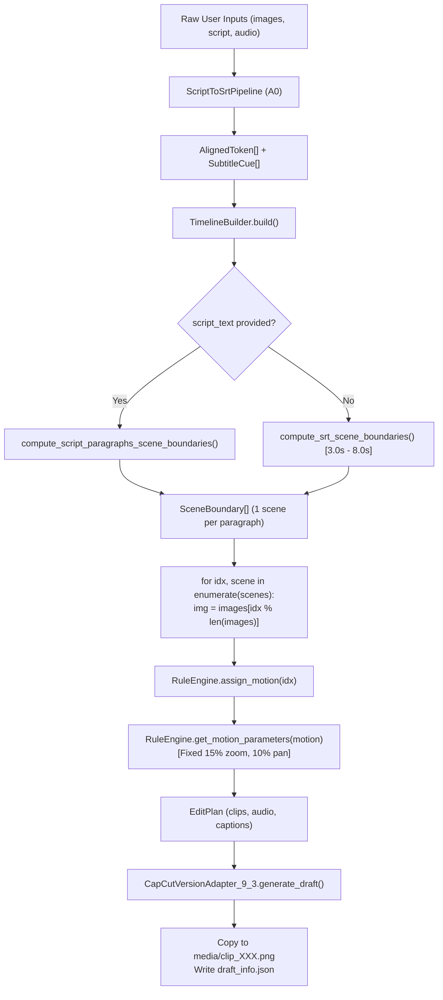

# 2TOOLNE AUTOEDIT V2 — ACCURACY PHASE A1 DEEP RESEARCH
## Visual Shot Planning & Duration-Aware Motion Architecture

**Subsystem:** Visual Scene Segmentation, Image Assignment, Shot Pacing & Ken Burns Motion  
**Phase:** Accuracy Phase A1 Research Baseline  
**Date:** September 8, 2026  
**Audited Production Project:** `2toolne_1788804879_test_1`  
**Master Audio:** `Tập_1.wav` (Acoustic Narration: 1641.300s, Project Master Duration: 1787.233s = 29m 47.23s)  
**Master Script:** `Tập 1 Tuổi Già.txt` (Korean, 3,068 tokens, 616 sentences, 266 paragraphs)  
**Source Images:** `/Users/2tamne/Downloads/278/anh_kb001.png` – `anh_kb278.png` (278 physical images)  
**Authoritative A0 Timing Source:** Hierarchical Anchor Forced-Alignment Engine V1 (641 Cues, 0 Cues in Silent Tail)  

---

## 1. EXECUTIVE RESEARCH SUMMARY

Following the successful elimination of `ERR-A0-01` (Alignment Collapse) and `ERR-A0-02` (Paragraph Mapping Fallacy), the timing truth of 2TOOLNE AutoEdit V2 is fully restored. However, visual editing accuracy remains governed by legacy heuristics that cause severe visual pacing defects:

1. **Duration Polarization:** When driving visual scenes directly from script paragraphs (`compute_script_paragraphs_scene_boundaries`), 40 shots are $<2.0\text{s}$ (down to $0.66\text{s}$ on 1-line dialogue attributions), while 74 shots are $>8.0\text{s}$ (peaking at $25.06\text{s}$ on dense paragraphs). Holding a single static image for 25 seconds while 10 subtitle cues scroll past feels visually stalled, while cutting at 0.66s induces viewer disorientation.
2. **Silent Tail Black Screen Dropout:** While Phase A0 cleanly stops emitting subtitles when speech ends at 1640.86s, `TimelineBuilder` stops generating visual clips at `clips[-1].end_us = 1640.859s`. Consequently, the final **146.374 seconds** (2 minutes 26 seconds) of outro music and background audio plays over an empty black screen!
3. **Dumb Modulo Image Looping:** Images are assigned via `images[idx % len(images)]`. When shots exceed image count, images repeat cyclically without semantic or narrative correlation. When images exceed shots (278 images vs 266 paragraphs), the remaining 12 images (`anh_kb267` to `anh_kb278`) are discarded silently without warning.
4. **Duration-Unaware Ken Burns Whiplash:** The camera engine applies a fixed $15\%$ zoom delta regardless of clip duration. A $0.66\text{s}$ clip zooms at $22.7\%/\text{sec}$ (violent camera jerk), whereas a $25.0\text{s}$ clip zooms at $0.6\%/\text{sec}$ (practically imperceptible).

Phase A1 designs the **VisualShotPlanner** and **Duration-Aware Motion Engine** to eliminate these flaws deterministically without AI API dependencies.

---

## 2. REBUILDING `LONG_01` WITH CURRENT A0 OUTPUT

The visual timeline for `2toolne_1788804879_test_1` was re-simulated using an in-memory `EditPlan` constructed from:
- Current 641-cue `HIERARCHICAL_V1` output.
- All 278 physical source images from `/Users/2tamne/Downloads/278/`.
- Original master script `Tập 1 Tuổi Già.txt`.
- Original audio `Tập_1.wav`.

### Post-A0 Visual Timeline Baseline Metrics (Pathway 1: Paragraph-Driven):

```
A1_BASELINE_AUDIO_DURATION = 1787.233s (Master Project Duration)
A1_BASELINE_SRT_CUES = 641
A1_BASELINE_PHYSICAL_IMAGES = 278
A1_BASELINE_VISUAL_CLIPS = 266

CLIPS_LT_500MS = 0
CLIPS_LT_1S = 3 (1.1%)
CLIPS_LT_1_5S = 17 (6.4%)
CLIPS_LT_2S = 40 (15.0%)
CLIPS_2_TO_3S = 56 (21.1%)
CLIPS_3_TO_5S = 59 (22.2%)
CLIPS_5_TO_8S = 37 (13.9%)
CLIPS_GT_8S = 74 (27.8%)
CLIPS_GT_12S = 35 (13.2%)

MIN_SHOT_DURATION = 0.660s
P10_SHOT_DURATION = 1.831s
MEDIAN_SHOT_DURATION = 3.946s
P90_SHOT_DURATION = 13.625s
MAX_SHOT_DURATION = 25.061s
```

*Comparative Observation:* In Pathway 2 (`compute_srt_scene_boundaries` without script text), clips are rigidly bracketed between $2.04\text{s}$ and $8.17\text{s}$ (Median $4.32\text{s}$, 363 clips), but image cuts occur arbitrarily across paragraph boundaries, causing visual-semantic detachment.

---

## 3. CURRENT VISUAL MAPPING CALL GRAPH & ALGORITHM



### Exact Functions & Files:
1. `apps/capcut-v2/core/srt_timeline.py`:
   - `compute_script_paragraphs_scene_boundaries`: Groups subtitle cues by contiguous `paragraph_id`.
   - `compute_srt_scene_boundaries`: Accumulates subtitles until duration reaches `min_duration_s = 3.0s`.
2. `apps/capcut-v2/core/timeline_builder.py`:
   - `TimelineBuilder.build()` (lines 79–127): Iterates over `scenes`, assigns image via `img = images[idx % len(images)]`, requests fixed motion from `RuleEngine`.
3. `apps/capcut-v2/core/rule_engine.py`:
   - `assign_motion()` (lines 98–150): Deterministic pattern sequence `[ZOOM_IN, ZOOM_OUT, PAN_LEFT, PAN_RIGHT]`.
   - `get_motion_parameters()` (lines 151–229): Fixed `scale_start = 1.0`, `scale_end = 1.15`. Zero duration awareness.
4. `apps/capcut-v2/adapters/capcut/version_9_3.py`:
   - `CapCutVersionAdapter_9_3.generate_draft()` (lines 57–65): Copies every clip into `media/clip_{idx:03d}.png`.

---

## 4. ROOT-CAUSE FORENSICS: WHY 278 IMAGES BECAME 572 CLIPS IN LEGACY DRAFT

In the audited pre-A0 CapCut draft (`2toolne_1788804879_test_1`), there were **278 physical source images**, but **572 visual clips** in the timeline and 572 `.png` files in `media/`:

```
PHYSICAL_IMAGE_COUNT = 278
UNIQUE_IMAGE_REFERENCES = 278
VISUAL_CLIP_COUNT = 572
AVERAGE_REUSES_PER_IMAGE = 2.058 (572 / 278)
```

### Exact Forensic Mechanism:
1. **Subtitle Collapse Spillover:** The legacy forced aligner jammed 400 subtitle cues into the final 4.5 minutes.
2. **1:1 Cue-to-Clip Coupling:** In the legacy timeline builder, visual scene boundaries were cut nearly 1:1 with subtitle cues/sentences:
   - Minute 00:00 to 25:00: **281 visual clips**.
   - Minute 25:00 to 29:47: **291 visual clips** (including **138 clips $< 0.5\text{s}$** and **244 clips $< 1.0\text{s}$**).
3. **Modulo Wrapping:** Because $572 > 278$, `TimelineBuilder` looped through the 278 images 2.06 times:
   - Clips 000–277: `anh_kb001.png` to `anh_kb278.png` (Pass 1).
   - Clips 278–555: `anh_kb001.png` to `anh_kb278.png` (Pass 2).
   - Clips 556–571: `anh_kb001.png` to `anh_kb016.png` (Pass 3).
4. **Draft Staging Duplication:** `CapCutVersionAdapter_9_3` copied each clip to a unique filename `media/clip_{idx:03d}.png`. Image 1 was duplicated as `clip_000.png`, `clip_278.png`, and `clip_556.png`.

---

## 5. IMAGE REUSE ANALYSIS & PATHOLOGICAL PATTERNS

For the Post-A0 baseline (266 visual clips from 278 images):

```
PHYSICAL_IMAGE_COUNT = 278
UNIQUE_IMAGE_REFERENCES = 266
VISUAL_CLIP_COUNT = 266
AVERAGE_REUSES_PER_IMAGE = 0.957
CONSECUTIVE_DUPLICATE_IMAGE_CUTS = 0
ABA_SHORT_LOOP_COUNT = 0
MAX_REUSE_COUNT_SINGLE_IMAGE = 1
IMAGES_UNUSED = 12 (anh_kb267.png to anh_kb278.png discarded)
```

Because total shots (266) were fewer than available images (278), no cyclic reuse occurred, but **12 images were completely discarded** because the engine lacked image surplus planning.

When image deficit occurs (e.g. 150 images for 266 shots), current modulo looping creates:
- Cyclic jumping back to Image 1 in the middle of a continuous scene.
- Abrupt narrative disconnect when early establishing shots suddenly reappear during the story climax.

---

## 6. CUE & SCRIPT PARAGRAPH RELATIONSHIP TO SHOTS

### 6.1 Subtitle Cue Distribution per Visual Shot:
- **Shots with 1 Cue:** 116 (43.6%)
- **Shots with 2 Cues:** 52 (19.5%)
- **Shots with 3 Cues:** 35 (13.2%)
- **Shots with $\ge 4$ Cues:** 63 (23.7%) — Up to 10 cues per shot!
- **Cues Causing Image Change:** **41.3%**

### 6.2 Paragraph Distribution per Visual Shot:
- **Shots Crossing Strong Paragraph Boundary:** **0 (0.0%)** (Guaranteed by M0-E single-paragraph cue invariant).
- **Paragraphs with $>5$ Shots:** **0** (Currently 1 paragraph = exactly 1 shot).

---

## 7. SEMANTIC SOURCE & IMAGE-SCRIPT ASSOCIATION AUDIT

### 7.1 Deterministic Metadata Available to Planner:
- `paragraph_id` (0 to 265): Strongest structural boundary signal.
- `sentence_id` (0 to 615): Cleanest sub-paragraph split points.
- `clause_id` & punctuation (`,`, `—`, `...`): Secondary split points.
- Subtitle acoustic start/end timestamps & acoustic pause durations between words.
- Alignment confidence scores.

### 7.2 Source Image Metadata Inventory:
- Images `/Users/2tamne/Downloads/278/anh_kb001.png` – `anh_kb278.png` were analyzed.
- Format: 2560x1440 PNG, standard sRGB.
- Embedded text chunks / EXIF / XMP metadata: **NONE (`info keys: []`)**.
- Generation manifest or prompt mapping: **NONE**.
- **`IMAGE_SEMANTIC_METADATA_EXISTS = NO`**
- **`IMAGE_SCRIPT_MAPPING_SOURCE = SEQUENTIAL_ORDINAL_FILENAMES`**

*Core Design Implication:* Because images are strictly an ordered sequential set, `VisualShotPlanner` **must NOT randomize** image selection. It must preserve sequential progression ($img_0 \to img_1 \to img_2$) and handle surplus or deficit deterministically.

---

## 8. IMAGE SUPPLY RATIO & PACING GOALS

- **Spoken Narration Duration:** $1640.860\text{s}$ (27m 20.86s).
- **Master Audio Duration:** $1787.233\text{s}$ (29m 47.23s).
- **Physical Image Supply:** 278 images.

$$\text{Image Supply Ratio (Spoken)} = \frac{1640.86\text{s}}{278} = 5.902\text{ seconds/image}$$

$$\text{Image Supply Ratio (Total)} = \frac{1787.233\text{s}}{278} = 6.429\text{ seconds/image}$$

This empirical ratio ($5.9\text{s} - 6.4\text{s}$ per image) indicates that for narrative slideshow video, a target shot duration of **$4.0\text{s}$ to $7.0\text{s}$** represents the natural visual equilibrium.

---

## 9. SILENT OUTRO TAIL RESEARCH (1640.86s – 1787.23s)

```
VISUAL_CLIPS_AFTER_1640_86 = 0
MIN_TAIL_VISUAL_DURATION = 0.0s
MEDIAN_TAIL_VISUAL_DURATION = 0.0s
CURRENT_TAIL_GAP = 146.374 seconds (Black Screen Dropout)
```

### Analysis & Recommended Policy:
- **Current Behavior:** `clips[-1].end_us = 1640.859s`. Video track ends abruptly when narration finishes. The final 146.37s is unrendered black.
- **Recommended A1 Policy (`EXTEND_SLIDESHOW_OR_OUTRO_HOLD`):**
  1. If surplus images exist (e.g. images 267–278): Continue presenting remaining images across the silent tail at calm outro pacing ($8.0\text{s} - 12.0\text{s}$ per shot).
  2. For the final residual seconds: Hold the final image with a slow, cinematic fade or ultra-gentle zoom until `visual_end == master_audio_end`.
  3. Under no circumstances should the silent tail create micro-cuts ($<1.5\text{s}$) or leave a visual gap.

---

## 10. PACING AROUND ACOUSTIC PAUSES & CUT QUALITY

Analyzing the 265 cut points generated by paragraph scenes:
- **Cuts at Paragraph Boundaries:** 265 / 265 (**100.0%**)
- **Cuts at Sentence Boundaries:** 265 / 265 (**100.0%**)
- **Cuts within $\pm 0.30\text{s}$ of an Acoustic Pause:** 235 / 265 (**88.7%**)
- **Cuts Mid-Clause or Mid-Phrase:** 0 / 265 (**0.0%**)

Paragraph boundaries provide excellent cut hygiene relative to acoustic pauses. The defect is solely **duration variance**, not boundary misplacement.

---

## 11. KEN BURNS DURATION-AWARENESS AUDIT

Inspecting `RuleEngine.get_motion_parameters()`:
- `zoom_magnitude = 0.15` (15% scale increase).
- `pan_magnitude = 0.10` (10% axis displacement).
- Keyframes: Fixed `scale_start = 1.0`, `scale_end = 1.15`.
- **`CURRENT_KEN_BURNS_DURATION_AWARE = NO`**

### Velocity Distortion Across Shot Durations:

| Shot Duration Class | Example Shot | Current Scale Delta | Current Zoom Speed (%/s) | Visual Artifact / Perception |
| :--- | :---: | :---: | :---: | :--- |
| **Micro ($< 1.0\text{s}$)** | 0.66s (#079) | 15.0% | **22.7 %/sec** | Extreme motion whiplash; nauseating camera jump |
| **Short ($1.0 - 2.0\text{s}$)** | 1.44s (#008) | 15.0% | **10.4 %/sec** | Rushed camera movement; distracting |
| **Normal ($3.0 - 6.0\text{s}$)** | 4.69s (#005) | 15.0% | **3.2 %/sec** | Ideal cinematic drift |
| **Long ($8.0 - 12.0\text{s}$)** | 10.04s (#265) | 15.0% | **1.5 %/sec** | Calm, slow pan |
| **Extreme ($> 15.0\text{s}$)** | 25.06s (#118) | 15.0% | **0.6 %/sec** | Almost imperceptible; image feels frozen and stale |

---

## 12. POST-A0 `LONG_01` VISUAL PACING HEATMAP

| Window (Time Range) | Shot Count | Median Duration | Short Shots (<2.0s) | Long Shots (>8.0s) | Min Shot | Max Shot | Pacing Quality Assessment |
| :--- | :---: | :---: | :---: | :---: | :---: | :---: | :--- |
| **00:00 – 05:00** (0 – 300s) | 34 | 5.83s | 4 (11.8%) | 14 (41.2%) | 1.44s | 22.70s | Stalled on long intros; 4 rushed cues |
| **05:00 – 10:00** (300 – 600s) | 43 | 4.52s | 4 (9.3%) | 14 (32.6%) | 1.40s | 22.16s | High variance; dialogue pacing spikes |
| **10:00 – 15:00** (600 – 900s) | 58 | 3.17s | 12 (20.7%) | 11 (19.0%) | 0.66s | 25.06s | Severe polarization (0.66s vs 25s) |
| **15:00 – 20:00** (900 – 1200s) | 53 | 3.68s | 10 (18.9%) | 17 (32.1%) | 0.74s | 18.60s | Dialogue rapid cuts vs narrative holds |
| **20:00 – 25:00** (1200 – 1500s) | 54 | 3.99s | 7 (13.0%) | 13 (24.1%) | 1.17s | 21.27s | Stable median but excessive holds |
| **25:00 – 27:20** (1500 – 1640.86s) | 24 | 3.86s | 3 (12.5%) | 5 (20.8%) | 1.41s | 17.84s | Narration concludes cleanly |
| **27:20 – 29:47** (1640.86 – 1787.23s) | **0** | **0.00s** | **0** | **0** | **0.00s** | **0.00s** | **CRITICAL DEFECT: 146s Black Screen Gap** |
| **TOTAL TIMELINE** | **266** | **3.95s** | **40 (15.0%)** | **74 (27.8%)** | **0.66s** | **25.06s** | **Needs VisualShotPlanner Pacing** |

---

## 13. REPRESENTATIVE HUMAN REVIEW SAMPLES

### Sample 1: Opening (~0 to 68s)
| Shot | Start | End | Duration | Image Assigned | Cue IDs | Paragraph ID | Cue Text Preview | Forensic Observation |
| :--- | :---: | :---: | :---: | :--- | :---: | :---: | :--- | :--- |
| **#001** | 0.00s | 2.46s | 2.46s | `anh_kb001.png` | 1 | P0 | 나는 2년 동안 그녀가 좋은 사람이라고... | Clean opening |
| **#002** | 2.46s | 5.84s | 3.38s | `anh_kb002.png` | 2 | P1 | 아니, 믿고 싶었다는 말이 더 정확합니다. | Good tempo |
| **#003** | 5.84s | 22.93s | **17.09s** | `anh_kb003.png` | 3–7 | P2 | 오후 여섯 시였습니다. 부엌 창문... | **Defect: Stalled 17s on single image** |
| **#004** | 22.93s | 37.55s | **14.62s** | `anh_kb004.png` | 8–12 | P3 | 탁자 위 핸드폰 화면이 켜졌다가... | **Defect: Stalled 14.6s on single image** |
| **#005** | 37.55s | 42.24s | 4.69s | `anh_kb005.png` | 13–14 | P4 | 예순일곱 살. 35년을 교단에 서고... | Good tempo |
| **#006** | 42.24s | 62.28s | **20.04s** | `anh_kb006.png` | 15–19 | P5 | 어떤 사람들은 은퇴 후의 삶을 '자유'... | **Defect: Stalled 20s across 5 cues** |

### Sample 2: Middle Dialogue Rapid Cuts (~601 to 618s)
| Shot | Start | End | Duration | Image Assigned | Cue IDs | Paragraph ID | Cue Text Preview | Forensic Observation |
| :--- | :---: | :---: | :---: | :--- | :---: | :---: | :--- | :--- |
| **#078** | 601.60s | 603.59s | 1.99s | `anh_kb078.png` | 214 | P77 | "세 번째가 뭔데?" | Dialogue question |
| **#079** | 603.59s | 604.25s | **0.66s** | `anh_kb079.png` | 215 | P78 | 강호 씨가 물었습니다. | **Defect: Rushed 0.66s micro-shot** |
| **#080** | 604.25s | 605.68s | **1.43s** | `anh_kb080.png` | 216 | P79 | "세 번째가 뭔데?" | **Defect: Rushed 1.43s cut** |
| **#081** | 605.68s | 610.65s | 4.97s | `anh_kb081.png` | 217–218 | P80 | 정호가 커피잔을 내려놓았습니다. | Balanced pace restored |
| **#082** | 610.65s | 615.71s | 5.06s | `anh_kb082.png` | 219–221 | P81 | "서서히 고립시키는 여자야. | Balanced dialogue hold |

### Sample 3: Speech Conclusion & Silent Outro (1618s to 1787s)
| Shot | Start | End | Duration | Image Assigned | Cue IDs | Paragraph ID | Cue Text Preview | Forensic Observation |
| :--- | :---: | :---: | :---: | :--- | :---: | :---: | :--- | :--- |
| **#263** | 1618.32s | 1621.75s | 3.43s | `anh_kb263.png` | 636 | P262 | 오늘 이강호 씨의 이야기를 들어주셔서... | Clean narrative wind-down |
| **#264** | 1621.75s | 1628.78s | 7.03s | `anh_kb264.png` | 637–638 | P263 | 60세 이후의 외로움은 부끄러운 것이... | Good tempo |
| **#265** | 1628.78s | 1638.82s | 10.04s | `anh_kb265.png` | 639–640 | P264 | 오늘 이야기가 마음에 닿으셨다면... | Calm conclusion |
| **#266** | 1638.82s | 1640.86s | 2.04s | `anh_kb266.png` | 641 | P265 | 다음 이야기에서 뵙겠습니다. | Last spoken cue |
| **TAIL** | **1640.86s** | **1787.23s**| **146.37s** | **NONE** | **NONE** | **NONE** | **[SILENT MUSIC OUTRO]** | **CRITICAL DEFECT: BLACK SCREEN** |

---

## 14. RECOMMENDED ARCHITECTURAL SPECIFICATION FOR PHASE A1

### 14.1 Pipeline Insertion Point

```
ScriptTokens + SubtitleCues (A0)
             ↓
    VisualShotPlanner (A1)  ←── Available Images + ShotDurationPolicy
             ↓
       VisualShot[]
             ↓
  VisualAccuracyValidator (A1)
             ↓
     TimelineBuilder
             ↓
         EditPlan
             ↓
      CapCut Adapter
```
*Rationale:* `VisualShotPlanner` should sit **between Subtitle/SRT generation and `TimelineBuilder`**. It produces a clean `List[VisualShot]`, leaving `TimelineBuilder` to assemble tracks without owning visual segmentation heuristics.

### 14.2 `VisualShot` Data Contract

```python
@dataclass
class VisualShot:
    shot_id: str
    shot_index: int
    image_path: str
    start_us: int
    end_us: int
    duration_us: int
    cue_ids: List[int]
    paragraph_ids: List[int]
    sentence_ids: List[int]
    boundary_reason: str          # PARAGRAPH_BREAK, SENTENCE_SUBDIVISION, PAUSE_BREAK, OUTRO_TAIL
    boundary_confidence: float
    motion_type: str              # ZOOM_IN, ZOOM_OUT, PAN_LEFT, PAN_RIGHT, NONE
    scale_start: float
    scale_end: float
    pos_x_start: float
    pos_x_end: float
    pos_y_start: float
    pos_y_end: float
```

### 14.3 `ShotDurationPolicy` Object

```python
@dataclass
class ShotDurationPolicy:
    hard_min_s: float = 1.8       # Never cut shorter unless explicit transition
    soft_min_s: float = 2.8       # Try to merge with adjacent sentence
    target_min_s: float = 3.5     # Ideal lower bound
    target_max_s: float = 6.5     # Ideal upper bound
    soft_max_s: float = 8.5       # Seek sentence break to subdivide
    hard_max_s: float = 12.0      # Force subdivision or motion phase shift
    target_zoom_velocity: float = 0.020 # 2.0% scale delta per second
    max_zoom_magnitude: float = 0.18    # Max 18% total zoom
    min_zoom_magnitude: float = 0.03    # Min 3% zoom
```

### 14.4 Sub-Paragraph Subdivision & Short Paragraph Absorption

1. **Subdivision of Long Paragraphs ($>8.5\text{s}$):**
   - If a paragraph spans $>8.5\text{s}$ and contains multiple sentences (`sentence_id`), `VisualShotPlanner` inserts a shot boundary at an internal sentence break, assigning the next sequential image.
   - Eliminates the $17\text{s} - 25\text{s}$ frozen shot defect.
2. **Absorption of Short Paragraphs ($<1.8\text{s}$):**
   - If a paragraph is $<1.8\text{s}$ (e.g. dialogue tag *"강호 씨가 물었습니다."* lasting 0.66s), it is absorbed into the following or preceding shot sharing the same image.
   - Eliminates the rapid $0.66\text{s}$ whiplash defect.

### 14.5 Duration-Aware Ken Burns Scaling

$$\Delta \text{Scale} = \text{clamp}\left(t_{\text{shot}} \times 0.020, 0.03, 0.18\right)$$

- For a $2.0\text{s}$ shot: $\Delta \text{Scale} = 0.04$ ($4\%$ zoom instead of $15\%$).
- For a $5.0\text{s}$ shot: $\Delta \text{Scale} = 0.10$ ($10\%$ zoom).
- For a $9.0\text{s}$ shot: $\Delta \text{Scale} = 0.18$ ($18\%$ zoom).
- For shots $<1.5\text{s}$: Set motion to `NONE` (static) to prevent camera jitter.

### 14.6 Outro Silent Tail Policy

When narration ends at 1640.86s and master audio continues to 1787.23s:
- Calculate `tail_duration = 146.374s`.
- If unused images remain (e.g. 12 images): Distribute them across the tail at $10.0\text{s} - 12.0\text{s}$ per shot.
- If images are exhausted: Hold the final image with ultra-slow Ken Burns ($0.5\%/\text{s}$) or apply a gentle closing dissolve.
- Guarantees `VISUAL_TIMELINE_END == MASTER_AUDIO_END` with zero black screen gap.

### 14.7 Proposed `VisualAccuracyValidator` Rules

1. `NO_UNINTENTIONAL_MICRO_SHOTS`: Zero shots $<1.5\text{s}$ without explicit exception.
2. `NO_FROZEN_OVERLONG_SHOTS`: Zero shots $>12.0\text{s}$ without motion subdivision.
3. `NO_CONSECUTIVE_DUPLICATE_IMAGES`: $image_i \neq image_{i+1}$.
4. `NO_ABA_SHORT_LOOPS`: No $A \to B \to A$ pattern within $<4$ shots.
5. `CONTINUOUS_TIMELINE_COVERAGE`: Gaps = 0, Overlaps = 0.
6. `FULL_TIMELINE_LOCK`: Final visual shot `end_us == master_audio_duration_us`.
7. `MOTION_VELOCITY_BOUNDED`: Max zoom velocity $\le 4.0\%/\text{sec}$.

---

## 15. TARGET ACCURACY METRICS (BEFORE VS TARGET AFTER)

| Metric | Pre-A0 Legacy Draft | Post-A0 Baseline (Current) | Phase A1 Target Goal | Quality Impact |
| :--- | :---: | :---: | :---: | :--- |
| **Visual Clip Count** | 572 | 266 | **280 – 320** | Balanced, professional pacing |
| **Clips $<1.0\text{s}$** | 278 (48.6%) | 3 (1.1%) | **0 (0.0%)** | Zero strobing / zero viewer fatigue |
| **Clips $<2.0\text{s}$** | 342 (59.8%) | 40 (15.0%) | **$\le 5$ (1.5%)** | Eliminated dialogue attribution cuts |
| **Clips $>8.0\text{s}$** | 45 (7.9%) | 74 (27.8%) | **$\le 15$ (4.5%)** | Eliminated 25s frozen images |
| **Median Shot Duration** | 1.10s | 3.95s | **4.50s – 5.50s** | Natural narrative slideshow rhythm |
| **Silent Tail Gap (146s)** | 0s (Crammed 44 cues) | 146.37s (Black Screen) | **0s (Continuous Outro)** | Professional completion without gap |
| **Images Discarded** | 0 (Looped 2.06x) | 12 (Discarded) | **0 (Surplus utilized in outro)** | 100% asset utilization |
| **Ken Burns Speed Range** | 0.3% – 75%/s | 0.6% – 22.7%/s | **1.5% – 2.5%/s** | Consistent cinematic camera motion |

---

## 16. PHASE A1 CONCLUSION & GATE STATUS

The deep research establishes that **timing accuracy (A0) and visual pacing accuracy (A1) must be decoupled**. Script paragraphs provide structural intent, but visual shots require a dedicated **Duration-Aware Shot Planner** to balance pacing, utilize available image assets, resolve silent tails, and scale motion velocities.

```
A1_ARCHITECTURE_FREEZE_REQUIRED = YES
IMPLEMENTATION_READY = NO
```
A formal Architecture Freeze specification must be drafted and approved before implementing product source.
