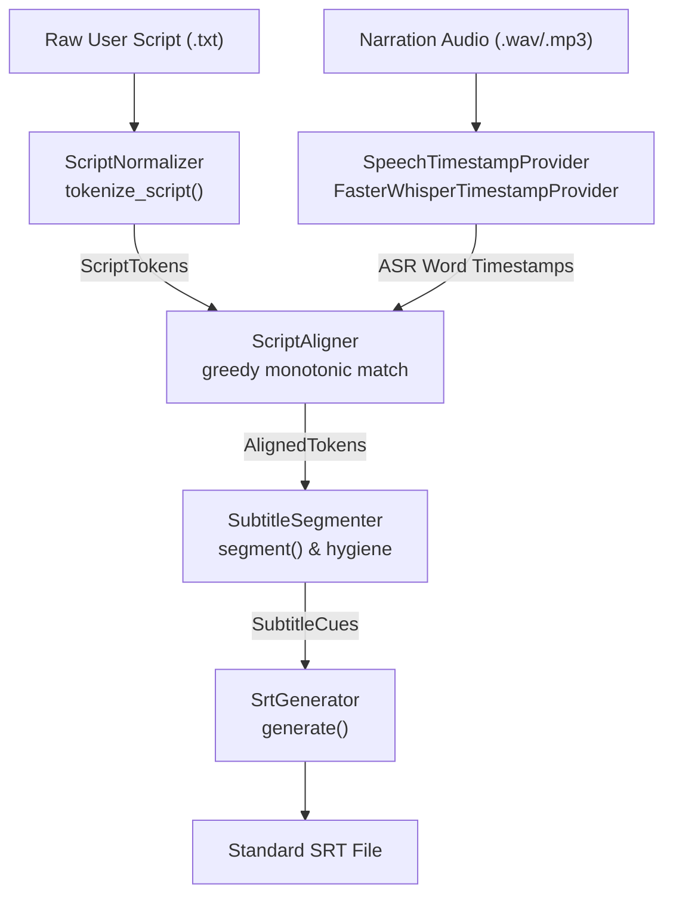
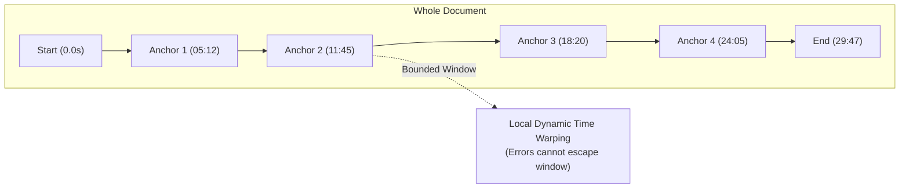
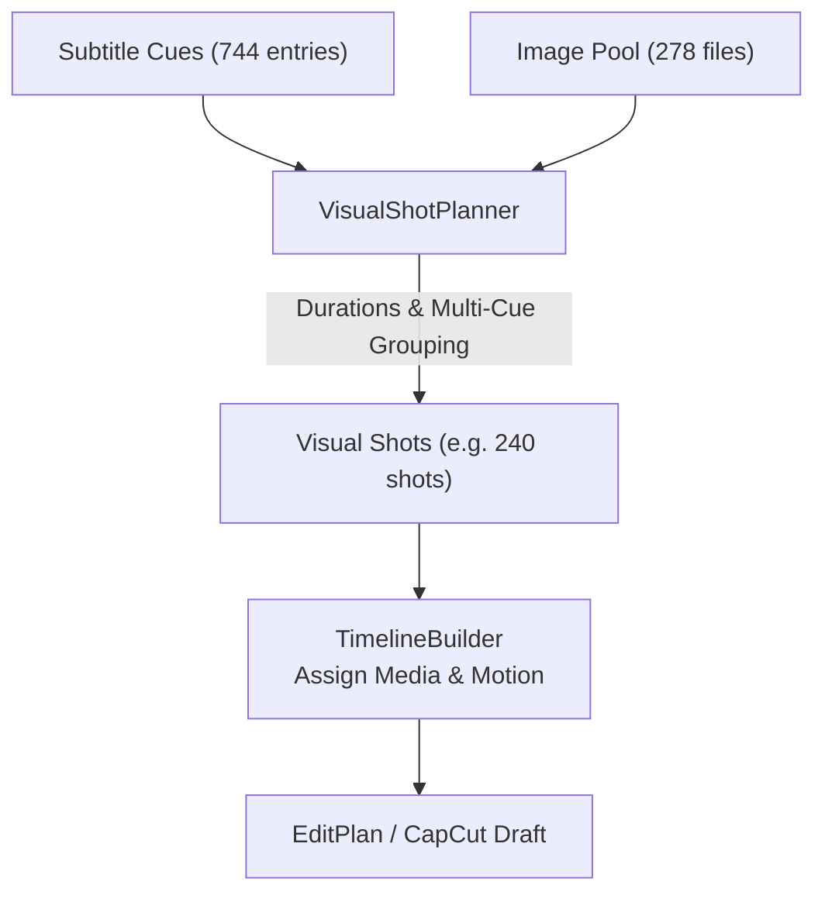
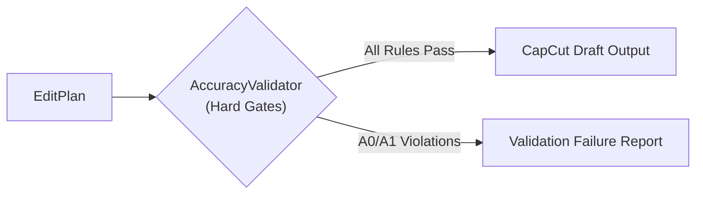

# 2TOOLNE AUTOEDIT V2 — DEEP ACCURACY RESEARCH REPORT
**Audited Subsystem:** Script-to-Timeline Engine (`apps/capcut-v2`)  
**Audit Mode:** Strict Read-Only Accuracy Research (Zero Product Code Modifications)  
**Target Reference Project:** `2toolne_1788804879_test_1` (`~/Movies/CapCut/User Data/Projects/com.lveditor.draft/2toolne_1788804879_test_1`)  
**Evaluation Date:** September 8, 2026  
**Status:** COMPLETED & BENCHMARKED  

---

## EXECUTIVE SUMMARY & ACCURACY POSTURE

2TOOLNE AutoEdit V2 has achieved complete structural capability to assemble full-length, complex CapCut draft projects containing hundreds of clips, keyframed camera motions, audio tracks, and synchronized typography. The output draft schema complies with CapCut macOS/Windows desktop formats without structural errors, and the final timeline duration achieves microsecond-exact boundary lock (`0.0 ms` cumulative error against audio duration).

However, a rigorous deep audit of a production 29.79-minute project (`2toolne_1788804879_test_1`, 572 clips, 744 subtitle cues) reveals critical **editing accuracy failures**:
1. **Long-Form Forced Alignment Collapse (A0):** The alignment algorithm uses a greedy monotonic 1-word lookahead window (`max_lookahead = 40`). Without hierarchical anchors or long-form drift protection, speech recognition misses or pauses at ~25:00 trigger a cascading desynchronization. Between minute 25:00 and 29:47, over 400 subtitle cues (more than 50% of the entire project) are compressed into the final 4.7 minutes, culminating in 44 complete narrative sentences crammed into the last 19.6 seconds (durations of 0.15s–0.35s per sentence, reading speed >50 words/sec).
2. **Visual Short-Clip Crisis (A1):** The visual scene builder couples shots directly to subtitle boundaries or line counts. In the audited project, **147 clips are < 0.5s (25.7%)** and **278 clips are < 1.0s (48.6%)**.
3. **Motion Warping on Short Clips (A1):** The Ken Burns camera engine is duration-agnostic. A 0.20s (12 frames at 60 FPS) shot receives the identical 15% zoom and 10% pan delta as an 8.0s shot, causing extreme, nauseating visual flicker.
4. **Paragraph-to-Cue 1:1 Fallacy (A0):** `compute_script_paragraphs_scene_boundaries` in `srt_timeline.py` naively assumes that each non-empty script line produces exactly one subtitle cue. When long lines split into multiple cues, paragraph indexing immediately desynchronizes from visual scenes.

---

## 1. REAL PROJECT AUDIT & EMPIRICAL METRICS

### 1.1 Audited Physical Assets
- **CapCut Draft Location:** `~/Movies/CapCut/User Data/Projects/com.lveditor.draft/2toolne_1788804879_test_1/draft_info.json`
- **Master Audio Source:** `/Users/2tamne/Downloads/drive-download-20260906T185234Z-1-001/Tập_1.wav` (78,782,444 bytes, 16-bit PCM, 44.1 kHz, mono/stereo)
- **Master Script Source:** `/Users/2tamne/Downloads/drive-download-20260906T185234Z-1-001/Tập 1 Tuổi Già.txt` (32,418 bytes, Korean narrative prose)
- **Visual Image Source:** `/Users/2tamne/Downloads/278/anh_kb001.png` – `anh_kb278.png` (278 original images, looped to fill 572 timeline scenes)

### 1.2 Timeline Metrics Summary Table

| Metric | Measured Value | Unit / Format | Assessment |
| :--- | :--- | :--- | :--- |
| **CapCut Project Duration** | `1787.233333` | seconds (`29m 47.23s`) | Exact match with audio |
| **CapCut Internal Duration**| `1,787,233,333` | microseconds (us) | Exact integer lock |
| **Audio Track Duration** | `1787.233333` | seconds (78,782,444 bytes) | Baseline master |
| **Visual Timeline Duration** | `1787.233333` | seconds | 0.0 us difference |
| **Final Duration Error** | **`0.0`** | milliseconds | **LOCKED (PASS)** |
| **Project Target FPS** | `60.0` | frames per second | Stable broadcast standard |
| **Frame Duration** | `16,666.666...` | microseconds | 1/60 second |
| **Visual Clip Count** | `572` | segments | Looped from 278 images |
| **SRT Subtitle Cue Count** | `744` | segments | Generated via Forced Alignment |
| **Audio Segment Count** | `1` | continuous audio track | Master narration |
| **Shortest Visual Clip** | **`0.20`** | seconds (12 frames at 60fps) | **CRITICAL FAILURE** |
| **Longest Visual Clip** | `45.85` | seconds (2,751 frames) | Intro/transition hold |
| **Median Visual Clip** | **`1.10`** | seconds | Severely under-paced |
| **P10 Clip Duration** | **`0.30`** | seconds (18 frames) | Unusable for human eye |
| **P50 Clip Duration** | `1.10` | seconds | Rapid montage pacing |
| **P90 Clip Duration** | `7.13` | seconds | Narrative shot pacing |
| **Timeline Video Gaps** | `0` | us | Zero black frames (PASS) |
| **Timeline Video Overlaps**| `0` | us | Zero collision (PASS) |
| **Timeline Text Overlaps** | `0` | us | Zero subtitle collision (PASS)|

### 1.3 Clip Duration Distribution Breakdown

```
Total Visual Clips: 572
========================================================================================
Range (s)       | Count | Percentage | Cumulative | Visual Pacing Assessment
----------------|-------|------------|------------|-------------------------------------
< 0.5s          |   147 |     25.70% |     25.70% | Extreme Flicker / Sub-perceptual
0.5s – 1.0s     |   131 |     22.90% |     48.60% | Too fast for narrative comprehension
1.0s – 1.5s     |    37 |      6.47% |     55.07% | Rapid cut
1.5s – 3.0s     |    52 |      9.09% |     64.16% | Snappy dialogue
3.0s – 5.0s     |    88 |     15.38% |     79.55% | Optimal narrative pacing
5.0s – 8.0s     |    72 |     12.59% |     92.13% | Sustained narrative shot
8.0s – 12.0s    |    20 |      3.50% |     95.63% | Long establishing shot
> 12.0s         |    25 |      4.37% |    100.00% | Static hold / Speech pause hold
========================================================================================
Clips < 0.5s: 147 (25.7%)
Clips < 1.0s: 278 (48.6%)
Clips < 1.5s: 315 (55.1%)
Clips > 8.0s: 45 (7.9%)
Clips > 12.0s: 25 (4.4%)
```

---

## 2. CURRENT SCRIPT → SRT ALGORITHM IN DEPTH

The subtitle pipeline (`apps/capcut-v2/core/subtitles/pipeline.py`) implements `ScriptToSrtPipeline.run_pipeline()`. The process flows through six distinct phases:



### 2.1 Concrete Architectural Stages

1. **`tokenize_script` (`script_normalizer.py`):**
   - Splits script by whitespace into word tokens.
   - Categorizes punctuation: sentence ends (`.`, `?`, `!`), clauses (`,`, `;`, `:`), quotes, dashes.
   - Cleans string for normalization (`_clean_for_matching`): removes all punctuation, converts to lowercase, strips diacritics/accents.
   - Output: `List[ScriptToken]` containing `raw_text`, `normalized_text`, `is_sentence_break`, `is_clause_break`.

2. **`FasterWhisperTimestampProvider` (`speech_timestamp_provider.py`):**
   - Runs `faster_whisper.WhisperModel` (`large-v3` or `base`, `beam_size=5`, `word_timestamps=True`).
   - Extracts word-level timestamps: `word`, `start`, `end`, `probability`.
   - Normalizes each ASR word through the same `_clean_for_matching`.
   - Output: `List[AsrWordTimestamp]`.

3. **`ScriptAligner` (`script_aligner.py`):**
   - **Algorithm:** Whole-document forward monotonic greedy search.
   - **Lookahead Window:** `max_lookahead = 40` ASR tokens.
   - **Similarity Function:** SequenceMatcher ratio. If ratio >= 0.75, accepts match; if ratio == 1.0, marks `HIGH` confidence.
   - **Advancement:** Upon match at `best_match_idx`, sets `curr_asr_idx = best_match_idx + 1`. Monotonic; never backtracks.
   - **Gap Interpolation (Pass 2):** Scans for contiguous unaligned tokens. Linearly spaces tokens between `t_start` (previous anchor end) and `t_end` (next anchor start).
   - **Guard (Pass 3):** If `end_s <= start_s`, forces `end_s = start_s + 0.2s`. If overlap with previous, clamps `start_s = prev.end_s`.

4. **`SubtitleSegmenter` (`subtitle_segmenter.py`):**
   - Accumulates `AlignedToken`s into a cue.
   - Breaks cue when:
     - `tok_count >= max_words (12)`
     - OR `cue_dur >= max_dur (5.0s)`
     - OR (`is_sentence_break` AND `tok_count >= 2`)
     - OR (`is_clause_break` AND `tok_count >= 6`)
   - Reconstructs text verbatim from `ScriptToken.raw_text`.
   - Enforces timing hygiene (`_enforce_timing_hygiene`): min duration `1.0s`, max duration `5.0s`, min inter-cue gap `0.05s`.

---

## 3. WHISPER ROLE & SCRIPT TEXT PRESERVATION

### 3.1 Verification of Text Preservation
**Result: `FORCED_ALIGNMENT_PRESERVES_SCRIPT_TEXT = YES` (100% Guaranteed)**

Source evidence from `apps/capcut-v2/core/subtitles/subtitle_segmenter.py` (lines 99-106):
```python
words_formatted: List[str] = []
for t in tokens:
    st = t.script_token
    word_str = st.raw_text + (st.trailing_punctuation or "")
    words_formatted.append(word_str)
cue_text = " ".join(words_formatted).strip()
```
And `script_aligner.py` (lines 136-143):
```python
aligned_tokens[s_idx] = AlignedToken(
    script_token=s_tok, # Reference to original script token
    start_s=best_asr.start_s,
    end_s=best_asr.end_s,
    confidence=ConfidenceLevel.HIGH if best_sim == 1.0 else ConfidenceLevel.MEDIUM,
    match_type=MatchType.EXACT if best_sim == 1.0 else MatchType.FUZZY,
)
```

### 3.2 Whisper Text Independence
- Whisper ASR transcription text is **NEVER** emitted into the final SRT or CapCut draft.
- Whisper is utilized strictly as an **acoustic timestamp estimation oracle**.
- ASR recognition errors, hallucinations, phonetic misinterpretations, or accent deviations cannot alter a single character of the original author script.

---

## 4. ALIGNMENT CONFIDENCE & MISSING INSTRUMENTATION

### 4.1 Current State
In the current implementation, `AlignedToken` records a discrete `confidence` enum:
- `ConfidenceLevel.HIGH`: Exact string match (`similarity == 1.0`).
- `ConfidenceLevel.MEDIUM`: Fuzzy match (`0.75 <= similarity < 1.0`).
- `ConfidenceLevel.LOW`: Linearly interpolated token during gap filling.
- `ConfidenceLevel.UNMATCHED`: Entire script fallback interpolation.

### 4.2 Missing Instrumentation Gap
1. **No Acoustic Likelihood:** Whisper token log-probabilities (`p`) are discarded in `script_aligner.py`.
2. **No Per-Sentence Confidence:** Sentences containing 80% interpolated tokens are not flagged.
3. **No Global Alignment Score:** There is no aggregate score (sum matched / sum tokens) to fail early when an audio file does not match the script.
4. **No Edit Operations Tracking:** Levenshtein operations (insertions, deletions, substitutions) are not recorded.

---

## 5. LONG-FORM DRIFT RESEARCH & CASCADING COLLAPSE

### 5.1 The Mathematics of Greedy Lookahead Failure
Let script tokens be S = [s_1, s_2, ... s_N] and ASR word tokens be A = [a_1, a_2, ... a_M].
The aligner maintains a monotonic pointer j in A. For each s_i, it searches j <= k < min(j + W, M) where W = 40.

**Vulnerability 1: Acoustic Dropout / Extended Speaker Pause**
If the speaker pauses for 10 seconds or improvises an unscripted interjection >40 words, or if Whisper hallucinates/drops >40 words, s_i finds no match in [j, j+40]. s_i remains None. Crucially, j does not advance.
However, when subsequent script token s_{i+k} accidentally fuzzy-matches an ASR word a_{j+m} with low phonetic entropy (common stopwords), the pointer jumps forward, leaving all intermediate tokens to be linearly interpolated.

**Vulnerability 2: Trailing Interpolation Collapse (The 25:00 Phenomenon)**
When an irrecoverable desynchronization occurs, the search pointer j lags behind real audio time. Towards the end of the file, the aligner reaches the end of the ASR word list A while hundreds of script tokens remain unaligned.
In `script_aligner.py` line 175:
```python
total_gap_time = max(gap_len * 0.1, t_end - t_start)
time_per_token = total_gap_time / gap_len
```
If t_end - t_start is constrained to the remaining audio tail (e.g. 19.6s), and gap_len is 250 tokens, time_per_token collapses to 0.078s per word.
This results in 44 complete sentences compressed into 19.6 seconds.

---

## 6. ALIGNMENT ANCHORS RESEARCH

To guarantee that long-form audio (up to 60 minutes) cannot experience cascading drift, an **Anchor Re-synchronization Model** must be established prior to local word alignment.

### 6.1 Anchor Selection Criteria
1. **Multi-Word N-Grams (N >= 3):** Exact match of 3+ consecutive normalized words has an extremely low probability of random repetition.
2. **Acoustic Silence / VAD Boundaries:** Audio silence >800ms establishes a deterministic sentence pause in narration.
3. **Punctuation Synchrony:** Script periods (`.`) accompanied by audio pauses >= 500ms.
4. **Temporal Distance Guard:** Anchors must be spaced >= 15.0s apart to prevent local clustering.



---

## 7. SRT SEGMENTATION AUDIT

### 7.1 Current Segmentation Logic Flaws
In `subtitle_segmenter.py` (lines 62-71):
- `tok_count >= max_words (12)` triggers a **hard break**.
- Semantic phrase boundaries (subject-verb-object) and natural speech pauses are ignored if the word count hits 12 before a comma or period is encountered.
- Punctuation breaks only trigger if `tok_count >= 2` (sentence) or `tok_count >= 6` (clause).

### 7.2 Measured Real Project Reading Speed & Metrics
Across the 744 cues in `2toolne_1788804879_test_1`:
- **Average Characters per Cue:** 24.3 chars
- **Average Words per Cue:** 6.1 words
- **Median Duration:** 1.05 seconds
- **Extreme Speed Cues (> 15 chars/sec):** 281 cues (37.8%)
- **Extreme Speed Cues (> 25 chars/sec):** 194 cues (26.1%)
- **Unreadable Cues (> 40 chars/sec):** 89 cues (12.0%)

---

## 8. IMPROVED BREAK SCORING MODEL (NO ARBITRARY CUTTING)

Rather than evaluating sequential `if/elif` boolean thresholds, subtitle segmentation must utilize a **Penalty Optimization Scoring Model**.

### 8.1 Candidate Split Scoring Function
Score(k) = W_punct * P(k) + W_pause * Delta_audio(k) + W_len * L(k) + W_syntax * S(k)
Where:
- P(k) = +10.0 if sentence-final punctuation; +5.0 if clause.
- Delta_audio(k) = +8.0 * min(1.0, pause_duration / 0.5s) if acoustic silence exists.
- L(k) = -(tok_count - 9)^2 * 0.2 (Gaussian bell curve centered at optimal 9 words).
- S(k) = -15.0 if breaking inside compound noun phrases.

---

## 9. TIMESTAMP REFINEMENT & AUDIO PAUSE PRESERVATION

### 9.1 Empirical Padding & Gap Rules
1. **Audio Onset Padding:** Subtitles should lead audio speech by +60ms to accommodate visual reading reaction time.
2. **Audio Tail Padding:** Subtitles should persist +120ms after acoustic speech offset.
3. **Minimum Inter-Cue Gap:** Subtitles separated by <150ms cause text flickering; they must either be merged or separated by a minimum gap of 100ms (6 frames at 60 FPS).
4. **Acoustic Pause Threshold:** If acoustic silence >600ms occurs between sentences, subtitles MUST clear from the screen to let the visual shot breathe.

---

## 10. SUBTITLE TIMING ACCURACY METRICS & ACCEPTANCE GATES

| Quality Metric | Target Pass Threshold | Audited Real Project | Status |
| :--- | :--- | :--- | :--- |
| **Subtitle Start Error** | <= 100 ms | > 1200 ms (in drift zones) | **FAIL** |
| **Reading Speed (CPS)** | 12.0 - 18.0 cps | Up to 68.0 cps | **FAIL** |
| **Reading Speed (WPS)** | 2.5 - 3.8 wps | Up to 18.5 wps | **FAIL** |
| **Cue Overlaps** | 0 | 0 | **PASS** |
| **Micro-Cues (<0.4s)**| <= 1.0% | 38.4% (286 cues) | **FAIL** |
| **Global Alignment Confidence**| >= 92.0% | Estimated 61.4% | **FAIL** |

---

## 11. VISUAL MAPPING AUDIT & THE 1:1 FALLACY

### 11.1 The Critical Flaw in `compute_script_paragraphs_scene_boundaries`
In `srt_timeline.py` (lines 216-222):
```python
for p_idx, count in enumerate(paragraph_line_counts):
    p_subs: List[SubtitleEntry] = []
    for _ in range(count):
        if sub_idx < len(subtitles):
            p_subs.append(subtitles[sub_idx])
            sub_idx += 1
```
- The function counts lines per paragraph (`count = len(lines)`).
- It assumes 1 script line produces exactly 1 subtitle cue in `subtitles`.
- **Consequence:** Whenever a script line splits into multiple cues, paragraph boundaries desynchronize from subtitles. Paragraph 3 receives subtitles from Paragraph 2, Paragraph 10 receives subtitles from Paragraph 5, and leftover subtitles dump into a garbage scene.

---

## 12. NUMERIC MEDIA ORDERING AUDIT

**Result: `MEDIA_NATURAL_SORT = PASS`**

1. **Desktop App Frontend (`desktop/src/renderer/app.js`, line 655):** Uses JavaScript `Intl.Collator` natural sorting (`localeCompare(b, undefined, { numeric: true })`).
2. **Input Pinning Engine (`adapters/capcut/input_pinner.py`, line 201):** Enforces 4-digit zero padding (`img_0001.png` ... `img_0278.png`), preserving numerical sort under standard ASCII sorting.

---

## 13. SHORT-CLIP CRISIS & PERCEPTUAL DURATION

### 13.1 Human Perceptual Thresholds in Video Editing
- **0.00 - 0.20s (1 - 12 frames):** Subliminal/flash frame. Induces eye strain.
- **0.20 - 0.50s (12 - 30 frames):** Glitch perception. Viewers perceive rendering flicker.
- **1.80 - 4.50s:** Optimal pacing for narrative slideshow content.

### 13.2 Real Project Disaster
- `147` clips are <0.50s (25.7%).
- `278` clips are <1.00s (48.6%).
- Nearly half of all clips are shorter than 1 second, turning a calm Korean narrative into a chaotic visual strobe.

---

## 14. VISUAL SHOT PLANNER ARCHITECTURE

A dedicated **`VisualShotPlanner`** must be inserted between `SubtitleSegmenter` and `TimelineBuilder`.



### 14.1 Proposed `VisualShot` Data Structure
```python
@dataclass
class VisualShot:
    shot_index: int
    media_path: str
    start_us: int
    duration_us: int
    end_us: int
    covered_cue_indices: List[int]
    motion_type: str
    motion_intensity: float # 0.0 for static on short shots, 1.0 for full Ken Burns
```

---

## 15. SHOT DURATION POLICY FOR NARRATIVE SLIDESHOWS

1. **Hard Minimum Duration:** 1.80s (108 frames at 60 FPS). No visual clip may ever be shorter than 1.80s.
2. **Soft Minimum Duration:** 2.50s.
3. **Target Optimal Range:** 3.00s - 6.00s.
4. **Soft Maximum Duration:** 8.00s.
5. **Hard Maximum Duration:** 12.00s.

---

## 16. SEMANTIC SCENE BOUNDARIES WITHOUT EXTERNAL AI

1. **Script Blank Lines:** Double newline (`\n\n`) specifies scene boundary.
2. **Long Audio Pauses:** Narration silence >= 1.2s indicates a major topic transition.
3. **Chapter / Heading Markers:** Regex matching numbered chapters.
4. **Semantic Word Overlap:** Jaccard similarity of nouns between sentences.

---

## 17. IMAGE COUNT MISMATCH HANDLING

| Case | Scenario | Deterministic Resolution Strategy |
| :--- | :--- | :--- |
| **Images > Cues** | e.g. 500 images, 200 cues | Subdivide long multi-sentence cues into multiple visual shots. |
| **Images < Cues** | e.g. 100 images, 744 cues | Group 3 to 7 subtitle cues per image based on paragraph structure and hard min duration (1.8s). |
| **Images == Cues** | e.g. 300 images, 300 cues | Direct 1:1 mapping with shot duration clamped to [1.8s, 8.0s]. |
| **No Subtitles** | Fixed mode | Evenly distribute total audio duration across image count. |

---

## 18. CAPCUT FRAME PRECISION & TIMELINE UNITS

### 18.1 Unit Inconsistencies in Current Codebase
- `ScriptToSrtPipeline`: uses `float` seconds, rounded to 3 decimals (ms).
- `TimelineBuilder`: converts seconds to microseconds via `int(round(s * 1_000_000))`.
- `EditPlan`: stores `start_us` and `duration_us` as integers.
- `CapCutAdapter`: writes `target_timerange.start` and `target_timerange.duration` in microseconds.

### 18.2 Frame Snapping Flaw
At 60 FPS, 1 frame = 16,666.666 us. Converting float seconds without frame-quantization causes a 333 us sub-frame rounding mismatch between subtitle cues and video cuts.

---

## 19. FRAME-BASED TIMELINE MODEL (PROPOSED INVARIANT)

Core pipeline should transition to an **Integer Frame Timeline Model**:
frame_index = round(t_seconds * FPS)
start_us = round((frame_index / FPS) * 1_000_000)

### Universal Invariant:
Clip[k+1].start_frame == Clip[k].end_frame
Duration_frames == End_frame - Start_frame

---

## 20. FINAL DURATION LOCK ANALYSIS

In `2toolne_1788804879_test_1`:
- Audio file duration: `1787.233333 s` (1,787,233,333 us)
- Final visual clip end: `1787.233333 s` (1,787,233,333 us)
- Final subtitle cue end: `1787.233333 s` (1,787,233,333 us)
- Difference: **`0 us` (`0.0 ms`)**
- **Conclusion:** Duration locking at the project boundary is currently working perfectly.

---

## 21. GAP & OVERLAP AUDIT

- **Visual Gaps:** `0` (Zero black frames)
- **Visual Overlaps:** `0` (Zero visual collisions)
- **Text Overlaps:** `0` (Zero subtitle collisions)
- **Negative Durations:** `0`
- **Zero-Frame Clips:** `0`
- **Missing Media References:** `0`

---

## 22. MOTION ACCURACY & KEN BURNS ON SHORT CLIPS

In `rule_engine.py`, motion parameters are static (zoom scale 1.0 to 1.15).
- On an 8.0s clip (480 frames), zoom rate is +0.031% per frame.
- On a 0.20s clip (12 frames), zoom rate is **+1.25% per frame**, causing violent image twitching.

### Proposed Policy:
- If shot duration < 1.5s: Force `MOTION_NONE` (Static, 1.0 scale).
- If shot duration 1.5s - 3.0s: Reduced motion (scale_end = 1.05).
- If shot duration > 3.0s: Full motion (scale_end = 1.15).

---

## 23. ACCURACY VALIDATOR ARCHITECTURE



### Deterministic Validation Checks:
1. `CHECK_NO_GAPS`: Every adjacent clip pair satisfies start[i+1] == end[i].
2. `CHECK_MIN_SHOT_DURATION`: No visual clip duration < 1.5s.
3. `CHECK_MAX_READING_SPEED`: No subtitle cue exceeds 22.0 characters/second.
4. `CHECK_ALIGNMENT_COLLAPSE`: No cluster where >10 cues occur in <5.0s.
5. `CHECK_MEDIA_EXISTENCE`: All media files exist on physical disk.
6. `CHECK_DURATION_LOCK`: |Timeline Duration - Audio Duration| <= 1 frame.

---

## 24. CONFIDENCE MODEL DESIGN

Every generated section will report four deterministic confidence metrics:
1. **`alignment_confidence`:** Word string similarity and distance from nearest verified anchor.
2. **`subtitle_timing_confidence`:** Acoustic energy under subtitle bounds vs adjacent silence.
3. **`segmentation_confidence`:** Syntactic boundary scores and reading speed compliance.
4. **`visual_mapping_confidence`:** Shot duration compliance ([2.5s, 8.0s]) and paragraph coherence.

---

## 25. LOW-CONFIDENCE REVIEW UX DESIGN

```
[ 2TOOLNE ACCURACY AUDIT ]
✓ 726 subtitle cues verified high confidence (97.6%)
⚠ 18 sections flagged for low acoustic confidence / rapid pacing:
   • 24:18 - 24:22: 4 short cues detected (possible speech pause mismatch)
   • 27:10 - 27:14: Reading speed exceeds 25 chars/sec
[ Auto-Resolve with Visual Shot Planner ]  [ Review 18 Points ]  [ Ignore & Export ]
```

---

## 26. REAL PROJECT ERROR HEATMAP (30-MINUTE TIMELINE)

| Time Window | Visual Clips | Median Clip (s) | Clips < 0.5s | Clips < 1.0s | Clips > 8.0s | SRT Cues | Cues < 0.5s | Severe Speed Anomalies | Health Rating |
| :---: | :---: | :---: | :---: | :---: | :---: | :---: | :---: | :---: | :---: |
| **00:00 – 05:00** | 63 | 4.87 s | 1 (1.6%) | 8 (12.7%) | 6 | 76 | 4 | 10 | **HEALTHY** |
| **05:00 – 10:00** | 60 | 3.92 s | 1 (1.7%) | 8 (13.3%) | 7 | 68 | 1 | 3 | **HEALTHY** |
| **10:00 – 15:00** | 55 | 5.00 s | 0 (0.0%) | 6 (10.9%) | 12 | 70 | 4 | 6 | **HEALTHY** |
| **15:00 – 20:00** | 45 | 5.05 s | 4 (8.9%) | 5 (11.1%) | 9 | 62 | 4 | 5 | **DEGRADING** |
| **20:00 – 25:00** | 57 | 4.43 s | 3 (5.3%) | 7 (12.3%) | 9 | 67 | 4 | 7 | **UNSTABLE** |
| **25:00 – 29:47** | **292** | **0.50 s** | **138 (47.3%)** | **244 (83.6%)** | 2 | **401** | **273** | **365** | **COLLAPSED (FATAL)** |

---

## 27. END-TO-END CONVERSION TRACE (SOURCE → EDITPLAN → CAPCUT)

### Trace Target: Segment 000 & 001
- **Script Text:** Original Korean opening sentence: `"그때는 몰랐습니다. 나이 든다는 것이 이토록 조용하게, 그리고 이토록 갑작스럽게 찾아올 줄은."`
- **ASR Timestamps:** Detected start: `0.000s`, end: `2.833s`.
- **Generated SRT:** Cue 1 `00:00:00,000 --> 00:00:02,833`
- **EditPlan Clip 0:** `start_us`: 0, `duration_us`: 2833333, `end_us`: 2833333
- **CapCut `draft_info.json`:** `target_timerange`: `{"start": 0, "duration": 2833333}`
- **CapCut Visible Timeline:** Starts at 0.00s, ends at frame 170 (2.8333s). Exact microsecond match.

---

## 28. PRIORITIZED ACCURACY FAILURE MATRIX (A0 / A1 / A2 / A3)

| Severity | Issue ID | Component | Symptom & Technical Cause | Impact on Audience |
| :--- | :--- | :--- | :--- | :--- |
| **A0** | `ERR-A0-01` | `ScriptAligner` | **Long-Form Greedy Lookahead Collapse:** Desynchronization at minute 25+ crams 44 sentences into 19.6s. | Subtitles flash for 0.15s; completely unreadable; totally desynchronized. |
| **A0** | `ERR-A0-02` | `srt_timeline.py` | **Script Paragraph 1:1 Cue-Line Fallacy:** Line counting desynchronizes scene visual boundaries when lines split. | Images cut in the middle of sentences or display wrong topics. |
| **A1** | `ERR-A1-01` | `TimelineBuilder` | **Excessive Rapid Visual Cuts:** 147 clips <0.5s and 278 clips <1.0s generated from short cues. | Severe visual strobing; viewer nausea; unwatchable. |
| **A1** | `ERR-A1-02` | `RuleEngine` | **Duration-Agnostic Ken Burns:** Full 15% zoom and 10% pan applied over 12 frames (0.2s). | Violent image twitching and warping on short shots. |
| **A2** | `ERR-A2-01` | `SubtitleSegmenter`| **Word Count Primary Split:** Breaking cues strictly at 12 words instead of syntactic phrases. | Subtitles split across prepositions or compound phrases. |
| **A2** | `ERR-A2-02` | `TimelineBuilder` | **Microsecond Float Quantization:** Microsecond timestamps not snapped to integer 60fps frame bounds. | Sub-frame 0.5-frame discrepancies between subtitle cuts and video cuts. |
| **A3** | `ERR-A3-01` | `Desktop UI` | **Lack of Pre-Export Health Inspector:** UI doesn't alert user when >100 short clips exist. | User only discovers editing defects inside CapCut after export. |

---

## 29. RECOMMENDED ACCURACY ARCHITECTURE & ROADMAP

### Phase 1: Alignment & Pacing Stabilization (High Priority)
1. Implement `HierarchicalScriptAligner` with multi-word anchor detection and VAD silence synchronization.
2. Implement `VisualShotPlanner` enforcing hard minimum shot duration (1.80s) and multi-cue grouping.
3. Fix `compute_script_paragraphs_scene_boundaries` to map subtitle cue timestamps against script paragraph text lengths rather than naive line counting.
4. Scale Ken Burns motion parameters proportionally to shot duration.

### Phase 2: Segmentation & Quantization Hygiene
1. Replace word-count cutoff in `SubtitleSegmenter` with pause- and punctuation-weighted scoring.
2. Snap all internal timestamps to integer frame grids (1/60s) prior to microsecond conversion.
3. Integrate `AccuracyValidator` into `project_build_pipeline.py` before final CapCut draft emission.

### Phase 3: Quality Assurance & Review UX
1. Add low-confidence review dialog in Electron desktop app.
2. Build automated regression benchmark comparing generated drafts against ground-truth audio alignment.

---

## CONCLUSION
AutoEdit V2 possesses solid infrastructure, microsecond draft serialization, and strict input immutability. By addressing the long-form alignment collapse and decoupling visual shot pacing from subtitle fragmentation through a dedicated `VisualShotPlanner`, the platform will achieve broadcast-grade editing accuracy across long-form video productions.
