# 2TOOLNE AutoEdit V2 — Dark Professional Visual Snapshot Report

**Date**: 2026-09-09T19:31:42.220Z
**Design Language**: Dark Mode Default, Professional Creative Suite
**Brand Accent**: `#FF7A00` (Primary Orange)
**Surfaces**: `#0F1012` (App Base), `#141518` (Sidebar), `#191B1F` (Cards), `#202228` (Hover/Elevated)

| Item | Screen / Viewport | Size | Dimensions | File |
|---|---|---|---|---|
| `studio` | Studio Dựng Phim | 520.8 KB | 3072x1672 | [`tab_01_studio.png`](./tab_01_studio.png) |
| `queue_build` | Hàng Đợi Tạo Dự Án (Build Queue) | 349.0 KB | 3072x1672 | [`tab_02_build_queue.png`](./tab_02_build_queue.png) |
| `queue_render` | Hàng Đợi Xuất Video (Render Queue) | 272.6 KB | 3072x1672 | [`tab_03_render_queue.png`](./tab_03_render_queue.png) |
| `flow` | Google Flow Chrome | 210.0 KB | 3072x1672 | [`tab_04_flow.png`](./tab_04_flow.png) |
| `projects` | Dự Án Đã Tạo | 263.6 KB | 3072x1672 | [`tab_05_projects.png`](./tab_05_projects.png) |
| `upscale` | AI Upscale 4K | 340.3 KB | 3072x1672 | [`tab_06_upscale.png`](./tab_06_upscale.png) |
| `cloud` | Cloud Lưu Trữ | 339.6 KB | 3072x1672 | [`tab_07_cloud.png`](./tab_07_cloud.png) |
| `account` | Tài Khoản & Bản Quyền | 273.9 KB | 3072x1672 | [`tab_08_account_license.png`](./tab_08_account_license.png) |
| `settings` | Cài Đặt Hệ Thống | 347.3 KB | 3072x1672 | [`tab_09_settings.png`](./tab_09_settings.png) |
| `viewport_1536x864` | Studio Viewport 1536x864 (Windows Laptop Default) | 521.5 KB | 3072x1672 | [`viewport_1536x864.png`](./viewport_1536x864.png) |
| `viewport_1280x800` | Studio Viewport 1280x800 (Compact Desktop Minimum) | 407.7 KB | 2560x1544 | [`viewport_1280x800.png`](./viewport_1280x800.png) |
| `viewport_1920x1080` | Studio Viewport 1920x1080 (Full HD Desktop) | 555.2 KB | 3840x2104 | [`viewport_1920x1080.png`](./viewport_1920x1080.png) |
| `modal_example` | Modal Dialog Surface (modal_example.png) | 414.9 KB | 3072x1672 | [`modal_example.png`](./modal_example.png) |
| `light_mode` | Studio in Light Mode ([data-theme="light"]) | 526.7 KB | 3072x1672 | [`showcase_light_mode.png`](./showcase_light_mode.png) |
| `modal_light` | Modal Dialog Surface in Light Mode | 414.8 KB | 3072x1672 | [`modal_example_light.png`](./modal_example_light.png) |

## Visual Review Gallery

### Studio Dựng Phim

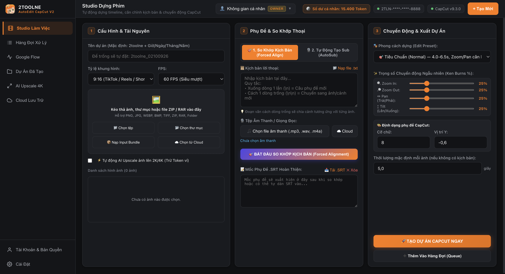

### Hàng Đợi Tạo Dự Án (Build Queue)

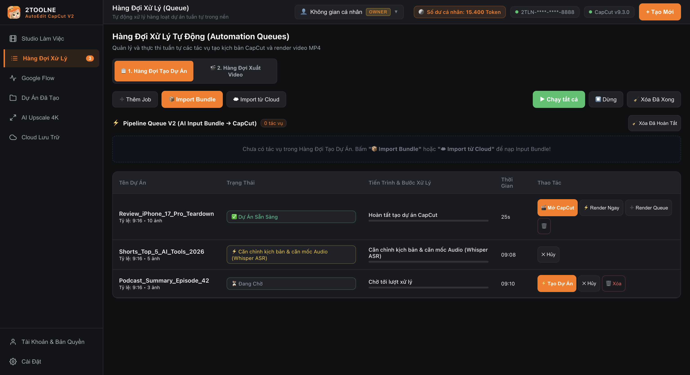

### Hàng Đợi Xuất Video (Render Queue)

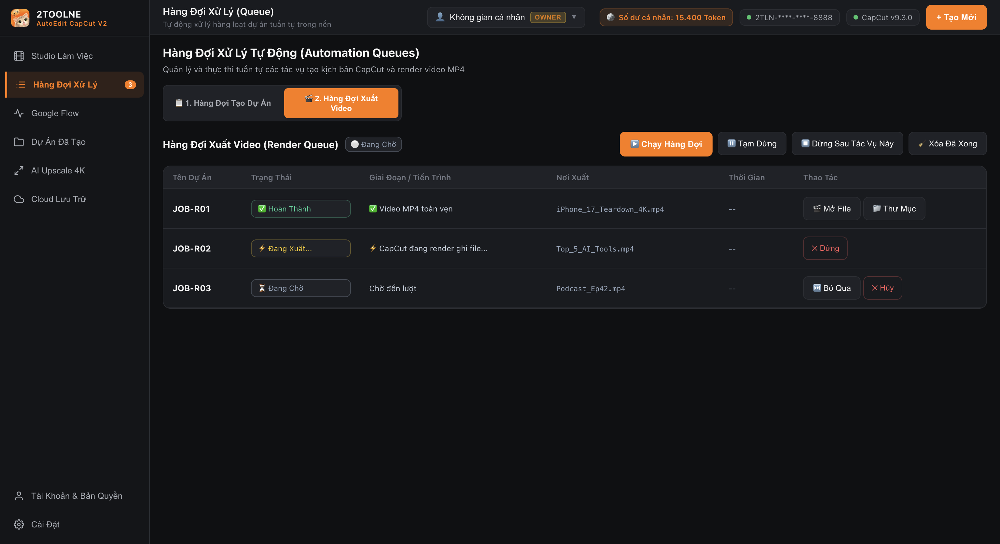

### Google Flow Chrome

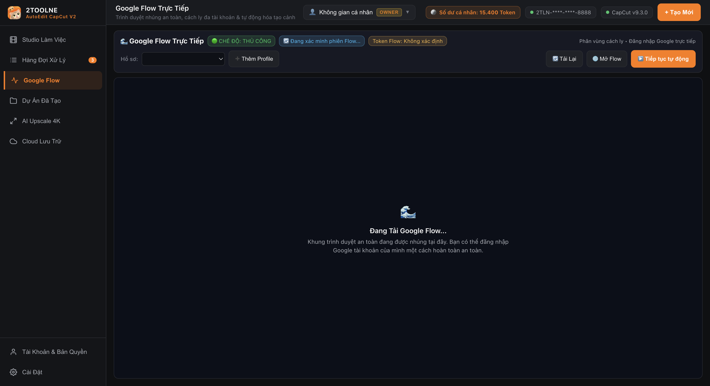

### Dự Án Đã Tạo

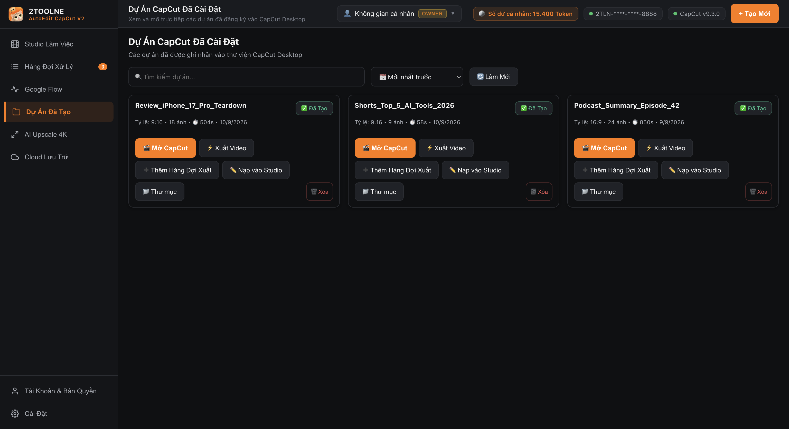

### AI Upscale 4K

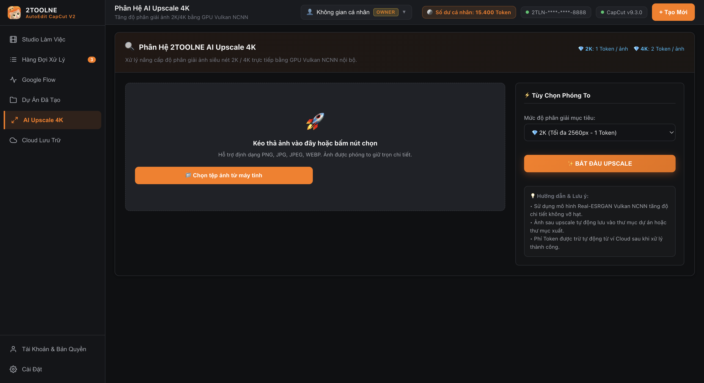

### Cloud Lưu Trữ

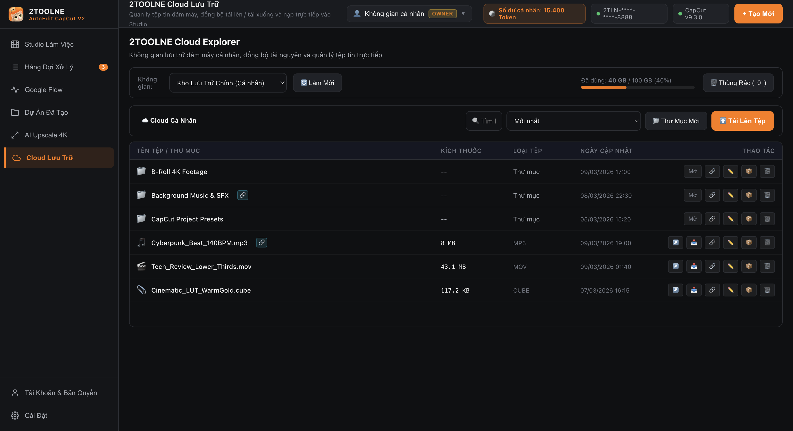

### Tài Khoản & Bản Quyền

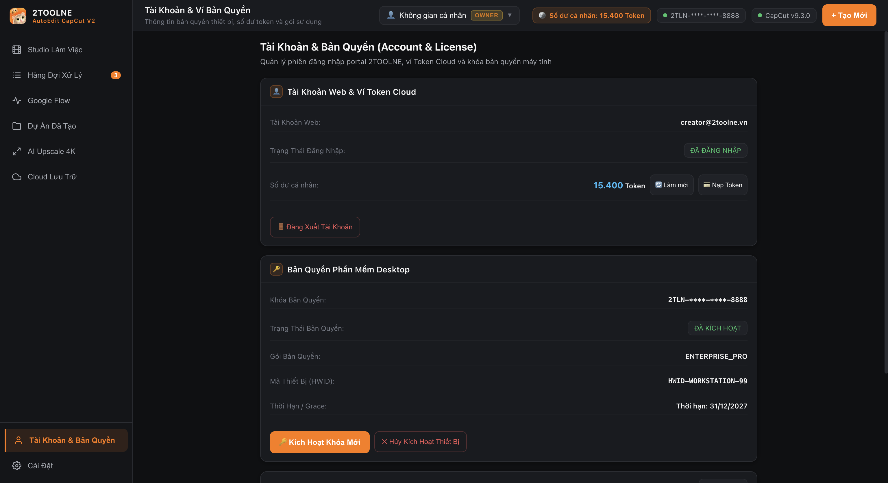

### Cài Đặt Hệ Thống

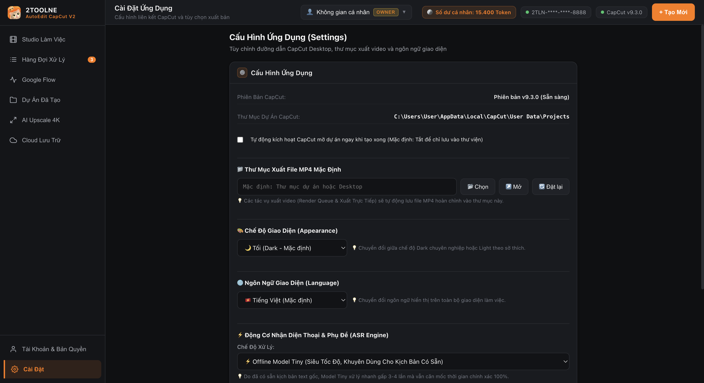

### Studio Viewport 1536x864 (Windows Laptop Default)

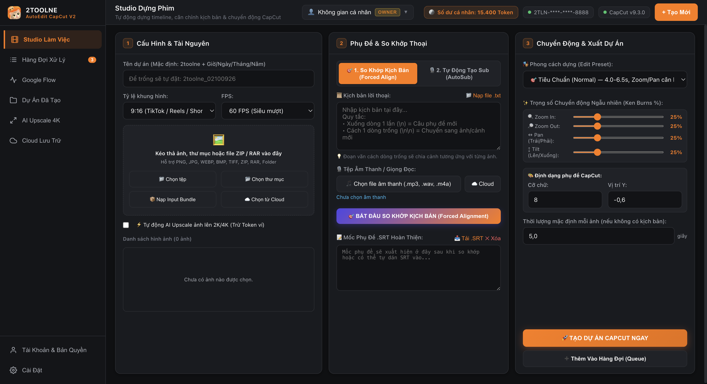

### Studio Viewport 1280x800 (Compact Desktop Minimum)

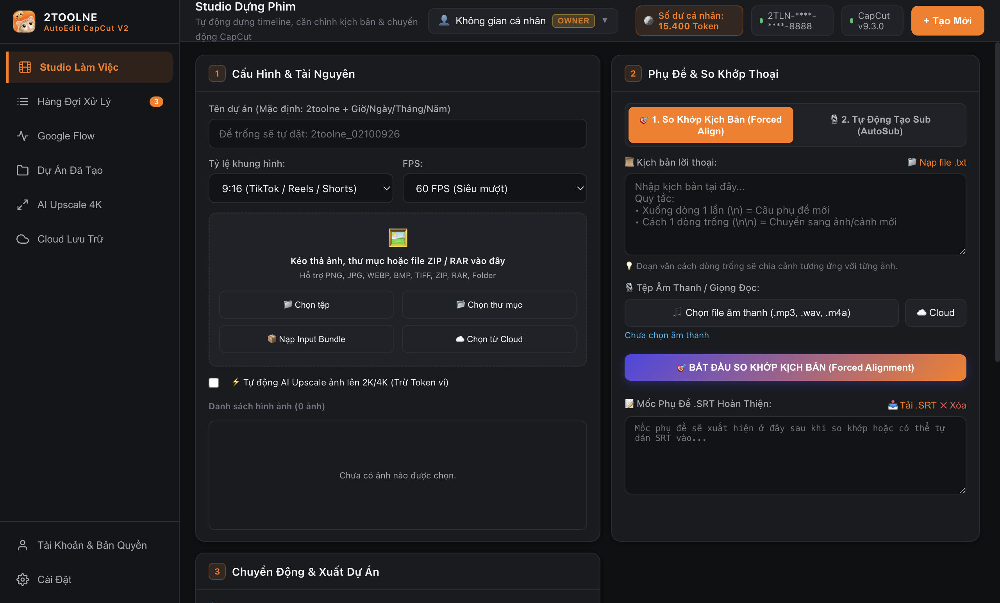

### Studio Viewport 1920x1080 (Full HD Desktop)

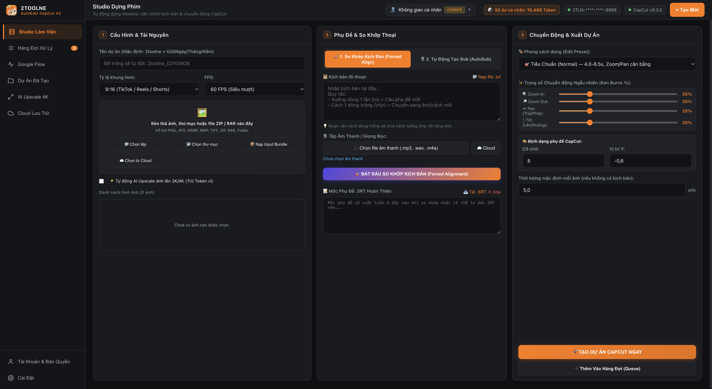

### Modal Dialog Surface (modal_example.png)

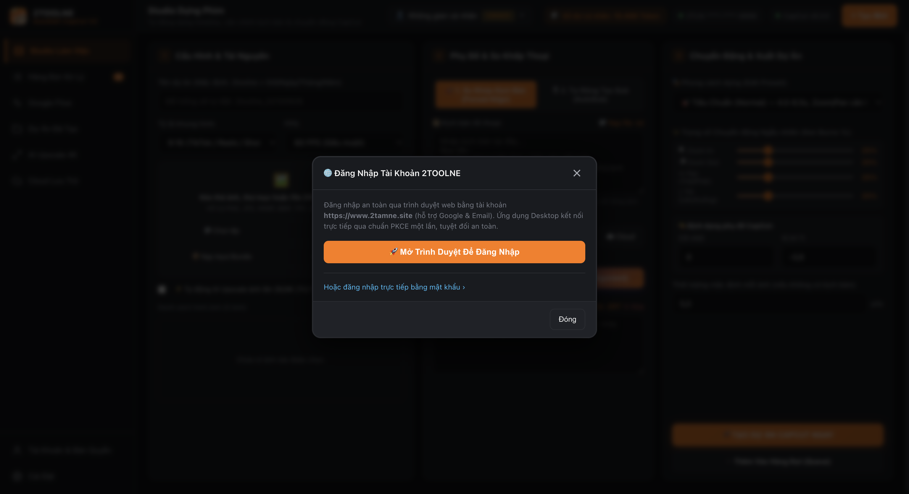

### Studio in Light Mode ([data-theme="light"])

![Studio in Light Mode ([data-theme="light"])](./showcase_light_mode.png)

### Modal Dialog Surface in Light Mode

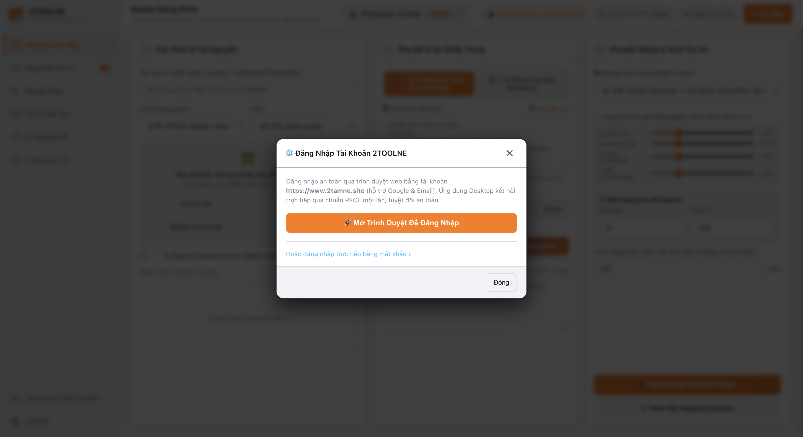

